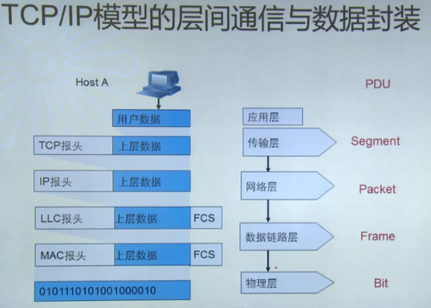

## 计算机网络基础

### 一、数据通信标准

数据通信标准分为事实的以及法定的。有些事实上的标准虽然不是任何标准化组织规定的，但却是所有设备都遵循的。比如TCP/IP协议。

#### 1. 国际标准化组织

有专门的组织来负责通信及行业标准，被人们熟知的有：国际标准化组织ISO、电子电器工程师协会 IEEE、美国国家标准局 ANSI、电子工业协会 EIA/TIA、国际电信联盟 ITU、INTERNET工程任务委员会 IETF。

### 二、IP网络基础

#### 1. OSI七层模型

- 应用层：提供应用程序间通讯
- 表示层：数据编解码，处理数据格式、数据加解密等
- 会话层：建立、维护和管理会话
- 传输层：建立主机端到端连接
- 网络层：寻址和路由选择
- 数据链路层：提供介质访问、链路管理、MAC地址寻址等
- 物理层：比特流传输，主要是调制与解调

其中，上三层负责主机之间的数据传输（即操作系统层面），下四层负责网络数据传输。

#### 2. TCP/IP协议栈

- 应用层：HTTP、Telnet、FTP、TFTP
- 传输层：TCP、UDP
- 网络层：IP
- 数据链路层：Ethernet、802.3（以太网）、PPP
- 物理层：接口和线缆的标准

##### 2.1 TCP/IP模型的层间通信和数据封装

FCS：帧尾校验；PDU：协议数据单元

### 三、物理层

物理层主要规定了介质类型、接口类型、信令类型等；规范在终端系统之间激活、维护和关闭物理链路的电气、机械、流程和功能等方面的要求；规范电平、数据速率、最大传输距离和物理接头等特征。

#### 1. 物理层设备

中继器、集线器等

#### 2. 物理层介质

- 同轴电缆
- 双绞线
- 光纤：一般黄色的是单模光纤、橙色的是多模光纤，为什么有这个区分？因为多模光纤的激光器便宜，但现在趋向于使用单模光纤了。
- 无线电波

#### 3. CSMA/CD协议

CSMA/CD（Carrier Sense Multiple Access with Collision Detection)：基带冲突检测的载波监听多路访问技术。

CSMA/CD主要包含4个处理内容：发前监听、发送、发中检测、冲突处理。

当确认发生冲突后，进入冲突处理程序。有两种冲突情况：

1. 侦听中发现线路忙：若在侦听中发现线路忙，则等待一个延时后再次侦听，若仍然忙，则继续延迟等待，一直到可以发送为止。每次延时的时间不一致，由**退避算法**确定延时值。
2. 发送过程中发现数据碰撞：若发送过程中发现数据碰撞，先发送阻塞信息，强化冲突，再进行监听工作，以待下次重新发送（方法同1）

#### 4. 物理层协议

主要有802.3（以太网）、802.4、802.5等

### 四、数据链路层

数据链路层分为2个子层：

- MAC Sub-layer：介质访问控制子层，指定数据如何通过物理线路进行传输，并与物理层通信
- LLC Sub-layer：逻辑链路控制子层，识别协议类型并对数据进行封装通过网络传输

#### 1. 数据链路层协议

802.2 LLC、Frame Relay、PPP协议等‘

#### 2. 以太网地址

MAC地址有48位，厂商编号（24位）+ 序列号（24位）

华为产品前3个字节是0x00E0FC

前24位中，如果第8位为0，则对应单播；如果第8位为1，则对应组播；如果MAC地址所有的位都为FF，则为广播

#### 3. 数据链路层数据封装

帧：Header + Data + Trailer

Etherent_II协议：D.MAC+S.MAC+Type+Data+FCS（常用），其中Type类型值大于等于1536（0x0600），以太网的数据帧的字节长度>6+6+2+46+4=64B < 1518B

- Type类型主要有：IP(0x0800)、ARP（0x0806）等

IEEE 802.3帧格式：很少用到，在一些控制设备可能使用

#### 4. 数据帧的发送和接收

当主机接收到的数据帧所包含的目的MAC地址是自己时，会把以太网封装剥掉后送往上层协议。

### 五、网络层

#### 1. 网络层数据封装

IP地址唯一标识一台网络设备，由32个二进制位组成，采用点分十进制格式显示；

IP地址分为两部分：网络部分 + 主机部分

#### 2. IP地址分类

1. A类地址：1.0.0.0 ~ 126.255.255.255        /8    

2. B类地址：128.0.0.0 ~ 191.255.255.255    /16

3. C类地址：192.0.0.0 ~ 223.255.255.255    /24

4. D类地址：224.0.0.0 ~ 239.255.255.255    

5. E类地址：240.0.0.0 ~ 255.255.255.255    

   其中，A、B、C类为单播地址，D类位组播地址，E类为科学保留地址

到了现在，由于IP地址极度紧缺，已经打破了分类的限定。

##### 2.1 特殊IP地址

| 网络部分 | 主机部分 | 地址类型 | 用途                            |
| -------- | -------- | -------- | ------------------------------- |
| Any      | 全“0”    | 网络地址 | 代表一个网段                    |
| Any      | 全“1”    | 广播地址 | 特定网段的所有节点              |
| 127      | Any      | 环回测试 | 环回测试                        |
| 全“0”    | 全“0”    | 所有网络 | 华为VRP路由器；用于指定默认路由 |
| 全“1”    | 全“1”    | 广播地址 | 本网段所有节点                  |

##### 2.2 私有IP地址

- 10.0.0.0 ~ 10.255.255.255
- 172.16.0.0 ~ 172.31.255.255
- 192.168.0.0 ~ 192.168.255.255

#### 3. 掩码

使用掩码来区分网络部分和主机部分；掩码使用与IP地址一样的格式；掩码的网络部分和子网部分全都是1，主机部分全都是0。

IP的掩码要求1或0连续，即1中间不可出现0。

自然掩码就是IP地址分类的掩码，不对网段进行细分。

为了进一步细分网段，就出现了子网和掩码的配合使用，即子网掩码。

在子网划分时，可用主机数：= 2**n - 2

变长子网掩码，就是在网络规划中可用使用不同的子网掩码来细分子网。

#### 4. 无类域间路由（CIDR）

CIDR（Classless Inter Domain Routing）减少了路由表的规模，增强了网络的可扩展性，可把子网掩码缩小。

#### 5. ARP地址解析协议（Address Resolution Protocol）

ARP协议用来获取某个IP地址的MAC地址，以填充2层的目标MAC地址。在PC上，默认ARP记录保存4个小时

1. 获取同一网段的IP的MAC地址时，
   1. 广播寻找某个IP的MAC地址
   2. 对应的主机以单播发回自己的MAC地址
2. 如果主机与目标主机不在同一个网段，就会填充自己的网关地址。

#### 6. Proxy ARP

如果ARP请求是从一个网络的主机发往另一个网络上的主机，那么连接这两个网络的路由器就可以回答该请求，这个过程称为委托ARP或ARP代理。

#### 7. Gratuitous ARP（免责ARP）

主要用来检测同一网络中是否存在IP地址冲突，每5分钟检测一次。

#### 8. RARP 逆向ARP解析协议（Reserve Address Resolution Protocol）

RARP协议可以通过MAC地址来获取IP地址，例如无盘工作站。

#### 9. 路由器的作用

1. 路由器运行在网络层，核心作用是实现网络互联。
2. 分组数据转发
   1. 路由（寻址）：路由表建立、刷新、寻址
   2. 子网间的速率匹配
   3. 隔离网络，防止网络风暴，指定访问规则（防火墙）
   4. 异种网络互连（比如电信线、以太网等）

### 六、传输层

四层PDU封装的是端口号

#### 1. TCP协议

TCP为应用程序提供一种面向连接的、可靠的服务。

TCP的可靠性体现在：

- 面向连接的传输
- 最大报文段长度（双方协商）
- 传输确认机制
- 首部和数据的校验和
- 流量控制

##### 1.1 三次握手：

1. TCP连接的建立：
   1. 客户端发起：**SYN(seq = a)**
   2. 服务端返回SYN及对客户端的确认：**SYN(seq=b,ack=a+1)**
   3. 客户端确认SYN：ACK(seq=b+1)
2. TCP连接的终止：
   1. 客户端发起终止：**FIN(seq=a)**
   2. 服务器端确认终止：**ACK(seq=a+1)**
   3. 服务器段发起终止：**FIN(seq=b,ack=a+1)**
   4. 客户端确认终止：**ACK(seq=b+1)**

##### 1.2 端到端通信

端口号1024以下的为预留的，从1025到65535为应用可用端口号。

21：FTP应用；80：HTTP端口号

##### 1.3 MSS

当建立一个连接时，连接的双方需要协商MSS。MSS确认了一个TCP报文的最大字节数。

MSS的默认值为536，因此它允许IP数据报长度为576字节。

##### 1.4 滑动窗口机制

用来控制流量速度，在TCP报文中可携带窗口数量，即每次处理的数量

#### 2. UDP协议

UDP为应用程序提供面向无连接的服务，传输数据之前源端和目的端不需要建立连接

不需要维护连接状态、收发状态等，因此服务器可同时面向多个客户端传输相同的消息

UDP适用于对传输效率要求高的应用

UDP协议中也有校验和，但是可用可不用

### 七、应用层

应用层负责处理特定的应用程序。

#### 1. ICMP（Internet Control Message Protocol）

ICMP被认为是网络层的一个组成部分。它传递差错、控制、查询报文等信息。

ICMP报文常被IP层或更高层协议（TCP、UDP）使用，如Ping。

##### 1.1 ICMP常用消息类型

- 0  Echo Reply：响应回应消息
- 3  Destination Unreachable：目的不可达信息
- 5  Redirect：重定向消息
- 8  Echo：响应消息
- 11  Time Exceeded：超时消息

#### 2. Tracert

Tracert用于查看IP数据报从一台主机传到另一台主机所经过的路由

Trace route程序使用ICMP报文和IP首部中的TTL字段（生存周期）

#### 3. Telnet

Telnet给用户提供了一种通过网络到远程服务器的方式。

Telnet使用的传输层协议为TCP，端口号23

华为设备尾缀含义：

SI：Stand Image；EI：Enhance Image；HI：High Image；LI：Limit Image