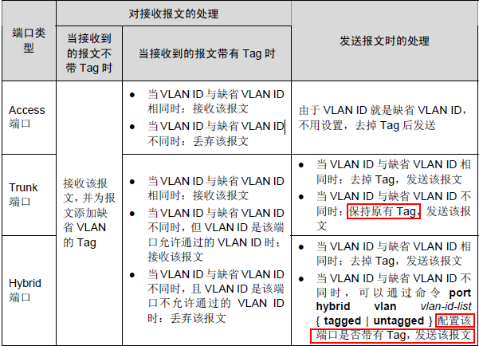
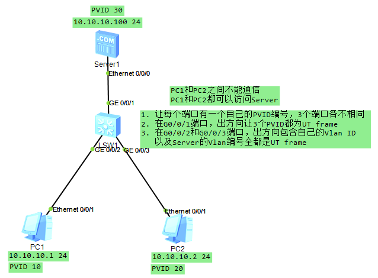

## 一、小范围局域网

### VRP概述

通用路由平台VRP(Versatile Routing Platform)是华为公司数据通信产品的通用操作系统平台。它以IP业务为核心，采用组件化的体系结构，在实现丰富功能特性的同时，提供基于应用的可裁剪和可扩展的功能。

- 是一个网络操作系统；
- 是支持多种设备的软件平台；
- 提供TCP/IP路由服务；

### 华为设备的配置

设备配置有两种方式：

1. Console口配置（带外）（RS232是串口）
2. Telnet配置（带内）

#### 华为设备视图

<Huawei>  // 用户模式，在该模式下，可以查看系统状态；进行简单配置；进行文件处理

#Huawei     // 系统模式，在用户模式通过system 命令进入，在系统模式中，包括以下视图：

- user-interface vty 0  ：用户界面视图
- interface serial 0：接口视图
- acl 2000：ACL视图
- vlan 5：VLAN视图
- ospf：路由协议相关视图，路由
- aaa：安全相关视图
- ........

> 可以用过return命令直接从任意非用户视图退到用户视图

#### 命令行在线帮助

1. 完全帮助
2. 部分帮助

#### 文件操作

`more\copy\move\rename\delete\reset recycle-bin\undelete\pwd\cd\dir\mkdir\rmdir\format（格式化存储设备）\fixdisk（恢复文件系统异常的存储设备）`

#### 配置文件管理

```
dis saved-configuration   
dis current-configuration
save
reset saved-configuration
compare configuration
```

#### Tips

1. `Dis diagnostic-information`：显示设备所有状态信息，不要随意运行
2. `user-interface vty 0 4`：进入用户管理模式
3. VRP可以作为FTP Server&Client，但是只能作为TFTP Client

### 以太网

#### 以太网设备

常见的以太网设备包括Hub、交换机等。交换机工作在数据链路层，它有效地隔离了以太网中的冲突域，极大地提升了以太网的性能。

#### 以太网接口的双工模式

1. 以太网电接口有下面三种双工模式：
   - 全双工
   - 半双工
   - 自协商：自协商端口的双工状态由本端口和对端端口自动协商而定。
2. 以太网光接口只能在全双工模式下进行

#### 以太网接口速率

如果是自协商接口，以太网接口速率由本端和对端接口双方自动协商而定。当然也可以关闭自协商使用指定的速率。

```
int g0/0/1
undo negotiation auto
speed 100
duplex full
```

#### 交换机的转发行为

交换机工作在数据链路层，转发数据帧。转发行为有：

1. 泛洪（Flooding）
2. 转发（Forward）
3. 丢弃（Discarding）：当交换机发现帧进出是同一个接口的时候会丢弃帧。

#### 交换机工作原理

在主机联网后，会维护一张ARP表，记录IP地址与MAC地址的映射；在交换机会去学习MAC地址表与交换机端口的映射。

在小型局域网刚开始工作时，

```
while 帧输入，获取MAC地址：
	if 单播：
		if 在地址表中存在：
			转发该帧
		else:
			泛洪该帧，源端口除外
	if 广播：
		泛洪该帧，源端口除外
```

二层交换机彻底解决了以太网的冲突问题，极大地改进了以太网的性能，提高了以太网的安全性。但仍然存在以下缺点：

1. 广播泛滥（主要）				2. 安全性仍旧无法得到有效保证

### VLAN

为了解决广播泛滥问题，提出了VLAN技术。在帧数据中加入Tag（4 B)，Tag中含有Vlan ID，编号从 1 ~ 4096（12b）。

一般情况下，终端设备只接受/发送标准帧，网络设备接受/发送标准帧和Vlan帧。通常，用户主机与交换机之间的链路为接入链路（Access）；交换机与交换机之间的链路为干道链路（Trunk）。

PVID表示端口在缺省情况下所属的Vlan，默认是1。

Hybrid端口既可以连接主机，又可以连接交换机。可以以Tagged或Untagged方式加入Vlan。

#### 3种Vlan端口对比



#### 3.1 Hybrid实验



```
vlan batch 10 20 30
interface GigabitEthernet0/0/1
 port hybrid pvid vlan 30
 port hybrid untagged vlan 10 20 30
interface GigabitEthernet0/0/2
 port hybrid pvid vlan 20
 port hybrid untagged vlan 20 30
interface GigabitEthernet0/0/3
 port hybrid pvid vlan 10
 port hybrid untagged vlan 10 30
```

#### 华为设备 Vlan划分方法

|             | Vlan 5                   | Vlan 10                  |
| ----------- | ------------------------ | ------------------------ |
| 基于端口    | G0/0/1、G0/0/5           | G0/0/2、G0/0/9           |
| 基于MAC地址 | MAC1、MAC2               | MAC3、MAC4               |
| 基于IP子网  | 10.0.0.x                 | 10.0.2.x                 |
| 基于协议    | IP协议                   | IPv6协议                 |
| 基于策略    | 10.0.1.* + g0/0/1 + MAC1 | 10.0.2.* + g0/0/2 + MAC2 |

### GARP/GVRP

GARP（Generic Attribute Registration Protocol）全称是通用属性注册协议，它为处于同一交换网内的交换机之间提供了一种分发、传播、注册某种信息的手段。

GVRP是GARP的一种具体实现，主要用于维护设备动态VLAN属性。通过GVRP协议，一台交换机上的VLAN信息会迅速传播给整个网络。

GVRP实现了VLAN属性的动态分发、注册、传播，从而减轻网络管理员的工作量，也能保证VLAN配置的正确性。它通过在交换机之间交互GVRP报文来注册、注销和传播交换机的属性。

### 生成树协议 STP

为了提高网络可靠性，交换网络中通常会使用冗余链路。然而，冗余链路会给交换网络带来环路，并导致广播风暴以及MAC地址表抖动等问题。进而会影响到用户的通信质量。

生成树协议STP（Spanning Tree Protocol）可以在提高可靠性的同时又能避免环路带来的各种问题。

#### STP工作原理

STP通过消除环路，阻塞掉某个端口来工作。STP传输的报文为BPDU（桥协议数据单元），其中，需要重点关注配置BPDU。

#### STP计算过程

1. 选举 Root Bridge：当初始启动时，设备默认自己是Root Bridge，且每个交换机有1个ID，通过交换比较，最小的为Root Bridge。之后，只有Root Bridge可以发送BPDU。

   ID = 序号 + MAC地址，其中，序号为4096的倍数，且序号 >=0 & <65535

2. 选举非根交换机的根端口（Root Port）：即非根交换到到达根交换机的最近端口（判断优先级 Cost > 邻居ID > 端口ID）

3. 选举链路的指定端口

4. 阻塞非根非指定端口

**根交换机上没有根端口**

| 端口角色        | 描述                                                         |
| --------------- | ------------------------------------------------------------ |
| Root Port       | 根端口，是所在交换机上离根交换机最近的端口，处于转发状态     |
| Designated Port | 指定端口，转发所连接的网段发往根交换机方向的数据和从交换机方面发往所连接网络的数据 |
| Alternate Port  | 预备端口，不向所连网段转发任何数据                           |

#### 端口状态

| 端口状态                   | 描述                                                         |
| -------------------------- | ------------------------------------------------------------ |
| Disabled<br />端口没有启用 | 此状态下端口不转发数据帧、不学习MAC地址表、不参与生成树计算  |
| Blocking<br />阻塞状态     | 此状态下端口不转发数据帧、不学习MAC地址表、接受并处理BPDU，但是不向外发送BPDU |
| Listening<br />侦听状态    | 此状态下端口不转发数据帧、不学习MAC地址表，只参与生成树计算，接收并发送BPDU |
| Learning<br />学习状态     | 此状态下端口不转发数据帧，但是学习MAC地址表，参与计算生成树，接受并发送BPDU |
| Forwarding<br />转发状态   | 此状态下端口正常转发数据帧、学习MAC地址表，参与计算生成树，接受并发送BPDU |

##### 端口状态变换

```
switch start
port blocking
if RP or DP 
	Listening
	wair 15s: if error, return blocking
	learning
	wait 15s: if error, return blocking
	forwarding
```

由于端口变换有两个forward delay，对现代网络影响较大，所以有了后续的RSTP、MSTP等。

#### 生成树相关配置

```
stp priority // 生成树优先级
stp cost // 生成树cost配置
```

### 链路聚合

采用链路聚合技术可以在不进行硬件升级的条件下，通过将多个物理接口捆绑为一个逻辑接口，来达到增加链路带宽的目的。在实现增大带宽目的的同时，链路聚合采用备份链路的机制，可以有效地提高设备之间链路的可靠性。

#### 链路聚合模式

1. 手工负载分担模式：此模式下所有活动接口都参与数据的转发、分担流量
2. LACP模式：LACP模式支持链路备份

链路聚合一定不会平分流量，且聚合带宽一定小于总和。

链路聚合所有被捆绑线路两端相连的物理接口的数量、双工方式、接口模式必须一致。

```
int eth-trunk 1
int g0/0/1
eth-trunk 1
int g0/0/2
eth-trunk 2
```

