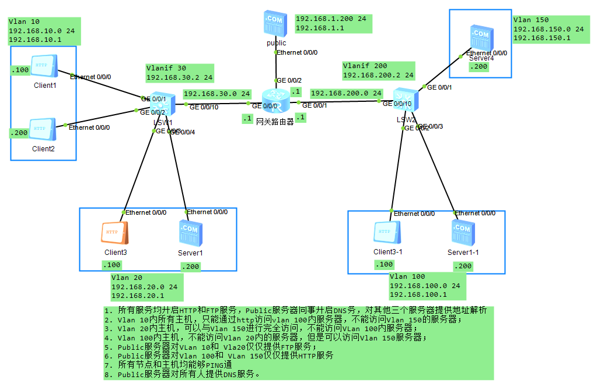

## 办公局域网基础

### 一、以太网

#### 1. 常见以太网设备

常见的以太网设备包括Hub、交换机等。交换机工作在数据链路层，它有效地隔离了以太网中的冲突域，极大地提升了以太网的性能。

#### 2. 以太网接口的工作方式

以太网电接口有下面三种双工模式：

- 全双工
- 半双工
- 自协商：自协商端口的双工状态由本端口和对端端口自动协商而定。

以太网光接口只能在全双工模式下进行

#### 3. 以太网接口速率

如果是自协商接口，以太网接口速率由本端和对端接口双方自动协商而定。当然也可以关闭自协商使用指定的速率。

#### 4. 交换机的转发行为

交换机工作在数据链路层，转发数据帧。转发行为有：

1. 泛洪（Flooding）
2. 转发（Forward）
3. 丢弃（Discarding）：当交换机发现帧进出是同一个接口的时候会丢弃帧。

#### 5. 交换机工作原理

在主机联网后，会维护一张ARP表，记录IP地址与MAC地址的映射；在交换机会去学习MAC地址表与交换机端口的映射。

在小型局域网刚开始工作时，

```
while 帧输入，获取MAC地址：
	if 单播：
		if 在地址表中存在：
			转发该帧
		else:
			泛洪该帧，源端口除外
	if 广播：
		泛洪该帧，源端口除外
```

二层交换机彻底解决了以太网的冲突问题，极大地改进了以太网的性能，提高了以太网的安全性。但仍然存在以下缺点：

1. 广播泛滥（主要）				2. 安全性仍旧无法得到有效保证

### 二、VLAN

为了解决广播泛滥问题，提出了VLAN技术。在帧数据中加入Tag（4 B)，Tag中含有Vlan ID，编号从 1 ~ 4096（12b）。

一般情况下，终端设备只接受/发送标准帧，网络设备接受/发送标准帧和Vlan帧。通常，用户主机与交换机之间的链路为接入链路（Access）；交换机与交换机之间的链路为干道链路（Trunk）。

PVID表示端口在缺省情况下所属的Vlan，默认是1。

Hybrid端口既可以连接主机，又可以连接交换机。可以以Tagged或Untagged方式加入Vlan。

#### 1. 3种Vlan端口对比


#### 2. 华为设备 Vlan划分方法

|             | Vlan 5                   | Vlan 10                  |
| ----------- | ------------------------ | ------------------------ |
| 基于端口    | G0/0/1、G0/0/5           | G0/0/2、G0/0/9           |
| 基于MAC地址 | MAC1、MAC2               | MAC3、MAC4               |
| 基于IP子网  | 10.0.0.x                 | 10.0.2.x                 |
| 基于协议    | IP协议                   | IPv6协议                 |
| 基于策略    | 10.0.1.* + g0/0/1 + MAC1 | 10.0.2.* + g0/0/2 + MAC2 |

#### 3. GARP/GVRP

GARP（Generic Attribute Registration Protocol）全称是通用属性注册协议，它为处于同一交换网内的交换机之间提供了一种分发、传播、注册某种信息的手段。

GVRP是GARP的一种具体实现，主要用于维护设备动态VLAN属性。通过GVRP协议，一台交换机上的VLAN信息会迅速传播给整个网络。

GVRP实现了VLAN属性的动态分发、注册、传播，从而减轻网络管理员的工作量，也能保证VLAN配置的正确性。它通过在交换机之间交互GVRP报文来注册、注销和传播交换机的属性。

#### 4. VLAN之间的访问

对于VLAN之间的互相访问，需要通过路由器来转发不同的VLAN包，但是每个VLAN要对应一个物理连接端口。该方法会导致资源的浪费。如果同一个交换机分属多个不同的子VLAN，可以使用单臂路由或者三层交换机的方式。

#### 5. 单臂路由

由于三层交换机的出现，基本上已弃用。

为了解决资源浪费的问题，设计只使用路由器的一个端口来完成。即单臂路由。

单臂路由需要在二层交换机和路由器之间相连的接口配置VLAN Trunking（就是将一个物理口划分成多个虚拟子接口，每个子接口对应一个VLAN），使多个VLAN共享同一条物理链路连接到路由器。

缺点：该方法会导致物理链路负载过大，且可靠性低。

#### 6. 三层交换机

三层交换机在端口上进行了Vlan划分，但是同时可以创建Vlan逻辑接口，实现在单个交换机上实现Vlan间路由。

### 三、生成树协议 STP

为了提高网络可靠性，交换网络中通常会使用冗余链路。然而，冗余链路会给交换网络带来环路，并导致广播风暴以及MAC地址表抖动等问题。进而会影响到用户的通信质量。

生成树协议STP（Spanning Tree Protocol）可以在提高可靠性的同时又能避免环路带来的各种问题。

#### 1. STP工作原理

STP通过消除环路，阻塞掉某个端口来工作。STP传输的报文为BPDU（桥协议数据单元），其中，需要重点关注配置BPDU。

#### 2. STP计算过程

1. 选举 Root Bridge：当初始启动时，设备默认自己是Root Bridge，且每个交换机有1个ID，通过交换比较，最小的为Root Bridge。之后，只有Root Bridge可以发送BPDU。

   ID = 序号 + MAC地址，其中，序号为4096的倍数，且序号 >=0 & <65535

2. 选举非根交换机的根端口（Root Port）：即非根交换到到达根交换机的最近端口（判断优先级 Cost > 邻居ID > 端口ID）

3. 选举链路的指定端口

4. 阻塞非根非指定端口

| 端口角色        | 描述                                                         |
| --------------- | ------------------------------------------------------------ |
| Root Port       | 根端口，是所在交换机上离根交换机最近的端口，处于转发状态     |
| Designated Port | 指定端口，转发所连接的网段发往根交换机方向的数据和从交换机方面发往所连接网络的数据 |
| Alternate Port  | 预备端口，不向所连网段转发任何数据                           |

**注：根交换机上没有根端口**

#### 3. 端口状态

| 端口状态                   | 描述                                                         |
| -------------------------- | ------------------------------------------------------------ |
| Disabled<br />端口没有启用 | 此状态下端口不转发数据帧、不学习MAC地址表、不参与生成树计算  |
| Blocking<br />阻塞状态     | 此状态下端口不转发数据帧、不学习MAC地址表、接受并处理BPDU，但是不向外发送BPDU |
| Listening<br />侦听状态    | 此状态下端口不转发数据帧、不学习MAC地址表，只参与生成树计算，接收并发送BPDU |
| Learning<br />学习状态     | 此状态下端口不转发数据帧，但是学习MAC地址表，参与计算生成树，接受并发送BPDU |
| Forwarding<br />转发状态   | 此状态下端口正常转发数据帧、学习MAC地址表，参与计算生成树，接受并发送BPDU |

#### 4. 端口状态变换

```
switch start
port blocking
if RP or DP 
	Listening
	wait 15s: if error, return blocking
	learning
	wait 15s: if error, return blocking
	forwarding
```

由于端口变换有两个forward delay，对现代网络影响较大，所以有了后续的RSTP、MSTP等。

### 四、链路聚合

采用链路聚合技术可以在不进行硬件升级的条件下，通过将多个物理接口捆绑为一个逻辑接口，来达到增加链路带宽的目的。在实现增大带宽目的的同时，链路聚合采用备份链路的机制，可以有效地提高设备之间链路的可靠性。

#### 1. 链路聚合模式

1. 手工负载分担模式：此模式下所有活动接口都参与数据的转发、分担流量
2. LACP模式：LACP模式支持链路备份

链路聚合一定不会平分流量，且聚合带宽一定小于总和。

链路聚合所有被捆绑线路两端相连的物理接口的数量、双工方式、接口模式必须一致。

### 五、路由

路由是将数据报文从一个子网转发到另一个子网的行为。

#### 1. 路由协议

路由协议定义了一套路由器之间通信时使用的规则，它维护路由表，提供最佳转发路径。

##### 1.1路由协议分类

1. 按照范围分类
   - IGPS：RIP、OSPF、ISIS等
   - EGPS：BGP等
2. 按照算法分类
   - 距离矢量路由选择协议（Distance-Vector）：包括RIP和BGP。其中，BGP也被称为路径矢量协议（Path-Vector）
   - 链路状态路由选择协议（Link-state）：又称最短路径优先路由选择协议，包括OSPF和ISIS
3. 按照业务应用分类
   - 单播路由协议（Unicast Routing Protocol）：包括RIP、OSPF、BGP、IS-IS等
   - 组播路由协议（Multicast Routing Protocol）：包括DVMRP、PIM-SM、PIM-DM等

#### 2. 路由优先级

当存在多个路由来源时，具有较高优先级（数值越小，越有限）的路由来源提供的路由将被激活，用于指导报文的转发。

##### 2.1 缺省的路由优先级

在华为系统中，对各种路由协议有一个默认的优先级：

| 路由协议 | 优先级 |
| -------- | ------ |
| DIRECT   | 0      |
| OSPF     | 10     |
| IS-IS    | 15     |
| STATIC   | 60     |
| RIP      | 100    |
| OSPF ASE | 150    |
| BGP      | 255    |

#### 3. 路由的度量

路由器优先选择较小度量值的路由，并加入到路由表中。（Cost）

#### 4. 等价路由（ECMP）

Equal Cost Multi Path，同一个路由协议，到同一个目的地有几条相同度量值的路由时，这些路由都会被加入到路由表中，IP包会在这几个链路上负载分担。

#### 5. 最大匹配原则

当路由器收到一个IP数据包时，会将数据包的目的IP地址与自己本地路由表中的表项进行一一比对，直到找到匹配度最长的条目。

#### 6. 静态路由

静态路由需要通过手工配置且配置简单，但是需要人工维护，适用于简单的拓扑网络。

#### 7. 缺省路由

缺省路由是一种特殊的路由条目，可以通过静态路由配置，某些动态路由协议也可以生成缺省路由，如OSPF和IS-IS。

在路由表中，缺省路由以到网络0.0.0.0（掩码为0.0.0.0）的形式出现。

当路由器收到一个在路由表中匹配不到明确路由的数据包时，会将数据包转发给缺省路由指向的下一跳。

缺省路由也支持路由的负载分担与路由备份，配置相同，只是网络以及掩码有点特殊。

#### 8. 自治系统 AS

AS是由同一个技术管理机构管理、使用统一选路策略的一些路由器的集合。

在AS内部一般使用IGP（内部网关协议），在AS之间一般使用EGP（外部网关协议）。

#### 9. 路由协议的混合使用

每种路由协议只能发布和学习自己协议已知的路由（指在某个端口上运行了该种路由协议的路由，或者在路由表中由本路由协议发现的路由）。

不同路由协议间交换路由信息时，需要进行引入（import-route）操作。

### 六、距离矢量路由协议

#### 1. 路由泛洪

路由器启动时对路由表进行初始化，对每个与自己直接相连的网段生成一个表项。每个初始表项跳数为0.

每个路由器周期性地向直接连接的其它路由器发送自己的路由表。(每个周期增加部分路由，N个周期后即可有所有的路由表)

路由器收到其他路由器的路由表后，会与自己的路由表进行对比，跳数小的路有条目会代替跳数多的路有条目。

#### 2. 路由环路

如果B路由表中含有下一跳为C的网段，在某一瞬间，如果C路由中对于该网段失去路由，即C到该网段不可达。但是B仍然正常通告可通过C到达该网段的路由表，C接受后认为通过B可达，并向B通告以此循环无效更新路由表。

解决办法：

1. 路由不可达：设定跳数16以上代表路由不可达，杜绝无限循环。
2. 水平分割：在通告的时候不再向原路由器通告来自该路由器的路由表
3. 路由抑制：如果C路由表中删除了某个网段的路由，通告的时候路由表中删除该条信息。但是路由表需要收到N次没有该网段路由的通告后才可以从自己的路由表中删除。此时，C路由可以将该网段的路由跳数设置为16，并通告给其他路由。B收到该路由后可以在下一个周期直接删除该路由条目，并回复确认。
4. 抑制时间：收到一个中断的抑制消息以后，用一个计时器去计时抑制，在抑制时间之内不将数据报文转发出去。
5. 触发更新：不需要等待周期变化来通告不可达路由，可以在发生时直接进行通告。

#### 3. RIP路由协议

**现行新建网络很少使用RIP协议。**

RIP协议适用于中小型网络，有RIPv1和RIPv2两个版本。使用UDP进行路由信息的交互，目标端口号是520。

RIP支持：水平分割、毒性逆转和触发更新。

一个RIP报文最多含有20个路由条目。

##### 3.1 RIP协议更新原理

初启动路由启动后会发送一个Request报文，现有路由每30s会发送一次Response报文。

如果180s内没有收到某个路由条目的信息，会再路由表删除该路由条目，如果180s后再经过120s仍未收到该路由条目的更新，会在路由器中彻底删除该条目。

##### 3.2 RIPv1 VS RIPv2

RIPv1为有类别路由协议，不支持VLSM和CIDR，它是以广播的形式发送报文，且不支持验证。

RIPv2为无类别路由协议，支持VLSM，支持路由聚合CIDR，支持以广播或者组播（224.0.0.9）的形式发送报文，支持明文验证和MD5密文验证。

##### 3.3 RIP配置

```
rip  # rip基础配置 ，RIP宣告网络时一定要宣告两路由器的直连网段；
version 2
network 192.168.1.0
network 172.16.0.0
```

RIP Version 2是可以与Version 1兼容的，但是需要把V2设置成广播方式。

##### 3.4 RIP路由聚合

路由聚合是指：同一自然网段内的不同子网的路由在向外（其它网段）发送时聚合成一条自然掩码的路由发送。

路由聚合对RIPv1不起作用，RIPv2支持无类地址域间路由。缺省情况下，RIPv2启用路由聚合功能，当需要将所有VLSN路由广播出去时，可关闭RIPv2的路由聚合功能。

路由聚合自动聚合成主类网络，也可以手工聚合成特定网络。但是不推荐自动聚合。

```
int g0/0/0  # 路由聚合是在端口层次配置的
rip summary-address x.x.x.x mask  # 手动聚合路由
```

##### 3.5 接口附加度量值

度量值就是说的跳数。也是在端口层面配置。

```
int g0/0/0
 rip metricin 5  # 该接口接收的所有条目跳数+5
 rip metricout 5  # 该接口发出的所有条目跳数+5
```

### 七、回环接口

#### 1. Lookback接口存在意义

1. 永远不会down
2. 用来做管理接口
3. 用来模拟网段

### 八、DHCP

如果IP地址采用手工配置，工作量大且不好管理，如果有用户擅自修改网络参数，还有可能会造成IP地址冲突等问题。使用动态主机配置协议DHCP（Dynamic Host Configuration Protocol）来分配IP地址等网络参数，可以减少管理员的工作量，避免用户手工配置网络参数时造成的地址冲突。

#### 1. DHCP报文

| 报文类型      | 含义                                                         |
| ------------- | ------------------------------------------------------------ |
| DHCP DISCOVER | 客户端用来寻找DHCP服务器                                     |
| DHCP OFFER    | DHCP服务器用来响应DHCP DISCOVER报文，<br />此报文携带了各种配置信息 |
| DHCP REQUEST  | 客户端请求配置确认，或者续借租期                             |
| DHCP ACK      | 服务器对REQUEST报文的确认响应                                |
| DHCP NAK      | 服务器对REQUEST报文的拒绝响应                                |
| DHCP RELEASE  | 客户端要释放地址时用来通知服务器                             |

#### 2. DHCP工作原理

客户端发送DHCP Discover（广播）-> 服务器发回 DHCP OFFER（单播）-> 客户端发送 DHCP REQUEST（广播）-> 服务器返回DHCP ACK（单播）

#### 3. DHCP租期更新

IP租约期限到达50%时，DHCP客户端会请求更新IP地址租约。

客户端发送 DHCP REQUEST（单播）-> 服务器返回DHCP ACK（单播）

#### 4. DHCP重绑定

DHCP客户端在租约期限达到87.5%时，还没收到服务器响应，会申请重绑定IP。

客户端发送DHCP REQUEST（单播）（如果该单播未收到，服务器未响应）-> 客户端发送 DHCP REQUEST（广播）-> 服务器返回DHCP ACK/NAK（单播）。

#### 5. IP地址释放

如果IP租约到期前都没有收到服务器响应，客户端停止使用此IP。如果DHCP客户端不再使用分配的IP地址，也可以主动向服务器发送DHCP RELEASE报文，释放该IP地址。

### 九、VRRP

VRRP：虚拟路由器备份协议。VRRP描述了一个动态选举协议，该协议从一组VRRP路由器中选举一个主路由器（Master），并将Master关联到一个虚拟路由器，作为所连接网段的网关。

VRRP用来做网关的热备份。VRRP也通过优先级来进行Master的选定，越大越有限。（特殊Priority值 255，如果虚拟的地址与IP拥有者路由器相同，则拥有该IP的路由器的Priority值为255。

### 十、AAA

AAA是Authentication（认证）、Authorization（授权）和Accounting（计费）的简称，它提供了认证、授权、计费三种安全功能。AAA可以用过多种协议来实现，目前华为设备支持基于RAUIUS（Remote Authentication Dial-In User Service）协议或HWTACACS（Huawei Terminal Access Controller Access Control System）协议来实现AAA。

- 认证：验证用户是否可以获得网络访问的权限。，AAA支持的认证方式有：不认证、本地认证、远端认证
- 授权：授权用户可以访问或使用网络上的哪些服务，AAA支持的授权方式有：不授权、本地授权、远端授权。
- 计费：记录用户使用网络资源的情况。AAA支持的计费方式有：不计费、远端计费。

AAA可以通过域来对用户进行管理，不同的域可以关联不同的认证、授权和计费方式。

test1@partner、test2@employee

```
aaa
 authentication-scheme auth1
  authentication-model local
 authorization-scheme auth2
  authentication-model local
 domain huawei
  authentication-scheme auth1
  authorization-scheme auth2
```

### 十一、ACL

访问控制列表ACL（Access Control List）可以定义一系列不同的规则，设备根据这些规则对数据包进行分类，并针对不同类型的报文进行不同的处理，从而可以实现对网络访问行为的控制、限制网络流量、提供网络性能、防止网络攻击等等。

#### 1. ACL分类

| 分类    | 编号范围  | 参数                                     |
| ------- | --------- | ---------------------------------------- |
| 基本ACL | 2000-2999 | 源IP地址等                               |
| 高级ACL | 3000-3999 | 源IP地址、目的IP地址、源端口、目的端口等 |
| 二层ACL | 4000-4999 | 源MAC地址、目的MAC地址、以太帧协议类型等 |

#### 2. ACL规则

每个ACL可以包含多个规则，路由器根据规则来对数据流量进行过滤。

```
acl 2000
 rule 5 deny source 192.168.1.0 0.0.0.255  # 这里是通配符掩码，与掩码相反，不能叫做反掩码
 rule 10 deny source 192.168.2.0 0.0.0.255
```

#### 3. 基本ACL配置

```
acl 2000
 rule 5 deny source 192.168.1.0 0.0.0.255  # 这里是通配符掩码，与掩码相反，不能叫做反掩码
 rule 10 deny source 192.168.2.0 0.0.0.255
int g0/0/0  # 子接口必须进入子接口
 traffic-filter outbound acl 2000
```

#### 4. 高级ACL配置

相对于基本ACL，更关心上层协议。

三层交换机ACL不在VlanIF端口，而在实体端口配置

### 二、华为设备常用配置

#### 1. 华为系统平台VRP

通用路由平台VRP(Versatile Routing Platform)是华为公司数据通信产品的通用操作系统平台。它以IP业务为核心，采用组件化的体系结构，在实现丰富功能特性的同时，提供基于应用的可裁剪和可扩展的功能。

VRP是一个网络操作系统；可以支持多种设备的软件平台；提供TCP/IP路由服务；

VRP可以作为FTP Server&Client，但是只能作为TFTP Client

#### 1. 命令行视图

```
<Huawei>  # 用户模式，在该模式下，可以查看系统状态；进行简单配置；进行文件处理
#Huawei   # 系统模式，在用户模式通过system 命令进入
```

在系统模式下，可以看到多种视图。包括用户界面视图（user-interface）、接口视图（interface）、ACL视图（acl）、VLAN视图（vlan）、WLAN视图（WLAN）、安全相关视图（aaa）等。

#### 2. 命令行帮助

```
命令 ?
```

#### 3. 配置文件管理

```
dis saved-configuration     # 显示保存的配置文件
dis current-configuration   # 显示当前配置
save                        # 保存当前配置
reset saved-configuration   # 重置保存的配置文件
compare configuration       # 比较配置文件
```

#### 4. 以太网接口速率配置

```
int g0/0/1  # 进入端口
undo negotiation auto  # 关闭自动协商
speed 100  # 速率设置为100Mbps
duplex full  # 设置端口为全双工模式
```

#### 5. 生成树配置

```
stp priority // 生成树优先级
stp cost // 生成树cost配置
```

#### 6. 链路聚合配置

```
int eth-trunk 1
int g0/0/1
eth-trunk 1
int g0/0/2
eth-trunk 2
```

#### 7. 三层交换机配置

```
# 三层交换机配置
vlan batch 10 20
interface GigabitEthernet0/0/1
 port link-type access
 port default vlan 10
interface GigabitEthernet0/0/2
 port link-type access
 port default vlan 20
interface Vlanif10
 ip address 192.168.1.1 255.255.255.0
interface Vlanif20
 ip address 192.168.2.1 255.255.255.0 静态路由
```

#### 8. 路由配置

```
# 静态路由
ip route-static desAddress mask nextStep  

# 静态路由的负载分担ECMP（在多根链路情况下，配置多个静态路由可实现ECMP）
# 注意：IP包负载分担的最小单位是流（同一系列报文包）
ip route-static desAddress mask nextStep
ip route-static desAddress mask nextStep

```

#### 9. 回环接口配置

```
interface LoopBack0
 ip address 172.16.1.1 255.255.255.0 
```

#### 10. DHCP配置

```
dhcp enable
ip pool pool2  # 定义一个地址池，多个DHCP地址池默认按照网关所属Vlan获取地址。
 network 1.1.1.0 mask 24
 gateway-list 1.1.1.1
 lease day 10  # 租期
int g0/0/1
 dhcp select global
```

#### 11. AAA配置

```
aaa
 authentication-scheme auth1
  authentication-model local
 authorization-scheme auth2
  authentication-model local
 domain huawei
  authentication-scheme auth1
  authorization-scheme auth2
```


### 十一、实验

#### 1. VRRP


```
# AR1配置
interface GigabitEthernet0/0/0
 ip address 172.16.13.1 255.255.255.0 
interface GigabitEthernet0/0/1
 ip address 192.168.10.11 255.255.255.0 
 vrrp vrid 1 virtual-ip 192.168.10.1
 vrrp vrid 1 priority 200
 vrrp vrid 1 track interface GigabitEthernet0/0/0 reduced 150
rip 1
 version 2
 network 192.168.0.0
 network 172.16.0.0
# AR2配置
interface GigabitEthernet0/0/0
 ip address 172.16.23.2 255.255.255.0 
interface GigabitEthernet0/0/1
 ip address 192.168.10.12 255.255.255.0 
 vrrp vrid 1 virtual-ip 192.168.10.1
 vrrp vrid 1 priority 150
rip 1
 undo summary
 version 2
 network 192.168.10.0
 network 172.16.0.0
# AR3配置
interface GigabitEthernet0/0/0
 ip address 172.16.13.3 255.255.255.0 
interface GigabitEthernet0/0/1
 ip address 172.16.23.3 255.255.255.0 
interface GigabitEthernet0/0/2
 ip address 172.16.30.1 255.255.255.0 
rip 1
 undo summary
 version 2
 network 172.16.0.0
# LSW3配置
vlan batch 10
interface Ethernet0/0/1
 port link-type access
 port default vlan 10
interface Ethernet0/0/2
 port link-type access
 port default vlan 10
interface Ethernet0/0/3
 port link-type access
 port default vlan 10
interface Ethernet0/0/4
 port link-type access
 port default vlan 10
```

#### 2. AAA

```
aaa 
 authentication-scheme default
 authentication-scheme authen-abc
 authorization-scheme default
 authorization-scheme local
 authorization-scheme author-abc
 accounting-scheme default
 domain default 
 domain default_admin 
 domain huawei  
  authentication-scheme authen-abc
  authorization-scheme author-abc
 local-user admin password cipher %$%$K8m.Nt84DZ}e#<0`8bmE3Uw}%$%$
 local-user admin service-type http
 local-user admin-root@huawei password cipher %$%$+(6v5gz)cU6P_D3>M{pQA|E4%$%$
 local-user admin-root@huawei privilege level 15
 local-user admin-root@huawei service-type telnet
 local-user admin-user@huawei password cipher %$%$'d-}+1^8=V7)Ab$x+y+6A|@p%$%$
 local-user admin-user@huawei service-type telnet
 local-user admin-super@huawei password cipher %$%$=`t++yFa>'YQOOKaoea#A}c,%$%$
 local-user admin-super@huawei privilege level 2
 local-user admin-super@huawei service-type telnet
```

#### 3. ACL实验



```
# LSW1配置
vlan batch 10 20 30
interface Vlanif10
 ip address 192.168.10.1 255.255.255.0
interface Vlanif20
 ip address 192.168.20.1 255.255.255.0
interface Vlanif30
 ip address 192.168.30.2 255.255.255.0
interface GigabitEthernet0/0/1
 port link-type access
 port default vlan 10
interface GigabitEthernet0/0/2
 port link-type access
 port default vlan 10
interface GigabitEthernet0/0/3
 port link-type access
 port default vlan 20
interface GigabitEthernet0/0/4
 port link-type access
 port default vlan 20
interface GigabitEthernet0/0/10
 port link-type access
 port default vlan 30
rip 1
 undo summary
 version 2
 network 192.168.10.0
 network 192.168.20.0
 network 192.168.30.0
 
 # LSW2配置
vlan batch 100 150 200
interface Vlanif100
 ip address 192.168.100.1 255.255.255.0
interface Vlanif150
 ip address 192.168.150.1 255.255.255.0
interface Vlanif200
 ip address 192.168.200.2 255.255.255.0
interface GigabitEthernet0/0/1
 port link-type access
 port default vlan 150
interface GigabitEthernet0/0/2
 port link-type access
 port default vlan 100
interface GigabitEthernet0/0/3
 port link-type access
 port default vlan 100
interface GigabitEthernet0/0/10
 port link-type access
 port default vlan 200
rip 1
 version 2
 network 192.168.100.0
 network 192.168.150.0
 network 192.168.200.0

# Router配置
acl number 3001  
 rule 5 permit icmp 
 # 允许RIP协议
 rule 10 permit udp destination-port eq rip 
 # 10网段只可以通过HTTP访问Vlan 100内服务器
 rule 15 permit tcp source 192.168.10.0 0.0.0.255 destination 192.168.100.200 0 destination-port eq www 
 rule 20 deny ip source 192.168.10.0 0.0.0.255 destination 192.168.100.200 0 
 # 10网段不能访问Vlan 150的服务器
 rule 25 deny ip source 192.168.10.0 0.0.0.255 destination 192.168.150.200 0 
 # 20网段不能访问Vlan 100内服务器
 rule 30 deny ip source 192.168.20.100 0 destination 192.168.100.200 0 
acl number 3002  
 rule 5 permit icmp 
 rule 10 permit udp destination-port eq rip 
  # Vlan 100主机不能访问Vlan 20内的服务器
 rule 15 permit ip source 192.168.100.200 0 destination 192.168.20.200 0 
 rule 20 deny ip source 192.168.100.0 0.0.0.255 destination 192.168.20.200 0 
acl number 3003  
 rule 5 permit icmp 
 rule 10 permit udp destination 192.168.1.200 0 destination-port eq dns 
 rule 15 permit tcp source 192.168.10.0 0.0.0.255 destination 192.168.1.200 0 destination-port eq ftp 
 rule 20 permit tcp source 192.168.20.0 0.0.0.255 destination 192.168.1.200 0 destination-port eq ftp 
 rule 25 permit tcp source 192.168.100.0 0.0.0.255 destination 192.168.1.200 0 destination-port eq www 
 rule 30 permit tcp source 192.168.150.0 0.0.0.255 destination 192.168.1.200 0 destination-port eq www 
 rule 500 deny ip 
interface GigabitEthernet0/0/0
 ip address 192.168.30.1 255.255.255.0 
 traffic-filter inbound acl 3001
interface GigabitEthernet0/0/1
 ip address 192.168.200.1 255.255.255.0 
 traffic-filter inbound acl 3002
interface GigabitEthernet0/0/2
 ip address 192.168.1.1 255.255.255.0 
 traffic-filter outbound acl 3003
rip 1
 undo summary
 version 2
 network 192.168.30.0
 network 192.168.200.0
 network 192.168.1.0
```

