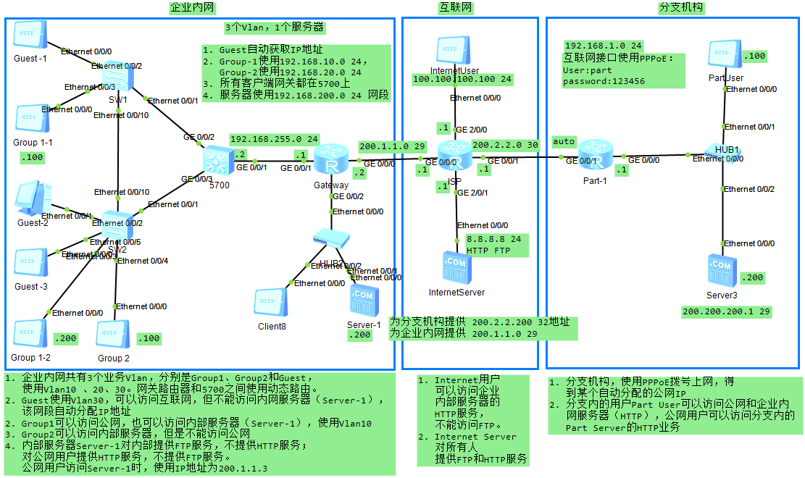

## 一、HCNA综合实验



```
# SW1配置
vlan batch 10 20 30
interface Ethernet0/0/1
 port link-type trunk
 port trunk allow-pass vlan 2 to 4094
interface Ethernet0/0/2
 port link-type access
 port default vlan 30
interface Ethernet0/0/3
 port link-type access
 port default vlan 10
interface Ethernet0/0/10
 port link-type trunk
 port trunk allow-pass vlan 2 to 4094

# SW2配置
vlan batch 10 20 30
interface Ethernet0/0/1
 port link-type trunk
 port trunk allow-pass vlan 2 to 4094
interface Ethernet0/0/2
 port link-type access
 port default vlan 30
interface Ethernet0/0/3
 port link-type access
 port default vlan 10
interface Ethernet0/0/4
 port link-type access
 port default vlan 20
interface Ethernet0/0/5
 port link-type access
 port default vlan 30
interface Ethernet0/0/10
 port link-type trunk
 port trunk allow-pass vlan 2 to 4094
 
# 5700配置
vlan batch 10 20 30
acl number 3001
 rule 5 permit icmp
 rule 10 deny ip source 192.168.30.0 0.0.0.255 destination 192.168.0.0 0.0.255.255
ip pool vlan10  # 多个DHCP地址池默认按照网关所属Vlan获取地址
 gateway-list 192.168.10.1
 network 192.168.10.0 mask 255.255.255.0
 dns-list 192.168.10.1
ip pool vlan20
 gateway-list 192.168.20.1
 network 192.168.20.0 mask 255.255.255.0
 dns-list 192.168.20.1
ip pool vlan30
 gateway-list 192.168.30.1
 network 192.168.30.0 mask 255.255.255.0
 dns-list 192.168.30.1
interface Vlanif1  #g0/0/1 所属接口，由于是2层，所以需要对它所属的虚拟口配置IP地址 
 ip address 192.168.255.2 255.255.255.0
interface Vlanif10
 ip address 192.168.10.1 255.255.255.0
 dhcp select global
interface Vlanif20
 ip address 192.168.20.1 255.255.255.0
interface Vlanif30
 ip address 192.168.30.1 255.255.255.0
 dhcp select global
interface GigabitEthernet0/0/1
 port link-type trunk
 port trunk allow-pass vlan 2 to 4094
interface GigabitEthernet0/0/2  # 三层交换机ACL不在VlanIF端口，而在实体端口配置
 port link-type trunk
 port trunk allow-pass vlan 2 to 4094
 traffic-filter inbound acl 3001
interface GigabitEthernet0/0/3   # 三层交换机ACL不在VlanIF端口，而在实体端口配置
 port link-type trunk
 port trunk allow-pass vlan 2 to 4094
 traffic-filter inbound acl 3001
rip 1
 undo summary
 version 2
 network 192.168.10.0
 network 192.168.20.0
 network 192.168.30.0
 network 192.168.255.0
ip route-static 0.0.0.0 0.0.0.0 192.168.255.1

# Gateway配置 
acl number 2001  # 用于配置Easy IP
 rule 5 permit source 192.168.0.0 0.0.255.255 
acl number 3001  
 rule 5 permit icmp 
 rule 6 permit udp destination-port eq rip 
 rule 10 permit ip source 192.168.20.0 0.0.0.255 destination 192.168.0.0 0.0.255.255 
 rule 15 deny ip source 192.168.20.0 0.0.0.255 
 rule 20 deny tcp source 192.168.0.0 0.0.255.255 destination 192.168.200.200 0 destination-port eq www 
interface GigabitEthernet0/0/0
 ip address 200.1.1.2 255.255.255.248 
 nat server protocol tcp global 200.1.1.3 www inside 192.168.200.200 www
 nat outbound 2001
interface GigabitEthernet0/0/1
 ip address 192.168.255.1 255.255.255.0 
 traffic-filter inbound acl 3001
 nat server global 200.1.1.3 inside 192.168.200.200
interface GigabitEthernet0/0/2
 ip address 192.168.200.1 255.255.255.0 
rip 1
 undo summary
 version 2
 network 192.168.200.0
 network 192.168.255.0  # RIP宣告网络时一定要宣告两路由器的直连网段
ip route-static 0.0.0.0 0.0.0.0 200.1.1.1

# ISP配置
ip pool pppoe1
 gateway-list 200.2.2.1 
 network 200.2.2.0 mask 255.255.255.252 
aaa 
 local-user part password cipher 123456
 local-user part service-type ppp
interface Virtual-Template1
 ppp authentication-mode pap 
 remote address pool pppoe1
 ip address 200.2.2.1 255.255.255.252 
interface GigabitEthernet0/0/0
 ip address 200.1.1.1 255.255.255.248 
interface GigabitEthernet0/0/1
 pppoe-server bind Virtual-Template 1
interface GigabitEthernet2/0/0
 ip address 100.100.100.1 255.255.255.0 
interface GigabitEthernet2/0/1
 ip address 8.8.8.1 255.255.255.0 
rip 1
 undo summary
 version 2
 network 8.0.0.0
 network 100.0.0.0
ip route-static 200.200.200.0 255.255.255.248 200.2.2.2

# Part1配置
acl number 2001  
 rule 5 permit source 192.168.1.0 0.0.0.255 
interface Dialer1
 link-protocol ppp
 ppp pap local-user part password cipher 123456
 ip address ppp-negotiate
 dialer user jct
 dialer bundle 1
 dialer-group 1
 nat server protocol tcp global 200.200.200.1 www inside 192.168.1.200 www
 nat outbound 2001
interface GigabitEthernet0/0/0
 ip address 192.168.1.1 255.255.255.0 
interface GigabitEthernet0/0/1
 pppoe-client dial-bundle-number 1 
dialer-rule
 dialer-rule 1 ip permit
ip route-static 0.0.0.0 0.0.0.0 200.2.2.1
```

