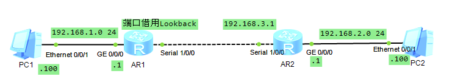
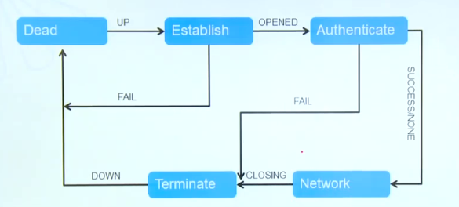
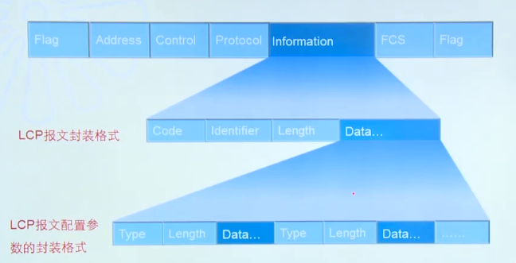
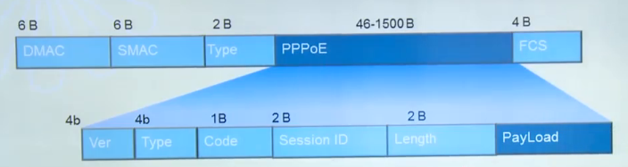
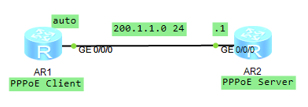
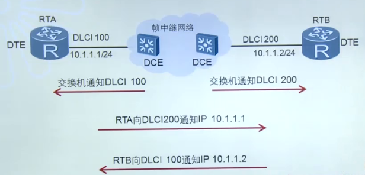
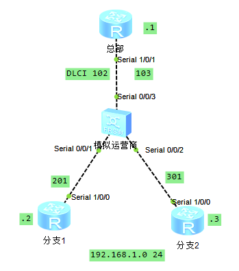
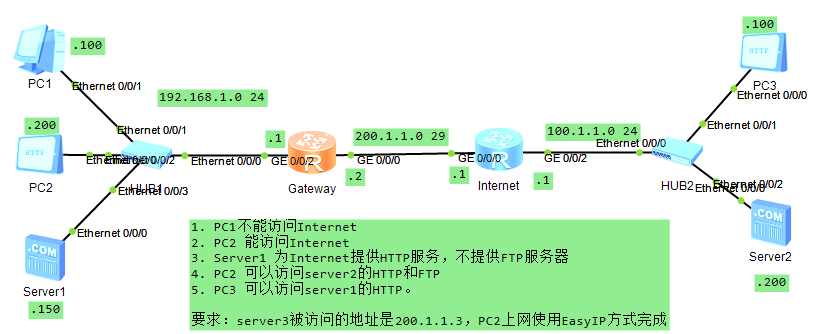

## 一、通过广域网连接Internet

### 1. HDLC与PPP原理与配置

广域网中经常会使用串行链路来提供远距离的数据传输，高级数据链路控制HDLC（High-Level Data Link Control）和点对点协议PPP（Point to Point Protocol）是两种典型的串口封装协议。

#### 1.1 串行链路的数据传输方式

异步传输与同步传输，现在更多用到同步的传输（基于DCE时钟同步）。

#### 1.2 HDLC基本配置

```
interface Serial 1/0/0
link-protocol hdlc
 ip address 10.0.1.1 30  # 这里一定要配置 30，否则有可能造成网络环路
```

#### 1.3 HDLC接口地址借用

```
interface Serial 1/0/0
link-protocol hdlc
 ip address unnumbered interface lookBack 0  # 串行接口可以借用Lookback接口的IP地址和对端建立连接
ip route-static 10.1.10 24 Serial 1/0/0
```

地址借用可以省公网地址。

以太网是多路访问的，需要寻址，绝对不能地址借用。只有点对点的线路才能进行地址借用。



```
# AR1配置
interface Serial1/0/0
 link-protocol hdlc
 ip address unnumbered interface LoopBack0
interface GigabitEthernet0/0/0
 ip address 192.168.1.1 255.255.255.0 
interface LoopBack0
 ip address 10.10.1.1 255.255.255.255 
ip route-static 192.168.2.0 255.255.255.0 Serial1/0/0  # IP借用的使用静态路由需要用串口

# AR2配置
interface Serial1/0/0
 link-protocol hdlc
 ip address 192.168.3.1 255.255.255.252 
interface GigabitEthernet0/0/0
 ip address 192.168.2.1 255.255.255.0 
ip route-static 192.168.1.0 255.255.255.0 Serial1/0/0
```

### 2. PPP协议

PPP协议是一种点到点链路层协议，主要用于在全双工的同异步链路上进行点到点的数据传输

#### 2.1 PPP组件

| 名称                                         | 作用                                         |
| -------------------------------------------- | -------------------------------------------- |
| 链路控制协议<br />Link Control Protocol      | 用来建立、拆除和监控PPP数据链路              |
| 网络层控制协议<br />Network Control Protocol | 用于对不同的网络层协议进行连接建立和参数协商 |

#### 2.2 PPP链路建立过程



#### 2.3 PPP帧格式



##### 2.3.1 LCP报文

| 报文类型          | 作用                                                         |
| ----------------- | ------------------------------------------------------------ |
| Configure-Request | 包含发送者试图与对端建立连接时使用的参数列表                 |
| Configure-Ack     | 表示完全接受对端发送的Configure-Request的参数取值            |
| Configure-Nak     | 表示对端发送的Configure-Request中的某些参数取值在本端不被认可 |
| Configure-Reject  | 表示对端发送的Configure-Request中的某些参数本端不能识别      |

##### 2.3.2 LCP协商参数

| 参数            | 作用                                                         | 缺省值   |
| --------------- | ------------------------------------------------------------ | -------- |
| 最大接收单元MRU | PPP数据帧中Information字段和Padding字段的总长度              | 1500字节 |
| 认证协议        | 认证对端使用的认证协议                                       | 不认证   |
| 魔术字          | 魔术字为一个随机产生的数据，用于检测链路环路，如果收到的LCP报文中<br />的魔术字和本端产生的魔术字相同，则认为链路有环路 | 启用     |

#### 2.4 PPP基本配置

```
interface Serial 1/0/0
link-protocol ppp
ip address 10.0.1.1 30  # 这里一定要配置 30，否则有可能造成网络环路
```

#### 2.5 PPP认证

##### 2.5.1 PPP-PAP认证

PPP是单向认证。认证方检查被认证方发送的用户名和密码信息是否正确。

Authentication-Request 明文发送用户名和密码 -> Authenticate-Ack/Authenticate-Nak

##### 2.5.2 PPP-CHAP认证

CHAP可以使用Challenge加密密码信息，与收到的加密密码信息做比较。

1. 认证方：发送Challenge    
2. 被认证方：根据Challenge加密自己的密码，发送Response
3. 认证方：发送Success/Failure

#### 2.6 IPCP地址协商

##### 2.6.1 静态地址协商

认证完成后，继续发送Configure报文协商IP地址。

1. 被认证方：Configure-Request(10.1.1.1)
2. 认证方：Configure-Ack
3. 认证方：Configure-Request(10.1.1.2)
4. 被认证方：Configure-Ack

##### 2.6.2 动态地址协商

1. 被认证方：Configure-Request(0.0.0.0)
2. 认证方：Configure-Nak(10.1.1.1)
3. 被认证方：Configure-Request(10.1.1.1)
4. 认证方：Configure-Ack
5. 认证方：Configure-Request(10.1.1.2)
6. 被认证方：Configure-Ack

#### 2.7 PPP认证配置

```
认证方:
aaa
 local-user pppuser password cipher 123456
 local-user pppuser service-type ppp
interface Serial1/0/0
 ppp authentication-mode pap

被认证方：
interface Serial1/0/0
 ppp pap local-user pppuser password simple 123456
```

如果是CHAP，还需要配置地址协商。

### 3 PPPoE原理与客户端配置

数字用户线路DSL（Digital Subscriber Line）是以电话线为传输介质的传输技术，人们通常把所有的DSL技术统称为xDSL，x代表不同种类的数字用户线路技术。目前比较流行的宽带接入方式为ADSL，ADSL是非对称DSL技术，使用的是PPPoE（PPP over Ethernet）协议。

PPPoE协议通过在以太网上提供点对点的连接，建立PPP会话，使得以太网中的主机能够连接到远端的宽带接入服务器上。PPPoE具有适用范围广、安全性高、计费方便等特点。

#### 3.1 DSL应用场景

数字用户线路DSL是以电话线为传输介质的传输技术。

#### 3.2 PPPoE会话建立过程

| 阶段         | 描述                                          |
| ------------ | --------------------------------------------- |
| 发现阶段     | 获取对方以太网地址，以及确定唯一的PPPoE会话   |
| 会话阶段     | 包含两部分：PPP协商阶段和PPP报文传输阶段      |
| 会话终结阶段 | 会话建立以后的任意时刻，发送报文结束PPPoE会话 |

#### 3.3 PPPoE报文



PPPoE报文是使用Ethernet格式来进行封装的。

| 类型 | 描述                      |
| ---- | ------------------------- |
| PADI | PPPoE发现初始报文（广播） |
| PADO | PPPoE发现提供报文         |
| PADR | PPPoE发现请求报文         |
| PADS | PPPoE发现会话确认报文     |
| PADT | PPPoE发现终止报文         |

PPPoE通过这五种类型的报文来建立和终结PPPoE会话。

#### 3.4 PPPoE发现阶段

1. 客户端通过广播发送PADI报文来发现接入服务器
2. PPPoE服务器收到PADI报文之后，将客户端请求的服务与自己能够提供的服务进行比较，如果可以提供，则单播回复PADO。
3. PPPoE客户端选择最先收到的PADO报文对应的PPPoE服务器，并单播发送一个PADR报文
4. PPPoE服务器生成唯一的PPPoE Session ID，并发送PADS报文给客户端，会话建立成功

#### 3.5 PPPoE会话阶段

1. PPPoE会话上的PPP协商和普通的PPP协商方式一致，分为LCP、认证、NCP三个阶段。
2. PPPoE会话的PPP协商成功后，就可以传输PPP数据（即上网真实数据）。

#### 3.5 PPPoE会话终结

PADT报文用于通知对端PPPoE会话结束。

#### 3.6 PPPoE配置



```
# Server配置
ip pool pool1  # 创建未对端分配的IP地址池 
 gateway-list 200.1.1.1 
 network 200.1.1.0 mask 255.255.255.0 
aaa  # 分配PPPoE的用户名密码
 local-user pppuser password cipher 123456
 local-user pppuser service-type ppp
interface Virtual-Template1  # 配置虚拟模板，用来方便多个PPPoE客户端接入时使用该模板，多个客户端时加入交换机？
 ppp authentication-mode pap 
 remote address pool pool1
 ip address 200.1.1.1 255.255.255.0 
interface GigabitEthernet0/0/0  # 将模板绑定到某个实际端口
 pppoe-server bind Virtual-Template 1
 
# Client配置
interface Dialer1  # 拨号接口
 link-protocol ppp
 ppp pap local-user pppuser password cipher 123456
 ip address ppp-negotiate  # 设定IP地址由服务器分配 
 dialer user hcna  # 指定拨号口使用的dialer user
 dialer bundle 1  # 指定拨号口使用的Bundle
 dialer-group 1  # 指定拨号口所属的拨号访问组
interface GigabitEthernet0/0/0  # 绑定到实体端口
 pppoe-client dial-bundle-number 1
dialer-rule  # 拨号规则配置，这里是有IP则进行
 dialer-rule 1 ip permit
```

### 4. 帧中继原理与配置

帧中继FR（Frame Relay）协议工作在OSI参考模型的数据链路层，是一种主要应用在运营商网络中的广域网技术。当企业网络需要使用帧中继技术与运营商网络相连时，管理员也需要了解帧中继的工作原理，并具备相应的故障处理能力。

#### 4.1 帧中继的应用场景

企业的总部和分支机构可以通过运营商的帧中继网络相连。帧中继是专线技术的一种。

#### 4.2 帧中继网络

帧中继网络提供了用户设备之间进行数据通信的能力。

用户设备被称作数据终端设备DTE。为用户设备提供网络接入的设备被称为数据电路终结设备DCE。

#### 4.3 虚电路

帧中继网络采用虚电路来连接网路两端的帧中继设备。即运营商让不同的用户来共享一套设备，并且互不干涉。类似局域网中的Vlan。

每条虚电路采用数据链路连接标识符DLCI来进行标识。

##### 4.3.1 LMI协商过程

本地管理接口LMI协议通过状态查询报文和状态应答报文维护帧中继的链路状态和PVC状态。可以通过LMI确定DLCI标识。

1. DTE：状态查询消息；
2. DCE：状态应答消息；
3. DCE：决定链路状态和PVC状态

##### 4.3.2 Inverse ARP协商过程



逆向地址解析协议（Inverse ARP）的主要功能是获取虚电路对端设备的IP地址。

##### 4.3.3 帧中继和水平分割


RTB通告给RTA一条路由信息，但由于水平分割机制，RTA不能通过接受此路由信息的S1/0/0接口将此路由信息转发给RTC。

解决办法：在每个物理接口上配置多个子接口，每个子接口使用一条虚电路连接到对端的路由器，这样可以解决水平分割带来的问题。

##### 4.3.4 帧中继配置-动态映射



```
# 总部配置
interface Serial1/0/1
 link-protocol fr
 ip address 192.168.1.1 255.255.255.0 
# 分支1配置
interface Serial1/0/0
 link-protocol fr
 ip address 192.168.1.2 255.255.255.0 
# 模拟运营商添加两个DLCI 102 及 201
```

##### 4.3.3 帧中继配置-静态映射

```
# 总部配置
interface Serial1/0/1
 link-protocol fr
 undo fr inarp
 ip address 192.168.1.1 255.255.255.0 
 fr map ip 192.168.1.2 102 broadcast
# 分支1配置
interface Serial1/0/0
 link-protocol fr
 undo fr inarp
 ip address 192.168.1.2 255.255.255.0 
 fr map ip 192.168.1.1 201 broadcast
```

以上配置可以使分支1和分支2跟总部进行通信，但是分支1与分支2无法通信。需要再次进行映射，这样配置可以通过总部进行互相通信。

```
fr map ip 192.168.1.2 301 broadcast
fr map ip 192.168.1.3 201 broadcast
```

### 5. NAT原理及配置

网络地址转换技术NAT（Network Address Translation）主要用于实现位于内部网路的主机访问外部网络的功能。当局域网内的主机需要访问外部网络时，通过NAT技术可以将其私网地址转换为公网地址，并且多个私网用户可以共用一个公网地址，这样既可保证网络互通，又节省了公网地址。

#### 5.1 NAT应用场景

企业所使用的网络为私有网络，使用的是私用地址；运营商维护的网络为公共网络，使用的是公网地址。私有地址不能再公网中路由。NAT一般部署在连接内网和外网的网关设备上。

#### 5.2 静态NAT

静态NAT实现了私有地址和公网地址的一对一映射。一个公网IP只会分配给唯一且固定的内网地址。

```
# 在路由器出口端口做静态NAT
[r1-GigabitEthernet0/0/1]nat static global 200.1.1.3 inside 192.168.1.100
[r1-GigabitEthernet0/0/1]nat static global 200.1.1.4 inside 192.168.1.200
```

#### 5.3 动态NAT

动态NAT基于地址池来实现私有地址和公有地址的转换。、

```
acl number 2000  
 rule 5 permit source 192.168.1.0 0.0.0.255 
nat address-group 1 200.1.1.3 200.1.1.4  # 建立一个NAT组
interface GigabitEthernet0/0/1
 ip address 200.1.1.2 255.255.255.248 
 nat outbound 2000 address-group 1 no-pat
```

#### 5.4 NAPT

网络地址端口转换NAPT允许多个内部地址映射到同一个公有地址的不同端口。

##### 5.4.1 Easy IP 

Easy IP时NAPT的一种实现方式，允许将多个内部地址映射到网关出接口地址上的不同端口。

```
acl number 2000  
 rule 5 permit source 192.168.1.0 0.0.0.255 
interface GigabitEthernet0/0/1
 ip address 200.1.1.2 255.255.255.248 
 nat outbound 2000 
```

#### 5.5 NAT服务器映射

通过配置NAT服务器，可以时外网用户访问内网服务器。

```
nat server protocol tcp global current-interface www inside 192.168.1.3 www
```

#### 5.6 NAT综合模拟



```
# Gateway配置
acl number 2000  
 rule 4 deny source 192.168.1.100 0 
 rule 5 permit source 192.168.1.0 0.0.0.255 
interface GigabitEthernet0/0/0
 ip address 200.1.1.2 255.255.255.248 
 nat server protocol tcp global 200.1.1.3 www inside 192.168.1.150 www
 nat outbound 2000
interface GigabitEthernet0/0/2
 ip address 192.168.1.1 255.255.255.0 
ip route-static 0.0.0.0 0.0.0.0 200.1.1.1

# Internet配置
interface GigabitEthernet0/0/0
 ip address 200.1.1.1 255.255.255.248 
interface GigabitEthernet0/0/2
 ip address 100.1.1.1 255.255.255.0 
```

### 


