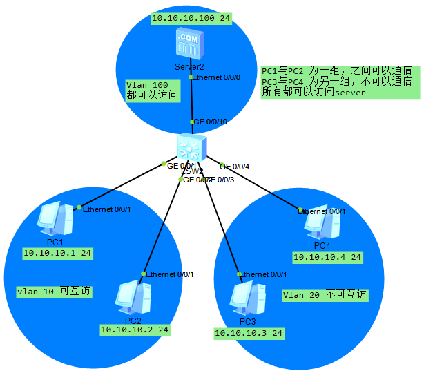

## 一、Vlan高级特性与配置

### 1. Mux Vlan基本原理及配置 

Mux Vlan提供了一种在Vlan端口间进行二层流量隔离的机制，可以实现同一Vlan下的访问隔离。



```
vlan batch 10 20 100
vlan 100
 mux-vlan  # 配置主Vlan
 subordinate group 10  # 配置MUX VLAN中的互通型从属Vlan
 subordinate separate 20  # 配置MUX VLAN中的隔离型从属Vlan
int g0/0/1
 port link-type access
 port default vlan 10
 port mux-vlan enable
int g0/0/2
 port link-type access
 port default vlan 10
 port mux-vlan enable
int g0/0/3
 port link-type access
 port default vlan 20
 port mux-vlan enable
int g0/0/4
 port link-type access
 port default vlan 20
 port mux-vlan enable
int g0/0/10
 port link-type access
 port default vlan 100
 port mux-vlan enable
```

### 2. Super Vlan原理

Vlan聚合，只在super-Vlan接口上配置IP地址，而不必为每个sub-Vlan分配IP地址。所有sub-Vlan共用IP网段，解决了IP地址资源浪费的问题。

### 3. ARP Proxy

当主机上没有配置缺省网关地址，它可以发送一个ARP请求，请求目的主机的MAC地址。使能ARP Proxy功能的交换机收到这样的请求后，会使用自己的MAC地址作为该ARP请求的回应，使得处于不同物理网络但网络号相同的主机之间可以正常的相互通信。

#### 3.1 ARP Proxy方式

| ARP Proxy方式   | 解决的问题                                                 |
| --------------- | ---------------------------------------------------------- |
| 路由式ARP Proxy | 解决同一网段不同物理网络上计算机的互通问题                 |
| Vlan内ARP Proxy | 结局相同Vlan内，且VLAN配置用户隔离后的网络上计算机互通问题 |
| Vlan间ARP Proxy | 解决不同Vlan之间对应计算机的三层互通问题                   |

```
vlanif 10
 arp-proxy enable  # 路由式
```

### 4. Vlan mapping

Vlan Mapping叫做Vlan translation，可以实现用户Vlan ID（私有Vlan）和运营商Vlan ID（业务VLan，也可以说是公有Vlan）之间相互转换的一个功能。

```
int g0/0/0
 port link-type trunk
 port trunk allow-pass vlan 100
 qinq vlan-translation enable  # 开启接口VLan转换功能
 port vlan-mapping vlan 1 to 20 map-vlan 100  # 配置接口上Vlan 1~20 的报文mapping成Vlan 100
```

### 5. 端口隔离

端口隔离是交换机端口之间的一种访问控制。可以在端口之间拒绝访问。

```
port-isolate mode all  # 配置端口隔离模式
inte g2/0/1
 port-isolate enable  # 在端口中启用端口隔离功能
inte g2/0/2
 port-isolate enable  # 在端口中启用端口隔离功能
```

### 6. QinQ技术原理与配置

QinQ协议在用户私网VLAN tag之外封装公网VLAN tag，在公网中报文只根据公网VLAN tag传播。QinQ为用户提供一种较为简单的二层VPN隧道。

#### 6.1 QinQ概述

QinQ是基于802.1Q封装的隧道协议，报文封装双层Vlan Tag。

#### 6.2 QinQ优点

1. 解决日益紧缺的公网VLAN ID资源问题
2. 用户可以规划自己的私网VLAN ID
3. 提供一种较为简单的二层VPN解决办法
4. 使用户网络具有较高的独立性

#### 6.3 QinQ的分类

根据QinQ的具体实现方式，通常分为如下几类：

1. 基于端口的QinQ：基于端口的基本QinQ，配置了该功能的端口，设备会为从此端口进入的报文打上一层VLAN ID为端口PVID的外层VLAN tag。它通过配置端口类型为dot1q-tunnel实现，当端口类型为dot1q-tunnel时，该端口加入的VLAN不支持二层组播功能。

2. 灵活QinQ：VLAN Stacking

   灵活QinQ根据指定条件为入报文加一层S-VLAN tag。

   指定条件：入报文外层VLAN的范围或VLAN+802.1P，仅指定报文802.1P优先级时，不关注报文外层VLAN的具体值，只要外层VLAN的802.1P优先级匹配就会打上S-VLAN tag。

   通过在端口配置VLAN Stacking实现。

   优势：相对基于端口的QinQ，灵活QinQ可以根据入报文的外层VLAN及802.1P来选择加或不加S-VLAN tag，并且S-VLAN tag可配置。

3. 基于流的灵活QinQ：基于ACL的灵活QinQ

   基于流的灵活QinQ通过全局配置流分类、流行为，再将流策略绑定流分类和流行为来实现。

   优势：相对灵活QinQ，基于流的灵活QinQ还可以根据入报文的内层VLAN的属性来加S-VLAN tag，配置范围更加灵活。如：内层VLAN、内层VLAN + 802.1P、外层VLAN、外层VLAN + 802.1P等属性

#### 6.4 QinQ的配置

