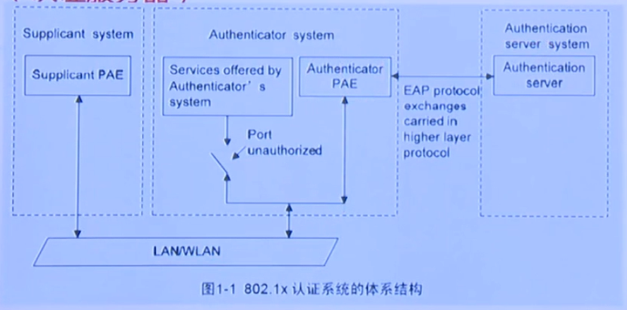

## 一、接入层技术

在企业网络中，任何一台终端的安全状态都将直接影响到整个网络的安全。而传统针对病毒的防御体系是以孤立的单点防御为主，这样的分散管理无法避免诸多的安全威胁。

### 1. NAC技术简介

企业内网安全面临的主要问题是内部威胁（高达60%），而终端是威胁的主要来源：

1. 终端不能及时打系统补丁
2. 员工绕过防火墙访问互联网
3. 员工未安装防病毒软件
4. 员工忘记设置必要的口令

现有安全设备难以有效保护网络：

1. 无法检查网络内计算机的安全状况
2. 缺乏对合法终端滥用网络资源的安全管理
3. 无法防止恶意终端的蓄意破坏

所以，需要考虑内部网络安全，强化内防内控，从终端入手强化弱点管理。

1. 终端接入控制：防止非法终端的接入，降低不安全终端的威胁；
2. 终端访问授权：防止合法终端越权访问，保护企业核心资源；
3. 终端安全健康性检查与策略管理：帮助企业落实安全管理制度；
4. 员工行为管理与违规审计：强化行为审计防止恶意终端破坏。

NAC（Network Access Control）：也称为网络接入控制，是思科最先提出的一种“端到端”的安全结构。

微软的NAP（网络访问保护）也是一种网络接入隔离控制技术，与NAC框架类似，服务器集成在Server系统中，客户端集成在Vista中。NAP服务器与客户端配合对于不符合当前系统运行状况要求的计算机进行强制受限网络访问。

H3C的EAD（Endpoint Admission Defense）称为端点准入防御。

#### 1.1 NAC关键组件

NAC包含三个关键组件：通信代理、网络访问控制设备和策略服务器。

华为S系列交换机可用于网络访问控制设备。策略服务器用来检测用户名密码等。

#### 1.2 NAC认证方式

针对不同场景，NAC提供了灵活的接入控制方式：

1. 802.1x认证接入（包括旁路认证）
2. MAC地址认证接入
3. Web认证接入

S9300除了上述NAC认证方式之外，还支持直接认证。

### 2. 802.1x工作原理

#### 2.1 802.1x体系结构

802.1x系统为典型的C/S体系，包括三个实体：Supplicant system（客户端）、Authenticator system（设备端，即交换机等）和Authentication server system（认证服务器）。



#### 2.2 Guest VLAN

开启Guest VLAN后，未获认证授权的用户，被临时加入GUEST VLAN，只能访问受限的部分资源（规划在GUEST VLAN中）

未开启GUEST VLAN时，用户在通过认证之前，不能访问任何网络资源。

对于dot1x且端口配置为port-based情况，交换机将组播触发认证报文。

- 若达到最大发送次数后仍无用户响应，端口就加入GUEST VLAN，端口下所有用户只能访问受限资源。
- 若有其他用户认证成功，端口将推出Guest VLAN，进入授权状态。

#### 2.3 静默功能

为避免用户发送大量能启动认证流程的报文，导致设备不停地向RADIUS服务器发起认证请求，浪费设备和RADIUS服务器的处理资源，交换机需要提供静默功能。

启用静默功能后，在用户认证失败后的一段时间（静默周期，可配置）内，认证模块讲不处理用户的认证报文。

### 3. 802.1x基本配置

NAC特性部署时与周边交互的模块比较多，各模块间协同工作需要正确配置，若配置不当，常会导致认证失败。

```
radius-server template server-1  # 创建radius模板
 radius-server shared-key simple hello  # 配置RADIUS服务器密钥
 radius-server authentication 10.10.1.120 1812  # 配置RADIUS主用认证服务器的IP地址、端口
 radius-server retransmit 2  # 配置重传次数

authentication-scheme dot1x  # 定义认证模板，dot1x为模板名称
 authentication-mode radius
 
domain 802.1x  # 定义认证域
 authentication-scheme dot1x
 radius-server server-1
 
dot1x enable  # 全局模式启用dot1x
interface GigabitEthernet0/0/1  
 dot1x enable  # 接口下启用dot1x
 dot1x mac-bypass  # 配置允许接入的最大用户数
 dot1x max-user 100  # 配置MAC旁路认证
 
# 可选配置
dot1x authentication-method {chap|eap|pap}  # 配置dot1x认证模式，默认chap
dot1x dhcp-trigger  # 启用DHCP报文触发dot1x认证功能
dot1x guest-vlan  # 配置接口guest vlan功能
dot1x port-control {auto|authorized-force|unauthorized-force}  # 配置端口控制模式
dot1x port-method {mac|port}  # 配置端口接入方式，即基于MAC（用户）还是基于端口
```

