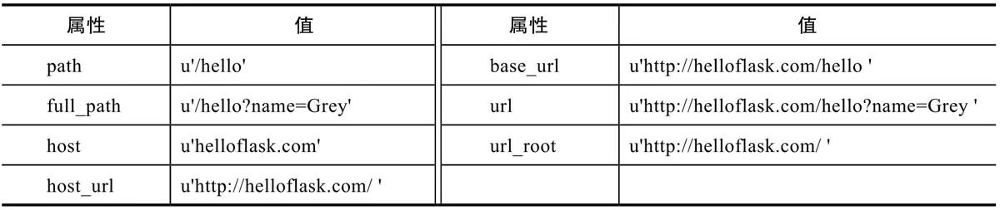
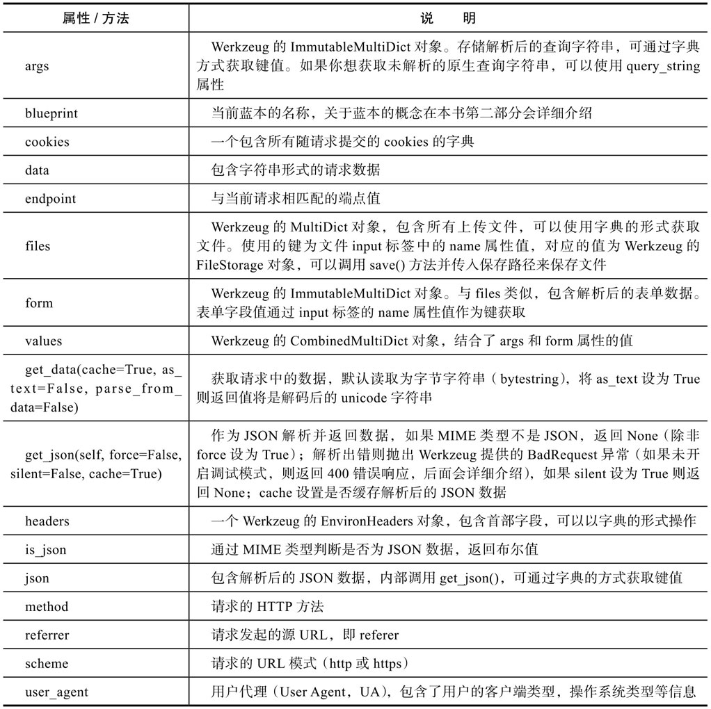

### 一、Flask基础

#### 1. Flask组成

Flask集成了Werkzeug以及Jinja，其中Werkzeug实现了WGSI。

#### 2. Pipenv

使用Pipenv可以用来更好地管理Python虚拟环境以及依赖包。

##### 2.1 常用命令

```python
pipenv insall  # 为当前项目创建虚拟环境，并且安装基本的包以及Pipfile文件中列出的依赖包
pipenv shell  # 显式地激活虚拟环境
pipenv run python hello.py  # （非虚拟环境）执行命令
pipenv graph  # 查看当前环境下的依赖情况
pip list  # 查看依赖列表
pipenv update flask  # 更新依赖包
pipenv --venv  # 查看项目对应的虚拟环境路径
```

##### 2.2 要点

Pipenv的管理依赖两个文件：Pipfile和Pipfile.lock文件。前者用来记录项目依赖包列表，后者记录了固定版本的详细依赖包列表。

在创建虚拟环境时，如果项目根目录下没有Pipfile文件，pipenv install命令会在项目文件夹根目录下创建.Pipfile和Pipfile.lock文件，当使用Pipenv安装/删除/更新依赖包时，Pipfile以及Pipfile.lock会自动更新。

开发依赖在使用pipenv install命令时需要添加额外的 --dev选项才会安装dev-packages部分定义的开发依赖包。

#### 3. Flask使用

##### 3.1 创建Flask实例

```python
from flask import Flask
app = Flask(__name__)  # __name__代表本模块
```

##### 3.2 Flask路由

1. 一个视图函数可以绑定多个URL

   ```python
   @app.route('/hi')
   @app.route('/hello')
   def say_hello():
       return '<h1>Hello, Flask!</h1>'
   ```

2. 动态URL

   ```python
   @app.route('/greet', defaults={'name': 'Programmer'})  # 变量添加默认值
   @app.route('/greet/<name>')  # <name>就是变量名的形式
   def greet(name):
       return '<h1>Hello, %s!</h1>' % name
   ```

#### 4. 命令行交互界面 CLI

CLI：Command Line Interface，命令行交互界面。

Flask通过依赖包Click内置CLI，安装Flask后，环境会自动添加一个flask命令脚本，我们可以通过flask命令执行内置命令、扩展提供的命令或是我们自己定义的命令。

##### 4.1 常用flask命令

```python
flask run  # 启动内置的开发服务器
flask --help  # 查看所有可用的命令
flask run --host=0.0.0.0  # 使服务器对外可见
flask run --port=80000  # 使服务器对外可见
```

##### 4.2 自定义flask命令

通过app.cli.command()装饰器，我们就可以注册一个flask命令。此时，函数的名称即为命令名称。可以使用flask func_name来触发函数。也可以在装饰器中传入参数来设置命令名称。

#### 5. 环境变量

Flask依靠环境变量对程序的功能、数据进行配置。

##### 5.1 常用环境变量

Flask内置的命令，都可以通过配置环境变量定义默认选项值，格式为：`FLASK_<COMMAND>_<OPTION>`

- FLASK_ENV：用来配置服务器是生产环境还是测试环境。

  ```python
  FLASK_ENV=development  # 配置为开发环境，此时调试模式（Debug Mode）将被开启，程序会自动激活Werkzeug内置的调试器（debugger）和重载器（reloader），它们会为开发带来很大的帮助。
  FLASK_ENV=production  # 配置为生产环境
  ```

  调试器：用来调试代码，错误追踪信息等。

  重载器：监测文件变动，然后重新启动开发服务器。默认会使用Werkzeug内置的stat重载器，但是它的缺点是耗电较严重，而且准确性一般。我们一般安装另一个用于检测文件变动的Python库Watchdog，安装后Werkzeug会自动使用它来监测文件变动。

- FLASK_RUN_HOST：配置服务器host

- FLASK_RUN_PORT：配置服务器端口

**以上配置需要结合Python-dotenv使用。**

##### 5.2 Python-dotenv使用

Python-dotenv：进行环境变量以及程序数据的的管理。它会生成两个文件：.flaskenv以及.env。.flaskenv用来存储和flask相关的公开环境变量，而.env用来存储包含敏感信息的环境变量

一般来说，在执行flask run命令运行程序前，我们需要提供程序实例所在模块的位置。我们可以通过Flask run直接运行程序，是因为Flask会自动探测程序实例，自动探测存在下面的规则：

1. 从当前目录寻找app.py和wsgi.py模块，并从中寻找名为app或application的程序实例；
2. 从环境变量FLASK_APP对应的值寻找名为app或application的程序实例；
3. 如果安装了python-dotenv，那么在使用flask run或其他命令时会使用它自动从.flaskenv文件和.env文件中加载环境变量。

当安装了python-dotenv时，Flask在加载环境变量的优先级是：手动设置的环境变量 > .env中设置的环境变量 > .flaskenv设置的环境变量

##### 5.3 环境变量的配置

1. 临时配置

   在Flask环境下通过命令配置：

   ```python
   set FLASK_APP=xxxx  # Windows下设置
   export FLASK_APP=xxxx  # Linux下设置
   ```

2. 持久配置，通过python-dotenv在.flaskenv文件中以健值对的形式配置。

   ```
   VAR = 1
   ```

#### 6. Git的gitignore提交参考

Python项目的.gitgnore模板可以参考 https://github.com/github/gitignore/blob/master/Python.gitignore。

使用PyCharm编写程序时会产生一些配置文件，这些配置文件保存在 .idea 目录下，关于这些文件的忽略设置可以参考 https://www.gitignore.io/api/pycharm。

#### 7. Python Shell

Python Shell就是执行Python交互式解释器，Flask也提供了内置的Shell来启动Python解释器。Flask Shell 自动包含程序上下文，并且已经导入了App实例。

#### 8. Flask扩展

Flask中大部分扩展都遵循Flask的约定。它们都会提供一个扩展类，实例化这个类，并传入我们常见的程序实例App作为参数，即可完成初始化。通常，扩展会在传入的程序实例上注册一些处理函数，并加载一些配置。

#### 9. 配置变量

在Flask中，配置变量就是一些大写形式的Python变量，可以称之为配置参数或配置键。使用统一的配置变量可以避免在程序中以硬编码的形式设置程序。

配置的名称必须是全大写形式，小写的变量将不会被读取。

在Flask中，可以将配置变量存储在单独的Python脚本中、JSON格式的文件或是Python类中。也可以像操作字典一样操作。

我们应该尽量将加载配置的操作提前，最好在程序实例app创建后就加载配置。

#### 10. 模板和静态文件

默认情况下，模板文件存放在项目根目录中的templates文件夹中，静态文件存放在static文件夹下，这两个文件夹需要和包含程序实例的模块处于同一个目录下。

### 二、Flask与HTTP

#### 1. Request对象

Request对象封装了从客户端发来的请求报文。可以从它获取请求报文中的所有数据。包括：





> Multi Dict类是字典的子类，它主要实现了同一个键对应多个值的情况。而Immutable Multi Dict类继承了Multi Dict类，但其值不可更改。

#### 2. Flask对请求的处理

为了便于将请求分发到对应的视图函数，程序实例中存储了一个路由表（app.url_map），其中定义了URL规则和视图函数的映射关系。处理请求时，如果找到对应的视图，会直接调用函数；如果未找到对应的视图，则返回404（资源未找到）错误。

使用flask routes命令可以查看程序中定义的所有路由，这个列表由app.url_map解析得到。

##### 2.1 