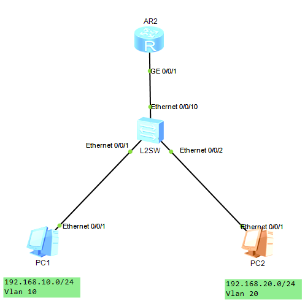

## 一、多个网段之间相互访问

### 1. IP路由基础

路由是将数据报文从一个子网转发到另一个子网的行为。

### 2. 路由协议

路由协议定义了一套路由器之间通信时使用的规则，它维护路由表，提供最佳转发路径

#### 2.1 路由协议分类

1. 按照范围分类
   - IGPS：RIP、OSPF、ISIS等
   - EGPS：BGP等
2. 按照算法分类
   - 距离矢量路由选择协议（Distance-Vector）：包括RIP和BGP。其中，BGP也被称为路径矢量协议（Path-Vector）
   - 链路状态路由选择协议（Link-state）：又称最短路径优先路由选择协议，包括OSPF和ISIS
3. 按照业务应用分类
   - 单播路由协议（Unicast Routing Protocol）：包括RIP、OSPF、BGP、IS-IS等
   - 组播路由协议（Multicast Routing Protocol）：包括DVMRP、PIM-SM、PIM-DM等

### 3. 路由优先级（Preference）

当存在多个路由来源时，具有较高优先级（数值越小，越有限）的路由来源提供的路由将被激活，用于指导报文的转发。

#### 3.1 VRP缺省的路由优先级

| 路由协议 | 优先级 |
| -------- | ------ |
| DIRECT   | 0      |
| OSPF     | 10     |
| IS-IS    | 15     |
| STATIC   | 60     |
| RIP      | 100    |
| OSPF ASE | 150    |
| BGP      | 255    |

### 4. 路由的度量

路由器优先选择较小度量值的路由，并加入到路由表中。（Cost）

### 5. 等价路由（ECMP）

Equal Cost Multi Path，同一个路由协议，到同一个目的地有几条相同度量值的路由时，这些路由都会被加入到路由表中，IP包会在这几个链路上负载分担

### 6. 最大匹配原则

当路由器收到一个IP数据包时，会将数据包的目的IP地址与自己本地路由表中的表项进行一一比对，指导找到匹配度最长的条目。

### 7. VLAN之间的互相访问

有几种方法：

1. 对于VLAN之间的互相访问，需要通过路由器来转发不同的VLAN包，但是每个VLAN要对应一个物理连接端口。该方法会导致资源的浪费。

2. 为了解决资源浪费的问题，设计只使用路由器的一个端口来完成。即单臂路由。

   单臂路由需要在二层交换机和路由器之间相连的接口配置VLAN Trunking（就是将一个物理口划分成多个虚拟子接口，每个子接口对应一个VLAN），使多个VLAN共享同一条物理链路连接到路由器。

   缺点：该方法会导致物理链路负载过大，且可靠性低。

   

   ```
   //交换机配置
   vlan batch 10 20
   interface Ethernet0/0/1
    port link-type access
    port default vlan 10
   interface Ethernet0/0/2
    port link-type access
    port default vlan 20
   interface Ethernet0/0/10
    port link-type trunk
    port trunk allow-pass vlan 2 to 4094
   //路由器配置
   interface GigabitEthernet0/0/1.1
    dot1q termination vid 10
    ip address 192.168.100.1 255.255.255.0 
    arp broadcast enable
   interface GigabitEthernet0/0/1.2
    dot1q termination vid 20
    ip address 192.168.200.1 255.255.255.0 
    arp broadcast enable
   ```

3. 交换机和路由器集成

   现在普遍使用三层交换机来完成。三层交换机由二层交换机和路由器在功能室的集成而来。它实现了VLAN的划分、VLAN内部的二层交换以及VLAN间路由的功能。
   
   ```
   # 三层交换机配置
   vlan batch 10 20
   interface GigabitEthernet0/0/1
    port link-type access
    port default vlan 10
   interface GigabitEthernet0/0/2
    port link-type access
    port default vlan 20
   interface Vlanif10
    ip address 192.168.1.1 255.255.255.0
   interface Vlanif20
    ip address 192.168.2.1 255.255.255.0静态路由
   ```

### 8. 静态路由

1. 手工配置，配置简单；
2. 需要人工维护
3. 适合于简单拓扑网络

```
ip route-static desAddress mask nextStep
```

#### 8.1 静态路由的负载分担 ECMP

在多根链路情况下，配置多个静态路由可实现ECMP

```
ip route-static desAddress mask nextStep
ip route-static desAddress mask nextStep
```

注意：IP包负载分担的最小单位是流（同一系列报文包）

#### 8.2 静态路由的备份

```
ip route-static desAddress mask nextStep
ip route-static desAddress mask nextStep preference 70  # 大于60就可生效
```

### 9. 缺省路由

缺省路由是一种特殊的路由条目，可以通过静态路由配置，某些动态路由协议也可以生成缺省路由，如OSPF和IS-IS。

在路由表中，缺省路由以到网络0.0.0.0（掩码为0.0.0.0）的形式出现。

当路由器收到一个在路由表中匹配不到明确路由的数据包时，会将数据包转发给缺省路由指向的下一跳。

```
ip route-static 0.0.0.0 0.0.0.0 nextStep
```

缺省路由也支持路由的负载分担与路由备份，配置相同，只是网络以及掩码有点特殊。

### 10. 动态路由协议

1. 路由协议是路由器之间交互信息的一种语言。
2. 路由协议共享网络状态和网络可达性的一些信息。
3. 路由协议定义了一套路由器之间通信时使用的规则。
4. 路由协议维护路由表、提供最佳转发路径。

#### 10.1 常见的路由协议

1. RIP：Routing Information Protocol，路由信息协议
2. OSPF：Open Shortest Path First，开放式最短路径优先
3. ISIS：Intermediate System to Intermediate System，中间系统到中间系统
4. BGP：Border Gateway Protocol，边界网关协议

#### 10.2 自治系统

自治系统（AS）：由同一个技术管理机构管理、使用统一选路策略的一些路由器的集合。

在AS内部一般使用IGP（包括RIP、OSPF、IS-IS），在AS之间一般使用EGP（BGP）。

#### 10.3 路由协议之间的互操作

每种路由协议只能发布和学习自己协议已知的路由。（自己已知的路由是指在某个接口上运行了该种路由协议的路由，或者在路由表中由本路由协议发现的路由）

不同的路由协议间交换路由信息时，需要进行引入（import-route）操作。

#### 10.4 衡量动态路由协议的一些性能指标

1. 正确性：能够正确找到最优的路由，且无自环；
2. 快收敛：当网络的拓扑结构发生变化之后，能够迅速在AS中做相应的路由改变；
3. 低开销：协议自身的开销（内存、CPU、网络带宽）最小；
4. 安全性：协议自身不易受攻击，有安全机制；
5. 普适性：适应各种拓扑结构和各种规模网络。

### 11. 距离矢量路由协议

动态路由协议的优势：可以自动发现最佳路径。

距离矢量路由协议特征：

1. 基于距离矢量算法，又称为Bellman-ford。
2. 路由以矢量（Distance，Direction）的方式通告。
3. 周期性更新：每个路由器周期性地向直接连接的其它路由器发送自己的路由表。

#### 11.1 路由泛洪

1. 路由器启动时对路由表进行初始化，对每个与自己直接相连的网段生成一个表项。每个初始表项跳数为0.
2. 每个路由器周期性地向直接连接的其它路由器发送自己的路由表。(每个周期增加部分路由，N个周期后即可有所有的路由表)
3. 路由器收到其他路由器的路由表后，会与自己的路由表进行对比，跳数小的路有条目会代替跳数多的路有条目。

#### 11.2 路由环路

如果B路由表中含有下一跳为C的网段，在某一瞬间，如果C路由中对于该网段失去路由，即C到该网段不可达。但是B仍然正常通告可通过C到达该网段的路由表，C接受后认为通过B可达，并向B通告以此循环无效更新路由表。

解决办法：

1. 路由不可达：设定跳数16以上代表路由不可达，杜绝无限循环。
2. 水平分割：在通告的时候不再向原路由器通告来自该路由器的路由表
3. 路由抑制：如果C路由表中删除了某个网段的路由，通告的时候路由表中删除该条信息。但是路由表需要收到N次没有该网段路由的通告后才可以从自己的路由表中删除。此时，C路由可以将该网段的路由跳数设置为16，并通告给其他路由。B收到该路由后可以在下一个周期直接删除该路由条目，并回复确认。
4. 抑制时间：收到一个中断的抑制消息以后，用一个计时器去计时抑制，在抑制时间之内不将数据报文转发出去。
5. 触发更新：不需要等待周期变化来通告不可达路由，可以在发生时直接进行通告。

#### 11.3 RIP路由协议

RIP协议适用于中小型网络，有RIPv1和RIPv2两个版本。使用UDP进行路由信息的交互，目标端口号是520。

RIP支持：水平分割、毒性逆转和触发更新。

现行新建网络很少使用RIP协议。

##### 1) 报文

初启动路由启动后会发送一个Request报文，现有路由每30s会发送一次Response报文。

如果180s内没有收到某个路由条目的信息，会再路由表删除该路由条目，如果180s后再经过120s仍未收到该路由条目的更新，会在路由器中彻底删除该条目。

##### 2) RIPv1 VS RIPv2

RIPv1为有类别路由协议，不支持VLSM和CIDR，它是以广播的形式发送报文，且不支持验证。

RIPv2为无类别路由协议，支持VLSM，支持路由聚合CIDR，支持以广播或者组播（224.0.0.9）的形式发送报文，支持明文验证和MD5密文验证。

> 有类与无类差别在于报文中是否含有子网掩码等信息。

一个RIP报文最多含有20个路由条目。

##### 3) RIP配置

```
rip  # rip基础配置 ，RIP宣告网络时一定要宣告两路由器的直连网段；
version 2
network 192.168.1.0
network 172.16.0.0
```

RIP 宣告网络时必须写主类网络？这事，路由器拿主类网络范围以及每个端口的地址进行比对，如果端口的网络范围在已宣告的主类网络范围内，代表该端口的网络参与RIP协议。此时路由器的端口可以：

1. 把自己接口所属网段发布至路由协议
2. 处理数据

RIP协议宣告不收私有地址以及公有地址的影响。宣告是网络必须正确。比如 200.1.1.1 宣告时，必须宣告为200.1.1.0 而不是 200.1.0.0。

RIP Version 2是可以与Version 1兼容的，但是需要把V2设置成广播方式。

```
int g0/0/1
rip version 2 broadcast  # 将某个端口设置为版本2的广播
```

##### 4) RIP路由聚合

路由聚合是指：同一自然网段内的不同子网的路由在向外（其它网段）发送时聚合成一条自然掩码的路由发送。

路由聚合对RIPv1不起作用，RIPv2支持无类地址域间路由。缺省情况下，RIPv2启用路由聚合功能，当需要将所有VLSN路由广播出去时，可关闭RIPv2的路由聚合功能。

路由聚合自动聚合成主类网络，也可以手工聚合成特定网络。但是不推荐自动聚合。

```
int g0/0/0  # 路由聚合是在端口层次配置的
rip summary-address x.x.x.x mask  # 手动聚合路由
```

##### 5) 接口附加度量值

度量值就是说的跳数。也是在端口层面配置。

```
int g0/0/0
 rip metricin 5  # 该接口接收的所有条目跳数+5
 rip metricout 5  # 该接口发出的所有条目跳数+5
```

### 12. Lookback接口

Lookback接口的意义：

1. Lookback永远不会down
2. 可以用来做管理接口
3. 可以用来模拟网段

```
interface LoopBack0
 ip address 172.16.1.1 255.255.255.0 
```

