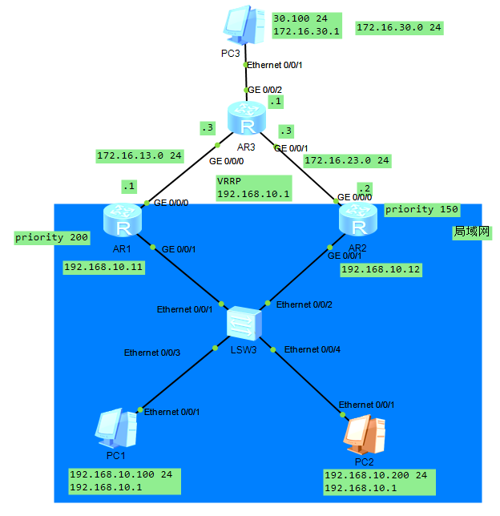

## 一、DHCP

如果IP地址采用手工配置，工作量大且不好管理，如果有用户擅自修改网络参数，还有可能会造成IP地址冲突等问题。使用动态主机配置协议DHCP（Dynamic Host Configuration Protocol）来分配IP地址等网络参数，可以减少管理员的工作量，避免用户手工配置网络参数时造成的地址冲突。

### 1. DHCP报文

| 报文类型      | 含义                                                         |
| ------------- | ------------------------------------------------------------ |
| DHCP DISCOVER | 客户端用来寻找DHCP服务器                                     |
| DHCP OFFER    | DHCP服务器用来响应DHCP DISCOVER报文，此报文携带了各种配置信息 |
| DHCP REQUEST  | 客户端请求配置确认，或者续借租期                             |
| DHCP ACK      | 服务器对REQUEST报文的确认响应                                |
| DHCP NAK      | 服务器对REQUEST报文的拒绝响应                                |
| DHCP RELEASE  | 客户端要释放地址时用来通知服务器                             |

### 2. DHCP工作原理

客户端发送DHCP Discover（广播）-> 服务器发回 DHCP OFFER（单播）-> 客户端发送 DHCP REQUEST（广播）-> 服务器返回DHCP ACK（单播）

### 3. DHCP租期更新

IP租约期限到达50%时，DHCP客户端会请求更新IP地址租约。

客户端发送 DHCP REQUEST（单播）-> 服务器返回DHCP ACK（单播）

### 4. DHCP重绑定

DHCP客户端在租约期限达到87.5%时，还没收到服务器响应，会申请重绑定IP。

客户端发送DHCP REQUEST（单播）（如果该单播未收到，服务器未响应）-> 客户端发送 DHCP REQUEST（广播）-> 服务器返回DHCP ACK/NAK（单播）。

### 5. IP地址释放

如果IP租约到期前都没有收到服务器响应，客户端停止使用此IP。如果DHCP客户端不再使用分配的IP地址，也可以主动向服务器发送DHCP RELEASE报文，释放该IP地址。

```
dhcp enable
ip pool pool2  # 定义一个地址池，多个DHCP地址池默认按照网关所属Vlan获取地址。
 network 1.1.1.0 mask 24
 gateway-list 1.1.1.1
 lease day 10  # 租期
int g0/0/1
 dhcp select global
```

## 二、VRRP

VRRP：虚拟路由器备份协议。VRRP描述了一个动态选举协议，该协议从一组VRRP路由器中选举一个主路由器（Master），并将Master关联到一个虚拟路由器，作为所连接网段的网关。

VRRP用来做网关的热备份。VRRP也通过优先级来进行Master的选定，越大越有限。（特殊Priority值 255，如果虚拟的地址与IP拥有者路由器相同，则拥有该IP的路由器的Priority值为255。

### 1. 实验



```
# AR1配置
interface GigabitEthernet0/0/0
 ip address 172.16.13.1 255.255.255.0 
interface GigabitEthernet0/0/1
 ip address 192.168.10.11 255.255.255.0 
 vrrp vrid 1 virtual-ip 192.168.10.1
 vrrp vrid 1 priority 200
 vrrp vrid 1 track interface GigabitEthernet0/0/0 reduced 150
rip 1
 version 2
 network 192.168.0.0
 network 172.16.0.0
# AR2配置
interface GigabitEthernet0/0/0
 ip address 172.16.23.2 255.255.255.0 
interface GigabitEthernet0/0/1
 ip address 192.168.10.12 255.255.255.0 
 vrrp vrid 1 virtual-ip 192.168.10.1
 vrrp vrid 1 priority 150
rip 1
 undo summary
 version 2
 network 192.168.10.0
 network 172.16.0.0
# AR3配置
interface GigabitEthernet0/0/0
 ip address 172.16.13.3 255.255.255.0 
interface GigabitEthernet0/0/1
 ip address 172.16.23.3 255.255.255.0 
interface GigabitEthernet0/0/2
 ip address 172.16.30.1 255.255.255.0 
rip 1
 undo summary
 version 2
 network 172.16.0.0
# LSW3配置
vlan batch 10
interface Ethernet0/0/1
 port link-type access
 port default vlan 10
interface Ethernet0/0/2
 port link-type access
 port default vlan 10
interface Ethernet0/0/3
 port link-type access
 port default vlan 10
interface Ethernet0/0/4
 port link-type access
 port default vlan 10

```

## 三、AAA

AAA是Authentication（认证）、Authorization（授权）和Accounting（计费）的简称，它提供了认证、授权、计费三种安全功能。AAA可以用过多种协议来实现，目前华为设备支持基于RAUIUS（Remote Authentication Dial-In User Service）协议或HWTACACS（Huawei Terminal Access Controller Access Control System）协议来实现AAA。

- 认证：验证用户是否可以获得网络访问的权限。，AAA支持的认证方式有：不认证、本地认证、远端认证
- 授权：授权用户可以访问或使用网络上的哪些服务，AAA支持的授权方式有：不授权、本地授权、远端授权。
- 计费：记录用户使用网络资源的情况。AAA支持的计费方式有：不计费、远端计费。

### 1. AAA域

AAA可以通过域来对用户进行管理，不同的域可以关联不同的认证、授权和计费方式。

比如 test1@partner、test2@employee等。

```
aaa
 authentication-scheme auth1
  authentication-model local
 authorization-scheme auth2
  authentication-model local
 domain huawei
  authentication-scheme auth1
  authorization-scheme auth2
```

### 2. 实验

```
aaa 
 authentication-scheme default
 authentication-scheme authen-abc
 authorization-scheme default
 authorization-scheme local
 authorization-scheme author-abc
 accounting-scheme default
 domain default 
 domain default_admin 
 domain huawei  
  authentication-scheme authen-abc
  authorization-scheme author-abc
 local-user admin password cipher %$%$K8m.Nt84DZ}e#<0`8bmE3Uw}%$%$
 local-user admin service-type http
 local-user admin-root@huawei password cipher %$%$+(6v5gz)cU6P_D3>M{pQA|E4%$%$
 local-user admin-root@huawei privilege level 15
 local-user admin-root@huawei service-type telnet
 local-user admin-user@huawei password cipher %$%$'d-}+1^8=V7)Ab$x+y+6A|@p%$%$
 local-user admin-user@huawei service-type telnet
 local-user admin-super@huawei password cipher %$%$=`t++yFa>'YQOOKaoea#A}c,%$%$
 local-user admin-super@huawei privilege level 2
 local-user admin-super@huawei service-type telnet
```

## 四、ACL简介

访问控制列表ACL（Access Control List）可以定义一系列不同的规则，设备根据这些规则对数据包进行分类，并针对不同类型的报文进行不同的处理，从而可以实现对网络访问行为的控制、限制网络流量、提供网络性能、防止网络攻击等等。

### 1. ACL分类

| 分类    | 编号范围  | 参数                                     |
| ------- | --------- | ---------------------------------------- |
| 基本ACL | 2000-2999 | 源IP地址等                               |
| 高级ACL | 3000-3999 | 源IP地址、目的IP地址、源端口、目的端口等 |
| 二层ACL | 4000-4999 | 源MAC地址、目的MAC地址、以太帧协议类型等 |

### 2. ACL规则

每个ACL可以包含多个规则，路由器根据规则来对数据流量进行过滤。

```
acl 2000
 rule 5 deny source 192.168.1.0 0.0.0.255  # 这里是通配符掩码，与掩码相反，不能叫做反掩码
 rule 10 deny source 192.168.2.0 0.0.0.255
```

### 3. 基本ACL配置

```
acl 2000
 rule 5 deny source 192.168.1.0 0.0.0.255  # 这里是通配符掩码，与掩码相反，不能叫做反掩码
 rule 10 deny source 192.168.2.0 0.0.0.255
int g0/0/0  # 子接口必须进入子接口
 traffic-filter outbound acl 2000
```

### 4. 高级ACL配置

相对于基本ACL，更关心上层协议。

三层交换机ACL不在VlanIF端口，而在实体端口配置

#### 4.1 ACL实验


```
# LSW1配置
vlan batch 10 20 30
interface Vlanif10
 ip address 192.168.10.1 255.255.255.0
interface Vlanif20
 ip address 192.168.20.1 255.255.255.0
interface Vlanif30
 ip address 192.168.30.2 255.255.255.0
interface GigabitEthernet0/0/1
 port link-type access
 port default vlan 10
interface GigabitEthernet0/0/2
 port link-type access
 port default vlan 10
interface GigabitEthernet0/0/3
 port link-type access
 port default vlan 20
interface GigabitEthernet0/0/4
 port link-type access
 port default vlan 20
interface GigabitEthernet0/0/10
 port link-type access
 port default vlan 30
rip 1
 undo summary
 version 2
 network 192.168.10.0
 network 192.168.20.0
 network 192.168.30.0
 
 # LSW2配置
vlan batch 100 150 200
interface Vlanif100
 ip address 192.168.100.1 255.255.255.0
interface Vlanif150
 ip address 192.168.150.1 255.255.255.0
interface Vlanif200
 ip address 192.168.200.2 255.255.255.0
interface GigabitEthernet0/0/1
 port link-type access
 port default vlan 150
interface GigabitEthernet0/0/2
 port link-type access
 port default vlan 100
interface GigabitEthernet0/0/3
 port link-type access
 port default vlan 100
interface GigabitEthernet0/0/10
 port link-type access
 port default vlan 200
rip 1
 version 2
 network 192.168.100.0
 network 192.168.150.0
 network 192.168.200.0

# Router配置
acl number 3001  
 rule 5 permit icmp 
 # 允许RIP协议
 rule 10 permit udp destination-port eq rip 
 # 10网段只可以通过HTTP访问Vlan 100内服务器
 rule 15 permit tcp source 192.168.10.0 0.0.0.255 destination 192.168.100.200 0 destination-port eq www 
 rule 20 deny ip source 192.168.10.0 0.0.0.255 destination 192.168.100.200 0 
 # 10网段不能访问Vlan 150的服务器
 rule 25 deny ip source 192.168.10.0 0.0.0.255 destination 192.168.150.200 0 
 # 20网段不能访问Vlan 100内服务器
 rule 30 deny ip source 192.168.20.100 0 destination 192.168.100.200 0 
acl number 3002  
 rule 5 permit icmp 
 rule 10 permit udp destination-port eq rip 
  # Vlan 100主机不能访问Vlan 20内的服务器
 rule 15 permit ip source 192.168.100.200 0 destination 192.168.20.200 0 
 rule 20 deny ip source 192.168.100.0 0.0.0.255 destination 192.168.20.200 0 
acl number 3003  
 rule 5 permit icmp 
 rule 10 permit udp destination 192.168.1.200 0 destination-port eq dns 
 rule 15 permit tcp source 192.168.10.0 0.0.0.255 destination 192.168.1.200 0 destination-port eq ftp 
 rule 20 permit tcp source 192.168.20.0 0.0.0.255 destination 192.168.1.200 0 destination-port eq ftp 
 rule 25 permit tcp source 192.168.100.0 0.0.0.255 destination 192.168.1.200 0 destination-port eq www 
 rule 30 permit tcp source 192.168.150.0 0.0.0.255 destination 192.168.1.200 0 destination-port eq www 
 rule 500 deny ip 
interface GigabitEthernet0/0/0
 ip address 192.168.30.1 255.255.255.0 
 traffic-filter inbound acl 3001
interface GigabitEthernet0/0/1
 ip address 192.168.200.1 255.255.255.0 
 traffic-filter inbound acl 3002
interface GigabitEthernet0/0/2
 ip address 192.168.1.1 255.255.255.0 
 traffic-filter outbound acl 3003
rip 1
 undo summary
 version 2
 network 192.168.30.0
 network 192.168.200.0
 network 192.168.1.0
```

