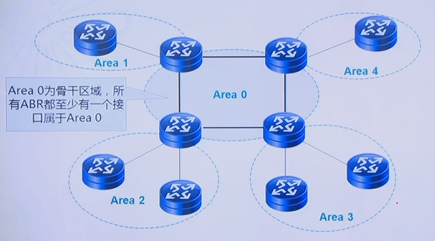

## 一、OSPF

OSPF：开放式最短路径优先协议（OSPF）是基于链路状态的内部网关协议的一种。

1. OSPF把自治系统AS（Autonomous System）划分成逻辑意义上的一个或多个区域；
2. OSPF通过LSA（Link State Advertisement）的形式发布路由；
3. OSPF依靠在OSPF区域内各设备间交互OSPF报文来达到路由信息的统一；
4. OSPF报文封装在IP报文内，可以采用单播或组播的形式发送。

### 1.1 OSPF基本特点

1. 支持无类域间路由（CIDR）
2. 无路由自环
3. 收敛速度快
4. 使用IP组播收发协议数据
5. 支持多条等值路由
6. 支持协议报文的认证

### 1.2 OSPF的路由计算过程

RIP会对收到的路由信息进行修改，这个过程可能会导致修改错误。

OSPF规定收到的路由信息要完全的转发出去。每个设备会拥有自己和其他人转发的所有原始路由条目LSA，维护到自己的LSDB中。即所有设备的数据库都是一致的。然后，路由器按照SPF算法进行计算，算出来最短路径树，然后将最短路径树转化为路由条目存储到IP路由表中。

### 1.3 PSPF基本概念

#### 1.3.1 自治系统（Autonomous System）

一个自治系统是指使用同一种路由协议交换路由信息的一组路由器。

#### 1.3.2 Router ID

用于在自治系统中唯一标识一台运行OSPF的路由器的32位整数，每个运行OSPF的路由器都有一个Router ID。

### 1.4 区域



如果网络中设备过多，OSPF可以会使用过多的处理资源，导致收敛过慢。为了解决这个问题，OSPF用分层的办法来减小网络规模。引入区域的概念。

Area 0为骨干区域，所有ABR（area border router）都至少有一个接口属于Area 0。每个设备的各个接口可以属于不同的区域。

所有普通区域的通信必须经过骨干区域。

### 1.5 路由器分类

- IR（Internal Router）：一个路由器所有接口都在同一个区域。
- BR（Backbone Router）：骨干区域的路由器所有接口都在同一个区域。
- ABR（Area Border Router）：路由器的接口同时连接骨干与非骨干区域。
- ASBR（Autonomous System Border Router）：连接其他自治系统的路由器。

### 1.6 OSPF基本配置

如果不配置OSPF的Router ID，Router会自动在设备上寻找一个最大的IP地址作为Router ID，但是不推荐。

Router ID 确定后很难进行更改。


```
# AR1配置
router id 2.2.2.2 
interface GigabitEthernet0/0/0
 ip address 10.1.2.1 255.255.255.0 
interface GigabitEthernet0/0/1
 ip address 10.1.1.1 255.255.255.0 
interface LoopBack0
 ip address 2.2.2.2 255.255.255.255 
ospf 1 
 area 0.0.0.0 
  network 10.1.2.0 0.0.0.255 
 area 0.0.0.1 
  network 2.2.2.2 0.0.0.0 
  network 10.1.1.0 0.0.0.255 
  
# AR2配置
router id 3.3.3.3 
interface GigabitEthernet0/0/0
 ip address 10.1.2.2 255.255.255.0 
interface GigabitEthernet0/0/1
 ip address 10.1.3.1 255.255.255.0 
interface LoopBack0
 ip address 3.3.3.3 255.255.255.255 
ospf 1 
 area 0.0.0.0 
  network 10.1.2.0 0.0.0.255 
 area 0.0.0.2 
  network 3.3.3.3 0.0.0.0 
  network 10.1.3.0 0.0.0.255 

# AR3配置
router id 1.1.1.1 
interface GigabitEthernet0/0/1
 ip address 10.1.1.2 255.255.255.0 
interface LoopBack0
 ip address 1.1.1.1 255.255.255.255 
ospf 1 
 area 0.0.0.1 
  network 1.1.1.1 0.0.0.0 
  network 10.1.1.0 0.0.0.255
 
# AR5配置
router id 4.4.4.4 
interface GigabitEthernet0/0/1
 ip address 10.1.3.2 255.255.255.0 
interface LoopBack0
 ip address 4.4.4.4 255.255.255.255
ospf 1 
 area 0.0.0.2 
  network 4.4.4.4 0.0.0.0 
  network 10.1.3.0 0.0.0.255 
```

## 二、OSPF邻居与邻接关系

为了交换链路状态信息以及路由信息，OSPF路由器之间首先要建立邻接关系。

### 2.1 邻居（Neighbor）和邻接（Adjacency）

OSPF支持点到点（仅限于2个设备）和广播型（Ethernet是广播多路访问）网络。以及NBMA网络，非广播多路访问


### 2.2 常见链路层协议对应的默认网络类型

| 网络类型       | 常见链路层协议              |
| -------------- | --------------------------- |
| Point-to-point | PPP链路：LAPB链路：HDLC链路 |
| Broadcast      | 以太网链路                  |
| NBMA           | 帧中继链路；ATM链路         |

point-to-point，可以直接建立邻居、邻接关系。

Broadcast：先建立邻居，有条件有选择的建立邻接。

NBMA：不支持建立邻居，邻接。需要手工配置。

### 2.3 虚连接（Virtual Link）

如果有两个Area 0区域或者某个区域与主干区域不相连，可以配置虚连接互相连接。

### 2.4 DR与BDR

DR：指定路由器；BDR：备份指定路由器。

网络中路由器会互相交换路由条目，如果网络中设备较多，每个人都需要给其他人一份自己的条目并受到其他所有人给自己的。效率会非常低。

所有网络中会选出DR与BDR设备。DR设备负责收集所有的路由条目，然后同步给其他的设备。

BDR为备份设备。

所有设备可以和DR以及BDR建立邻接关系，邻接关系可以同步数据库，邻居关系不可以。

#### 2.4.1 选举DR与BDR

DR是在每个网段中选举。PPP网络不选DR。

设备启动后，每个接口都会有一个优先级，优先级越高越容易成为DR，如果优先级一样，Router ID越大越容易成为DR。

优先级最大的路由器不一定是DR/BDR，因为选举确定后不会改变，除非设备链路断掉，重新选举。

```
int g0/0/0
 ospf dr-priority 200  # 设置优先级
```

如果一个接口的优先级为0，代表自己不参选，永远不会成为DR与BDR。

### 2.5 端口状态变换-广播型和NVMA


### 2.6 邻居和邻接关系的建立

| 网络类型            | 是否和邻居建立邻接关系                                       |
| ------------------- | ------------------------------------------------------------ |
| Point-to-point      | 总是和邻居建立邻接关系                                       |
| Point-to-MultiPoint | 总是和邻居建立邻接关系                                       |
| Virtual link        | 总是和邻居建立邻接关系                                       |
| Broadcast<br />NBMA | DR总是和其他所有路由器包括BDR建立邻接关系；<br />BDR总是和其他所有路由器包括DR建立邻接关系<br />处于DROther状态的路由器只与DR和BDR建立邻接关系 |

#### 2.6.1 NBMA网络实验


```
# AR1配置
router id 10.10.1.1 
interface Serial2/0/0
 link-protocol fr
 undo fr inarp
 fr map ip 10.10.123.2 102 broadcast
 fr map ip 10.10.123.3 103 broadcast
 ip address 10.10.123.1 255.255.255.0 
interface Serial2/0/1
 link-protocol ppp
interface LoopBack0
 ip address 10.10.1.1 255.255.255.255 
ospf 1 
 peer 10.10.123.2  # NBMA网络不支持广播，配置以单播形式建立邻居
 peer 10.10.123.3  
 area 0.0.0.0 
  network 10.10.1.1 0.0.0.0 
  network 10.10.123.0 0.0.0.255 

# AR2配置
router id 10.10.2.2 
interface Serial1/0/0
 link-protocol fr
 undo fr inarp
 fr map ip 10.10.123.1 201 broadcast
 fr map ip 10.10.123.3 201 broadcast
 ip address 10.10.123.2 255.255.255.0 
 ospf dr-priority 0  # 星型网络需要将DR固定在中心，其他的路由器不参选，此时没有BDR
interface Serial1/0/1
 link-protocol ppp
interface LoopBack0
 ip address 10.10.2.2 255.255.255.0 
ospf 1 
 peer 10.10.123.1
 area 0.0.0.0 
  network 10.10.2.2 0.0.0.0 
  network 10.10.123.0 0.0.0.255 

# AR3配置
router id 10.10.3.3
interface Serial2/0/0
 link-protocol fr
 undo fr inarp
 fr map ip 10.10.123.1 301 broadcast
 fr map ip 10.10.123.2 301 broadcast
 ip address 10.10.123.3 255.255.255.0 
 ospf dr-priority 0
interface LoopBack0
 ip address 10.10.3.3 255.255.255.255 
ospf 1 
 peer 10.10.123.1
 area 0.0.0.0 
  network 10.10.3.3 0.0.0.0 
  network 10.10.123.0 0.0.0.255 
```

#### 2.6.2 点对多点网络配置实验


```
# AR1配置
router id 10.10.1.1 
interface Serial2/0/0
 link-protocol fr
 undo fr inarp
 fr map ip 10.10.123.2 102 broadcast
 fr map ip 10.10.123.3 103 broadcast
 ip address 10.10.123.1 255.255.255.0 
 ospf network-type p2mp
interface Serial2/0/1
 link-protocol ppp
interface LoopBack0
 ip address 10.10.1.1 255.255.255.255 
ospf 1  
 area 0.0.0.0 
  network 10.10.1.1 0.0.0.0 
  network 10.10.123.0 0.0.0.255 

# AR2配置
router id 10.10.2.2 
interface Serial1/0/0
 link-protocol fr
 undo fr inarp
 fr map ip 10.10.123.1 201 broadcast
 fr map ip 10.10.123.3 201 broadcast
 ip address 10.10.123.2 255.255.255.0 
 ospf network-type p2mp
interface Serial1/0/1
 link-protocol ppp
interface LoopBack0
 ip address 10.10.2.2 255.255.255.0 
ospf 1 
 area 0.0.0.0 
  network 10.10.2.2 0.0.0.0 
  network 10.10.123.0 0.0.0.255 

# AR3配置
router id 10.10.3.3
interface Serial2/0/0
 link-protocol fr
 undo fr inarp
 fr map ip 10.10.123.1 301 broadcast
 fr map ip 10.10.123.2 301 broadcast
 ip address 10.10.123.3 255.255.255.0 
 ospf network-type p2mp
interface LoopBack0
 ip address 10.10.3.3 255.255.255.255 
ospf 1 
 area 0.0.0.0 
  network 10.10.3.3 0.0.0.0 
  network 10.10.123.0 0.0.0.255 
```

#### 2.6.3 虚电路配置

```
vlink-peer x.x.x.x  # 进入到Area0与待建立连接区域的中间区域的两边路由器配置
```

## 三、协议报文和链路状态通告

### 3.1 使用IP承载OSPF报文


### 3.2 OSPF认证

OSPF路由也可以用来做认证，包括接口认证和区域认证。只有通过认证后才能加入路由。

如果在Area 0做认证，则所有区域都需要做认证。

### 3.3 OSPD报文类型

| Type | 报文名称             | 报文功能               |
| ---- | -------------------- | ---------------------- |
| 1    | Hello                | 发现和维护邻居关系     |
| 2    | Database Description | 发现链路状态数据库摘要 |
| 3    | Link State Request   | 请求特定的链路状态信息 |
| 4    | Link State Update    | 发送详细的链路状态信息 |
| 5    | Link State Ack       | 发送确认报文           |

### 3.4 LSA类型-区域内路由计算

| LS Type | LSA名称             | LSA描述                                                      |
| ------- | ------------------- | ------------------------------------------------------------ |
| 1       | Router-LSA          | 每个路由器都会生成。这种LSA描述某区域内路由器端口<br />链路状态的集合，只在所描述的区域内泛洪。 |
| 2       | Network-LSA         | 由DR生成，用于描述广播型网络和NBMA网络。这种LSA包<br />含了该网络上所连接路由器的列表。只在该网络所属区域内泛洪。 |
| 3       | Network-Summary-LSA | 由区域边界路由器（ABR）产生，描述到AS内部本区域外部<br />某一网段的路由信息，在该LSA所生成的区域内泛洪。 |
| 4       | ASBR-Summary-LSA    | 由区域边界路由器（ABR）产生，描述到某一自治系统边界路由器<br />（ASBR）的路由信息，在ABR所连接的区域内泛洪（ASBR所在区域除外） |
| 5       | AS-external-LSA     | 由自治系统边界路由器（ASBR）产生，描述到AS外部某一网段的<br />路由信息，在整个AS内部泛洪。（其实类型5在无用，类型4转发后才有用） |

### 3.5 Link State ID

| LSA名称             | Link State ID                  |
| ------------------- | ------------------------------ |
| Router-LSA          | 生成这条LSA的路由器的Router ID |
| Network-LSA         | 所描述网段上DR的端口IP地址     |
| Network-Summary-LSA | 所描述的目的网段的地址         |
| ASBR-Summary-LSA    | 所描述的ASBR的Router ID        |
| AS-External-LSA     | 所描述的目的网段的地址         |

LS-AGE：越小说明该LSA报文越新，正常情况下，如果大于3600，删掉该LSA。

Seq#：编号，编号越大，LSA报文越新。

## 四、邻居和邻接关系建立过程

邻居与邻接建立过程也就是OSPF协议交互的过程，包括Hello报文，邻居状态变换以及链路状态数据库同步等内容。

