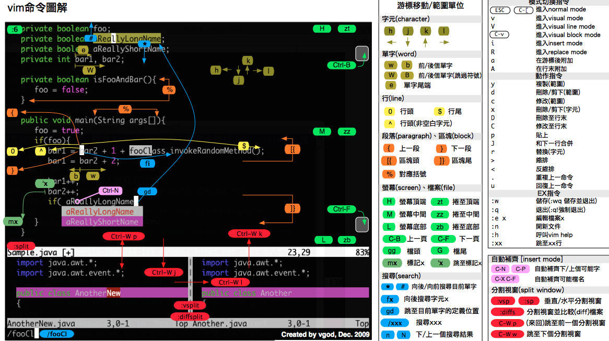

## 一、计算机系统基础

### 1. 主流操作系统

1. 桌面操作系统
2. 服务器操作系统
3. 嵌入式操作系统
4. 移动设备操作系统

### 2. Linux版本

1. 内核版：内核（kernel）是系统的心脏，是运行程序和管理硬件设备（像磁盘和打印机等）的核心程序，它提供了一个在裸设备与应用程序间的抽象层。分为稳定版和开发版
2. 发行版：通常包含了包括桌面环境、办公套件、媒体播放器、数据库等应用软件。比较好的有：Ubuntu、Redhat等

### 3. 单用户操作系统和多用户操作系统

单用户操作系统：指一台计算机在**同一时间只能由一个用户使用**，一个用户独自享用系统的全部硬件和软件资源。`Windows XP`之前的版本都是单用户操作系统

多用户操作系统：指一台计算机在**同一时间可以由多个用户使用**，多个用户共同享用系统的全部硬件和软件资源。`Unix`和 `Linux` 的设计初衷就是多用户操作系统

### 4. 一切皆文件

在Linux系统中，一切皆文件。比如键盘、鼠标、显示器都是一个文件。通常Linux系统会用一个数字来标记文件（其中，0、1、2已经被内部使用）。

`fd`：文件描述符，就是对应一个数字。

## 二、Linux基础知识

### 1. Linux主要目录

| 目录                                      | 存放内容                                                     |
| ----------------------------------------- | ------------------------------------------------------------ |
| /                                         | 根目录，一般根目录下只存放目录，在Linux下有且只有一个根目录，<br />所有的东西都是从这里开始 |
| /bin<br />/usr/bin                        | <br />可执行二进制文件的目录，如常用的命令`ls`、`tar`、`mv`、`cat`等 |
| /boot                                     | 放置Linux系统启动时用到的一些文件，如Linux的内核文件：`/boot/vmlinuz`、<br />系统引导管理器：`/boot/grub` |
| /dev                                      | 存放Linux系统下的设备文件，访问该目录下某个文件，相当于访问某个设备，<br />常用的是挂在光驱：`mount/dev/cdrom/mnt` |
| /etc                                      | 系统配置文件存放目录，不建议在此目录下存放可执行文件，重要的配置文件有：`/etc/inittab`、`/etc/fstab`、`/etc/init.d`、`/etc/X11`、`/etc\xinetd.d` |
| /home                                     | 系统默认的用户家目录，新增用户账号时，用户的家目录都存放在此目录下。<br />`~`表示当前用户的家目录、`~edu`表示用户`edu`的家目录。 |
| /lib<br />/usr/lib<br />/usr/local/lib    | <br />系统使用的函数库的目录，程序在执行过程中，需要调用一些额外的参数时需要函数库的协助。 |
| /lost+fount                               | 系统异常产生错误时，会将一些遗失的片段放置于此目录下。       |
| /mnt:/media                               | 光盘默认挂载点，通常光盘挂载于/mnt/cdrom下。当然，也可以选择任意位置进行挂载 |
| /opt                                      | 给主机额外安装软件所摆放的目录                               |
| /proc                                     | 此目录的数据都在内存中，如系统核心、外部设备、网络状态。由于数据都存放内存中，<br />所以不占用磁盘空间，比较重要的文件有：`/proc/cpuinfo`、`/proc/interrupts`、`/proc/net/`等 |
| /root                                     | 系统管理员root的家目录                                       |
| /sbin<br />/usr/sbin<br />/usr/local/sbin | 放置系统管理员使用的可执行命令，如 fdisk、shutdown、mount等。与`/bin`不同的是，<br />这几个目录是给系统管理员root使用的命令，一般用户只能查看而不能设置和使用 |
| /tmp                                      | 一般用户或正在执行的程序临时存放文件的目录，任何人都可以访问，重要数据不可放置在此 |
| /srv                                      | 服务启动后需要访问的数据目录，如www服务需要访问的网页数据存放在 /srv/www内 |
| /usr                                      | 应用程序存放目录                                             |
| /usr/bin                                  | 存放应用数据                                                 |
| /usr/share                                | 存放共享数据                                                 |
| /usr/lib                                  | 存放不能直接运行的，却是许多程序运行所必需的一些函数库文件   |
| /usr/local                                | 存放软件升级包                                               |
| /usr/share/doc                            | 系统说明文件存放目录                                         |
| /usr/share/man                            | 程序说明文件存放目录                                         |
| /var                                      | 放置系统执行过程中经常变化的文件                             |
| /var/log                                  | 随时更改的日志文件                                           |
| /var/spool/mail                           | 邮件存放的目录                                               |
| /var/run                                  | 程序或服务启动后，其PID存放在该目录下                        |

### 2. Linux主要命令

#### 2.1 Linux命令格式

```
command [-options] [parameter]
	// parameter：可以是0个、1个或多个
```

#### 2.2 常用Linux命令

在Linux操作系统中，有一些常用的命令需要掌握：

##### `ls`

查看当前文件夹下的内容

| 参数 | 含义                                         |
| ---- | -------------------------------------------- |
| -a   | 显示指定目录下所有子目录与文件，包括隐藏文件 |
| -l   | 以列表方式显示文件的详细信息                 |
| -h   | 配合 -l 以人性化的方式显示文件大小           |

##### `cd`

切换文件夹，change directory，`cd -`：切换到上一次所在目录。

##### `touch`

创建文件或修改文件时间。如果文件不存在，可以创建一个空白文件；如果文件已经存在，可以修改文件的末次修改日期

#####  `mkdir`

创建一个新目录，make directory

| 参数 | 含义             |
| ---- | ---------------- |
| p    | 可以递归创建目录 |

##### `rm`

删除文件或目录，使用`rm` 命令要小心，因为文件删除后不能恢复

| 参数 | 含义                                             |
| ---- | ------------------------------------------------ |
| -f   | 强制删除，忽略不存在的文件，无需提示             |
| -r   | 递归地删除目录下的内容，删除文件夹时必须加此参数 |
| -i   | 以进行交互式方式执行                             |

##### `tree`

以树状图列出文件目录结构

| 参数 | 含义       |
| ---- | ---------- |
| d    | 只显示目录 |

##### `cp`

将给出的文件或目录复制到另一个文件或目录中，相当于DOS下的 `copy` 命令

| 参数 | 含义                                                         |
| ---- | ------------------------------------------------------------ |
| -i   | 交互式复制，在覆盖目标文件之前将给出提示要求用户确认         |
| -r   | 若给出的源文件是目录文件，则 cp 将递归复制该目录下的所有子目录和文件，<br />目标文件必须为一个目录名 |
| -a   | 该选项通常在复制目录时使用，它保留链接、文件属性，并递归地复制目录，简单而言，保持文件原有属性。 |
| -f   | 已经存在的目标文件而不提示                                   |
| -v   | 显示拷贝进度                                                 |

##### `mv`

可以用来 移动文件或目录，也可以给文件或目录重命名

| 参数 | 含义                                   |
| ---- | -------------------------------------- |
| -i   | 覆盖文件前提示                         |
| -f   | 禁止交互式操作，如有覆盖也不会给出提示 |
| -v   | 显示移动进度                           |

##### `cat`

命令可以用来 查看文件内容、创建文件、文件合并、追加文件内容等功能；会一次显示所有的内容，适合查看内容较少的文本文件。

| 参数 | 含义               |
| ---- | ------------------ |
| -b   | 对非空输出行编号   |
| -n   | 对输出的所有行编号 |

Linux 中还有一个 `nl` *的命令和* `cat -b` 的效果等价

##### `more`

命令可以用于分屏显示文件内容，每次只显示一页内容；适合于查看内容较多的文本文件

| 操作键   | 功能                 |
| -------- | -------------------- |
| 空格键   | 显示手册页的下一屏   |
| Enter 键 | 一次滚动手册页的一行 |
| b        | 回滚一屏             |
| f        | 前滚一屏             |
| q        | 退出                 |
| /word    | 搜索 **word** 字符串 |

------------------------------

##### `grep`

Linux 系统中 grep 命令是一种强大的文本搜索工具；grep允许对文本文件进行正则表达式查找。

```shell
grep [-选项] '搜索内容串' 文件名
```

| 选项 | 含义                                     |
| ---- | ---------------------------------------- |
| -n   | 显示匹配行及行号                         |
| -v   | 显示不包含匹配文本的所有行（相当于求反） |
| -i   | 忽略大小写                               |

常用的两种正则表达式：

| 参数 | 含义                         |
| ---- | ---------------------------- |
| ^a   | 行首，搜寻以 **a** 开头的行  |
| ke$  | 行尾，搜寻以 **ke** 结束的行 |

----------------------------------------------------------------------------------------------------------------------------------------------------

##### `echo` 

显示文字内容；会在终端中显示参数指定的文字，通常会和重定向联合使用。

##### `>`和`>>`

重定向，Linux 允许将命令执行结果重定向到一个文件，将本应显示在终端上的内容 输出/追加到指定文件中。

##### `|`

管道，Linux 允许将一个命令的输出可以通过管道做为另一个命令的输入。

`Ctrl + shift + =`：可以放大终端窗口的字体显示；`Ctrl + -`：可以缩小终端窗口的字体显示

##### `shutdown -options time`

关机/重新启动

| Options | 含义     |
| ------- | -------- |
| -r      | 重新启动 |

不指定选项和参数时，默认表示1分钟后关闭电脑。

远程维护服务器时，最好不要关系系统，而应该重新启动系统。

```
shutdown -r now # 重新启动操作系统，now表示现在
shutdown now # 立刻关机
shutdown 20:25  # 在今天的20:25关机
shutdown +10    # 10分钟后自动关机
shutdown -c     # 取消之前指定的关机计划
```

-------------

##### `ln`

1) 软链接

| 序号 | 命令                          | 作用                                                       |
| ---- | ----------------------------- | ---------------------------------------------------------- |
| 01   | ln -s 被链接的源文件 链接文件 | 建立文件的软链接，用通俗的方式讲类似于Windows 下的快捷方式 |

注意：

1. 没有`-s`选项建立的是一个硬链接文件

   两个文件占用相同大小的硬盘空间，工作中几乎不会建立文件的硬链接

2. 源文件要使用绝对路径，不能使用相对路径，这样可以方便移动链接文件后，仍然能够正常使用

2) 硬链接

在使用 `ln` 创建链接时，如果没有 `-s` 选项，会创建一个硬链接，而不是软链接。

提示：

- 在 Linux 中，只有文件的 `硬链接数 == 0` 才会被删除
- 使用 `ls -l` 可以查看一个文件的硬链接的数量
- 在日常工作中，几乎不会建立文件的硬链接

> 在 Linux 中，文件名和文件的数据是分开存储的

---------------------

##### `find`

`find` 命令功能非常强大，通常用来在特定的目录下搜索符合条件的文件

常用用法：

| 命令                        | 含义                                   |
| :-------------------------- | -------------------------------------- |
| find ./ -name test.sh       | 查找当前目录下所有名为test.sh的文件    |
| find ./ -name '*.sh'        | 查找当前目录下所有后缀为.sh的文件      |
| find ./ -name "[A-Z]*"      | 查找当前目录下所有以大写字母开头的文件 |
| find /tmp -size 2M          | 查找在/tmp 目录下等于2M的文件          |
| find /tmp -size +2M         | 查找在/tmp 目录下大于2M的文件          |
| find /tmp -size -2M         | 查找在/tmp 目录下小于2M的文件          |
| find ./ -size +4k -size -5M | 查找当前目录下大于4k，小于5M的文件     |
| find ./ -perm 777           | 查找当前目录下权限为 777 的文件或目录  |

如果省略路径，表示在当前文件夹下查找

-------

##### `tar`

打包压缩是日常工作中备份文件的一种方式，在不同操作系统中，常用的打包压缩方式是不同的

- `Windows` 常用 `rar`
- `Mac` 常用 `zip`
- `Linux` 常用 `tar.gz`

`tar` 是 Linux 中最常用的备份工具，此命令可以把一系列文件打包到一个大文件中，也可以把一个打包的大文件恢复成一系列文件。

`tar` 的命令格式如下：

```bash
# 打包文件
tar -cvf 打包文件.tar 被打包的文件/路径...
# 解包文件
tar -xvf 打包文件.tar
```

`tar` 选项说明

| 选项 | 含义                                                         |
| ---- | ------------------------------------------------------------ |
| c    | 生成档案文件，创建打包文件                                   |
| x    | 解开档案文件                                                 |
| v    | 列出归档解档的详细过程，显示进度                             |
| f    | 指定档案文件名称，f 后面一定是 .tar 文件，所以必须放选项最后 |
| t    | 列出档案中包含的文件                                         |

> 注意：`f` 选项必须放在最后，其他选项顺序可以随意

-----------------

##### `gzip`

`tar`与 `gzip`命令结合可以使用实现文件打包和压缩，`tar` 只负责打包文件，但不压缩

用 `gzip` 压缩 `tar` 打包后的文件，其扩展名一般用 `xxx.tar.gz`

> 在 `Linux` 中，最常见的压缩文件格式就是 `xxx.tar.gz`

在 `tar` 命令中有一个选项 **-z** 可以调用 `gzip`，从而可以方便的实现压缩和解压缩的功能。命令格式如下：

```bash
# 压缩文件
tar -zcvf 打包文件.tar.gz 被压缩的文件/路径...
# 解压缩文件
tar -zxvf 打包文件.tar.gz
# 解压缩到指定路径
tar -zxvf 打包文件.tar.gz -C 目标路径
```

| 选项 | 含义                                           |
| ---- | ---------------------------------------------- |
| -C   | 解压缩到指定目录，注意：要解压缩的目录必须存在 |

---------

##### `bzip2`

`tar` 与 `bzip2` 命令结合可以使用实现文件打包和压缩（用法和 `gzip` 一样）

`tar` 只负责打包文件，但不压缩，用 `bzip2` 压缩 `tar` 打包后的文件，其扩展名一般用 `xxx.tar.bz2`

在 `tar` 命令中有一个选项 **-j** 可以调用 `bzip2`，从而可以方便的实现压缩和解压缩的功能，命令格式如下：

```shell
# 压缩文件
tar -jcvf 打包文件.tar.bz2 被压缩的文件／路径...

# 解压缩文件
tar -jxvf 打包文件.tar.bz2
```

------------------

##### `which`

1. `/etc/passwd` 是用于保存用户信息的文件`
2. `/usr/bin/passwd` 是用于修改用户密码的程序

`cd` 这个终端命令是内置在系统内核中的，没有独立的文件，因此用 `which` 无法找到 `cd` 命令的位置

`which` 命令可以查看执行命令所在位置，例如：

```bash
which ls
# 输出
# /bin/ls
which useradd
# 输出
# /usr/sbin/useradd
```

---------------------

##### `chmod`

`chmod` 可以修改用户/组对文件/目录的权限。命令格式如下：

```
chmod +/-rwx 文件名|目录名		// 该用法会一次性修改拥有者/组的权限
```

| [ u/g/o/a ] | 含义                                                      |
| :---------- | --------------------------------------------------------- |
| u           | user 表示该文件的所有者                                   |
| g           | group 表示与该文件的所有者属于同一组( group )者，即用户组 |
| o           | other 表示其他以外的人                                    |
| a           | all 表示这三者皆是                                        |

| [ +-= ] | 含义     |
| ------- | -------- |
| +       | 增加权限 |
| -       | 撤销权限 |
| =       | 设定权限 |

也可以使用数字法来设置权限：“rwx” 这些权限也可以用数字来代替

| 字母 | 说明                         |
| ---- | ---------------------------- |
| r    | 读取权限，数字代号为 "4"     |
| w    | 写入权限，数字代号为 "2"     |
| x    | 执行权限，数字代号为 "1"     |
| -    | 不具任何权限，数字代号为 "0" |

如执行：chmod u=rwx,g=rx,o=r filename 就等同于：chmod u=7,g=5,o=4 filename

> 注意：如果想递归所有目录加上相同权限，需要加上参数“ -R ”。 如：chmod 777 test/ -R 递归 test 目录下所有文件加 777 权限

----------------

##### `password`

在Unix/Linux中，超级用户可以使用passwd命令为普通用户设置或修改用户密码。用户也可以直接使用该命令来修改自己的密码，而无需在命令后面使用用户名。

----------------------------------

##### `who`

who命令用于查看当前所有登录系统的用户信息。

常用选项：

| 选项          | 含义                                 |
| :------------ | ------------------------------------ |
| -q或--count   | 只显示用户的登录账号和登录用户的数量 |
| -u或--heading | 显示列标题                           |

-----------------

##### `reboot`

##### `shutdown`

| 命令              | 含义                                       |
| :---------------- | ------------------------------------------ |
| reboot            | 重新启动操作系统                           |
| shutdown –r now   | 重新启动操作系统，shutdown会给别的用户提示 |
| shutdown -h now   | 立刻关机，其中now相当于时间为0的状态       |
| shutdown -h 20:25 | 系统在今天的20:25 会关机                   |
| shutdown -h +10   | 系统再过十分钟后自动关机                   |

##### `sudo`

`su` 是 `substitute user` 的缩写，表示使用另一个用户的身份

`sudo` 命令表示以其他身份来执行命令，预设的身份为 `root`。用户使用 `sudo` 时，必须先输入密码，之后有5 分钟的有效期限，超过期限则必须重新输入密码，若其未经授权的用户企图使用 `sudo`，则会发出警告邮件给管理员。

#### 2.3 查看命令手册

1. `command --help`：显示 `command` 命令的帮助信息

2. `man command`：查阅 `command` 命令的使用手册；`man` 是 **manual** 的缩写，是 Linux 提供的一个 **手册**，包含了绝大部分的命令、函数的详细使用说明

   使用 `man` 时的操作键：

   | 操作键   | 功能                 |
   | -------- | -------------------- |
   | 空格键   | 显示手册页的下一屏   |
   | Enter 键 | 一次滚动手册页的一行 |
   | b        | 回滚一屏             |
   | f        | 前滚一屏             |
   | q        | 退出                 |
   | /word    | 搜索 **word** 字符串 |

#### 2.4 用户权限

### 3. 用户权限相关命令

#### 3.1 基本概念

用户是 Linux 系统工作中重要的一环，用户管理包括用户与组管理在 Linux 中，可以指定每一个用户针对不同的文件或者目录的不同权限。

##### 3.1.1 文件权限查看

`ls -l`可以查看文件夹下文件的详细信息，从左到右依次是：

- 权限：第一个字符如果是`d`，则表示目录；
- 硬连接数：通俗的讲，就是有多少种方式，可以访问到当前目录/文件；
- 拥有者：家目录下，文件/目录的拥有者通常都是当前用户；
- 组
- 大小
- 时间
- 名称

##### 3.1.2 超级用户

Linux中，root账号通常用于系统的维护和管理，对操作系统的所有资源具有所有访问权限。在大多数版本的Linux系统中，都不推荐直接使用root账号登录系统。

在Linux安装的过程中，系统会自动创建一个用户账户，而这个默认的用户就称为“标准用户”。

#### 3.2 组管理命令

创建组/删除组的终端命令都需要通过 `sudo` 执行

| 序号 | 命令                      | 作用                      |
| ---- | ------------------------- | ------------------------- |
| 01   | groupadd 组名             | 添加组                    |
| 02   | groupdel 组名             | 删除组                    |
| 03   | cat /etc/group            | 确认组信息                |
| 04   | chgrp -R 组名 文件/目录名 | 递归修改文件/目录的所属组 |

组信息保存在 /etc/group 文件中

实际应用中，可以预先针对组设置好权限，然后将不同的用户添加到对应的组中，从而不用依次为每一个用户设置权限。

#### 3.3 用户管理命令

创建用户 / 删除用户 / 修改其他用户密码的终端命令都需要通过 `sudo` 执行

| 序号 | 命令                            | 作用         | 说明                                                         |
| ---- | ------------------------------- | ------------ | ------------------------------------------------------------ |
| 01   | `useradd -m -g 组 新建用户名`   | 添加新用户   | 1. `-m` 自动建立用户家目录<br />2. `-g` 指定用户所在的组，<br />    否则会建立一个和同名的组 |
| 02   | `passwd 用户名`                 | 设置用户密码 | 如果是普通用户，直接用 passwd <br />可以修改自己的账户密码   |
| 03   | `userdel -r 用户名`             | 删除用户     | `-r` 选项会自动删除用户家目录                                |
| 04   | `cat /etc/passwd | grep 用户名` | 确认用户信息 | 新建用户后，用户信息会保存在<br /> /etc/passwd 文件中        |

创建用户时，如果忘记添加 `-m` 选项指定新用户的家目录 —— 最简单的方法就是**删除用户，重新创建**

创建用户时，默认会创建一个和用户名同名的组名

用户信息保存在 `/etc/passwd` 文件中，`/etc/passwd` 文件存放的是用户的信息，由 6 个分号组成的 7 个信息，分别是：用户名；密码（x，表示加密的密码）；UID（用户标识）；GID（组标识）；用户全名或本地帐号；家目录；登录使用的 Shell，就是登录之后，使用的终端命令，`ubuntu` 默认是 `dash`

##### 3.3.1 查看用户信息

| 序号 | 命令          | 作用                       |
| ---- | ------------- | -------------------------- |
| 01   | `id [用户名]` | 查看用户 UID 和 GID 信息   |
| 02   | `who`         | 查看当前所有登录的用户列表 |
| 03   | `whoami`      | 查看当前登录用户的账户名   |

##### 3.3.2 设置用户主组

`usermod` 可以用来设置用户的主组/附加组和登录 Shell

主组：通常在新建用户时指定，在 `etc/passwd` 的第 4 列 GID 对应的组

附加组：在 `etc/group` 中最后一列表示该组的用户列表，用于指定用户的附加权限

提示：设置了用户的附加组之后，需要重新登录才能生效！

```bash
# 修改用户的主组（passwd 中的 GID）
usermod -g 组 用户名
# 修改用户的附加组
usermod -G 组 用户名
# 修改用户登录 Shell
usermod -s /bin/bash 用户名
```

注意：默认使用 `useradd` 添加的用户是没有权限使用 `sudo` 以 `root` 身份执行命令的，可以使用以下命令，将用户添加到 `sudo` 附加组中

```
usermod -G sudo 用户名
```

##### 3.3.3 切换用户

| 序号 | 命令       | 作用                   | 说明                                     |
| ---- | ---------- | ---------------------- | ---------------------------------------- |
| 01   | su -用户名 | 切换用户，并且切换目录 | - 可以切换到用户家目录，否则保持位置不变 |
| 02   | exit       | 退出当前登录账户       |                                          |

`su` 不接用户名，可以切换到 `root`，但是不推荐使用，因为不安全

#### 3.4 修改文件权限

| 序号 | 命令  | 作用       |
| ---- | ----- | ---------- |
| 01   | chown | 修改拥有者 |
| 02   | chgrp | 修改组     |
| 03   | chmod | 修改权限   |

- 命令格式如下：

```bash
# 修改文件|目录的拥有者
chown 用户名 文件名|目录名

# 递归修改文件|目录的组
chgrp -R 组名 文件名|目录名

# 递归修改文件权限, 数字即3位数表示，eg: 7 = rwx 6 = rw 1 = x，chmod在设置权限时，可以简单地使用三个数字分别对应拥有者/组和其他用户的权限
chmod -R 755 文件名|目录名

# 直接修改文件|目录的 读|写|执行 权限，但是不能精确到 拥有者|组|其他
chmod +/-rwx 文件名|目录名
```

`chmod` 可以修改用户/组对文件/目录的权限。命令格式如下：

```
chmod +/-rwx 文件名|目录名		// 该用法会一次性修改拥有者/组的权限
```

| [ u/g/o/a ] | 含义                                                      |
| :---------- | --------------------------------------------------------- |
| u           | user 表示该文件的所有者                                   |
| g           | group 表示与该文件的所有者属于同一组( group )者，即用户组 |
| o           | other 表示其他以外的人                                    |
| a           | all 表示这三者皆是                                        |

| [ +-= ] | 含义     |
| ------- | -------- |
| +       | 增加权限 |
| -       | 撤销权限 |
| =       | 设定权限 |

也可以使用数字法来设置权限：“rwx” 这些权限也可以用数字来代替

| 字母 | 说明                         |
| ---- | ---------------------------- |
| r    | 读取权限，数字代号为 "4"     |
| w    | 写入权限，数字代号为 "2"     |
| x    | 执行权限，数字代号为 "1"     |
| -    | 不具任何权限，数字代号为 "0" |

如执行：chmod u=rwx,g=rx,o=r filename 就等同于：chmod u=7,g=5,o=4 filename

> 注意：如果想递归所有目录加上相同权限，需要加上参数“ -R ”。 如：chmod 777 test/ -R 递归 test 目录下所有文件加 777 权限

### 4. 系统信息相关命令

系统命令主要为了方便通过远程终端维护服务器时，查看服务器上当前系统日期和时间/磁盘空间占用情况/程序执行情况。

#### 4.1 时间和日期

| 序号 | 命令 | 作用                                             |
| ---- | ---- | ------------------------------------------------ |
| 01   | date | 查看系统时间                                     |
| 02   | cal  | `calendar` 查看日历，`-y` 选项可以查看一年的日历 |

#### 4.2 磁盘信息

| 序号 | 命令           | 作用                              |
| ---- | -------------- | --------------------------------- |
| 01   | df -h          | `disk free` 显示磁盘剩余空间      |
| 02   | du -h [目录名] | `disk usage` 显示目录下的文件大小 |

`-h`：以人性化的方式显示文件大小

#### 4.3 进程信息

| 序号 | 命令               | 作用                                  |
| ---- | ------------------ | ------------------------------------- |
| 01   | ps aux             | `process status` 查看进程的详细状况   |
| 02   | top                | 动态显示运行中的进程并且排序          |
| 03   | kill [-9] 进程代号 | 终止指定代号的进程，`-9` 表示强行终止 |

`ps` 默认只会显示当前用户通过终端启动的应用程序

| 选项 | 含义                                     |
| ---- | ---------------------------------------- |
| a    | 显示终端上的所有进程，包括其他用户的进程 |
| u    | 显示进程的详细状态                       |
| x    | 显示没有控制终端的进程                   |

提示：使用 `kill` 命令时，最好只终止由当前用户开启的进程，而不要终止 `root` 身份开启的进程，否则可能导致系统崩溃

要退出 `top` 可以直接输入 `q`

## 三、Linux常用软件

### 1. 软件安装

#### 1.1 通过 apt 安装/卸载软件

apt 是 `Advanced Packaging Tool`，是 Linux 下的一款安装包管理工具，可以在终端中方便的安装/卸载/更新软件包。

```bash
# 1. 安装软件
$ sudo apt install 软件包
# 2. 卸载软件
$ sudo apt remove 软件名
# 3. 更新已安装的包
$ sudo apt upgrade 
```

#### 1.2 配置软件源

果希望在 `ubuntu` 中安装软件，更加快速，可以通过设置镜像源，选择一个访问网速更快的服务器，来提供软件下载/安装服务

提示：更换服务器之后，需要一个相对比较长时间的更新过程，需要耐心等待。更新完成后，再安装软件都会从新设置的服务器下载软件了

#### 1.3 Ubuntu软件操作的相关命令

```shell
sudo apt-get update  更新源
sudo apt-get install package 安装包
sudo apt-get remove package 删除包
sudo apt-cache search package 搜索软件包
sudo apt-cache show package  获取包的相关信息，如说明、大小、版本等
sudo apt-get install package --reinstall   重新安装包
sudo apt-get -f install   修复安装
sudo apt-get remove package --purge 删除包，包括配置文件等
sudo apt-get build-dep package 安装相关的编译环境
sudo apt-get upgrade 更新已安装的包
sudo apt-get dist-upgrade 升级系统
sudo apt-cache depends package 了解使用该包依赖那些包
sudo apt-cache rdepends package 查看该包被哪些包依赖
sudo apt-get source package  下载该包的源代码
sudo apt-get clean && sudo apt-get autoclean 清理无用的包
sudo apt-get check 检查是否有损坏的依赖
```

### 2. SSH

#### 2.1 SSH概念

在 Linux 中 SSH 是非常常用的工具，通过SSH 客户端我们可以连接到运行了SSH 服务器的远程机器上；客户端使用 `Secure Shell（SSH）` 协议连接到远程计算机。它是目前较可靠，专为**远程登录会话**和其他**网络服务**提供安全性的协议 。

SSH的安全性：

1. 利用 `SSH 协议` 可以有效防止远程管理过程中的信息泄露；
2. 通过 `SSH 协议` 可以对所有传输的数据进行加密，也能够防止 DNS 欺骗和 IP 欺骗；
3. `SSH` 的另一项优点是传输的数据可以是经过压缩的，所以可以加快传输的速度。

SSH 服务器的默认端口号是22。

在Window系统中，可以安装`Putty`或`XShell`客户端软件进行使用。在Linux系统中，可直接开启SSH服务。

#### 2.2 使用SSH登录远程服务器

```shell
ssh [-p port] user@remote
// user：指远程机器上的用户名，如果不指定的话默认为当前用户；
// remote：指远程机器上的地址；
// port：为SSH Server监听的端口，如果不指定，默认为22。
```

#### 2.3 SSH免密码登录

有关SSH配置信息都保存在用户家目录下的`.ssh`目录下。配置免密码登录步骤：

1. 配置公钥：执行`ssh-keygen`即可生成SSH钥匙，一路回车即可。
2. 上传公钥到服务器：执行`ssh-copy-id -p port user@remote`，可以让远程服务器记住我们的公钥。

#### 2.4 配置SSH别名

配置别名可以在系统中使用特定的名字来代替SSH的选项及参数。

例如如果我们每次输入`ssh -p port user@remote`，极不方便，我们可以在`~/.ssh/config`里面追加：

```
Host mac
	HostName ip地址
	User JCT
	Port 22
```

保存之后，即可用`ssh mac`来实现远程登录。

#### 2.5 使用SSH复制服务器文件 SCP

scp 就是 `secure copy`，是一个在 Linux 下用来进行远程拷贝文件的命令；它的命令格式与 ssh 基本相同，需要注意的是在指定端口时用的是大写的 `-P` 而不是小写的。

```shell
scp [-options] user@ip:filePath user@ip:filePath
	# ':' 后面的路径如果不是绝对路径，则以用户的家目录作为参照路径
	# 如果不写 'user@ip:'，则代表为本机
```

| 选项 | 含义                                                         |
| ---- | ------------------------------------------------------------ |
| -r   | 若给出的源文件是目录文件，则 scp 将递归复制该目录下的所有子目录和文件，目标文件必须为一个目录名 |
| -P   | 若远程 SSH 服务器的端口不是 22，需要使用大写字母 -P 选项指定端口 |

## 三、`vi`—— 终端中的编辑器

### 1. vi简介

在工作中，要对服务器上的文件进行简单的修改，可以使用 `ssh` 远程登录到服务器上，并且使用 `vi` 进行快速的编辑即可。在没有图形界面的环境下，要编辑文件，`vi` 是最佳选择！

常见需要修改的文件包括：源程序、配置文件（例如 `ssh` 的配置文件 `~/.ssh/config`）

#### 1.1 vi 

`vi` 是 `Visual interface` 的简称，是 `Linux` 中最经典的文本编辑器；在很多 `Linux` 发行版中，直接把 `vi` 做成 `vim` 的软连接。

`vi` 的核心设计思想 —— 让程序员的手指始终保持在键盘的核心区域，就能完成所有的编辑操作

`vi` 的特点：

1. 没有图形界面的功能强大的编辑器
2. 只能是编辑文本内容，不能对字体、段落进行排版
3. 不支持鼠标操作
4. 没有菜单
5. 只有命令

`vi` 编辑器在系统管理、服务器管理编辑文件时，其功能永远不是图形界面的编辑器能比拟的。

#### 1.2 vim

**vim = vi improved**

`vim` 是从 `vi` 发展出来的一个文本编辑器，支持代码补全、编译及错误跳转等方便编程的功能特别丰富，在程序员中被广泛使用，被称为编辑器之神。

### 2. 打开和新建文件

在终端中输入 `vi` 在后面跟上文件名即可

```bash
vi 文件名 # 如果文件已经存在，会直接打开该文件；如果文件不存在，会新建一个文件
```

#### 2.1 打开文件并且定位行

在日常工作中，有可能会遇到打开一个文件，并定位到指定行的情况。例如：在开发时，知道某一行代码有错误，可以快速定位到出错代码的位置，这个时候，可以使用以下命令打开文件

```bash
$ vi 文件名 +行数 # 如果只带上 `+` 而不指定行号，会直接定位到文件末尾
```

#### 2.2 异常处理

如果 `vi` 异常退出，在磁盘上可能会保存有交换文件；下次再使用 `vi` 编辑该文件时，会看到以下错误信息，按下字母 `d` 可以删除交换文件即可（提示：按下键盘时，注意关闭输入法）

### 3.  三种工作模式

`vi` 有三种基本工作模式：

#### 3.1 命令模式

打开文件首先进入命令模式，是使用`vi` 的入口；通过命令对文件进行常规的编辑操作，例如：定位、翻页、复制、粘贴、删除……

在其他图形编辑器下，通过快捷键或者鼠标实现的操作，都在命令模式下实现

#### 3.2 末行模式

末行模式用来执行保存**、**退出等操作；要退出`vi`返回到控制台，需要在末行模式下输入命令；末行模式是 `vi` 的出口。

| 命令 |     英文     | 功能                           |
| :--: | :----------: | ------------------------------ |
|  w   |    write     | 保存                           |
|  q   |     quit     | 退出，如果没有保存，不允许退出 |
|  q!  |     quit     | 强行退出，不保存退出           |
|  wq  | write & quit | 保存并退出                     |
|  x   |              | 保存并退出                     |

#### 3.3 编辑模式

在 `Touch Bar` 的 Mac 电脑上 ，按 `ESC` 不方便，可以使用 `CTRL + [` 替代

### 4. 常用命令

#### 4.1 重复次数

在命令模式下，先输入一个数字**，**再跟上一个命令，可以让该命令重复执行指定次数.

#### 4.2  移动

要熟练使用 `vi`，首先应该学会怎么在命令模式下样快速移动光标；编辑操作命令，能够和移动命令结合在一起使用

##### 1) 上、下、左、右

| 命令 | 功能 |  手指  |
| :--: | ---- | :----: |
|  h   | 向左 |  食指  |
|  j   | 向下 |  食指  |
|  k   | 向上 |  中指  |
|  l   | 向右 | 无名指 |

##### 2)  行内移动

| 命令 | 英文 | 功能                           |
| :--: | :--: | ------------------------------ |
|  w   | word | 向后移动一个单词               |
|  b   | back | 向前移动一个单词               |
|  0   |      | 行首                           |
|  ^   |      | 行首，第一个不是空白字符的位置 |
|  $   |      | 行尾                           |

##### 3) 行数移动

|  命令  | 英文 | 功能                 |
| :----: | :--: | -------------------- |
|   gg   |  go  | 文件顶部             |
|   G    |  go  | 文件末尾             |
| 数字gg |  go  | 移动到 数字 对应行数 |
| 数字G  |  go  | 移动到 数字 对应行数 |
| :数字  |      | 移动到 数字 对应行数 |

##### 4) 屏幕移动

|   命令   |  英文   | 功能     |
| :------: | :-----: | -------- |
| Ctrl + b |  back   | 向上翻页 |
| Ctrl + f | forward | 向下翻页 |
|    H     |  Head   | 屏幕顶部 |
|    M     | Middle  | 屏幕中间 |
|    L     |   Low   | 屏幕底部 |

#### 4.3 移动（程序）

##### 1) 段落移动

`vi` 中使用空行来区分段落；在程序开发时，通常一段功能相关的代码会写在一起——之间没有空行

| 命令 | 功能   |
| :--: | ------ |
|  {   | 上一段 |
|  }   | 下一段 |

##### 2) 括号切换

在程序世界中，`()`、`[]`、`{}` 使用频率很高，而且都是成对出现的

| 命令 | 功能           |
| :--: | -------------- |
|  %   | 括号匹配及切换 |

##### 3) 标记

在开发时，某一块代码可能需要稍后处理，例如：编辑、查看；此时先使用 `m` 增加一个标记，这样可以在需要时快速地跳转回来或者执行其他编辑操作。标记名称可以是 `a~z` 或者 `A~Z` 之间的任意一个字母；添加了标记的行如果被删除**，**标记同时被删除；如果在其他行添加了相同名称的标记**，**之前添加的标记也会被替换掉。

| 命令 | 英文 | 功能                                             |
| :--: | :--: | ------------------------------------------------ |
|  mx  | mark | 添加标记 x，x 是 a~z 或者 A~Z 之间的任意一个字母 |
|  'x  |      | 直接定位到标记 x 所在位置                        |

#### 4.3 选中文本（可视模式）

在 `vi` 中要选择文本，需要先使用 `Visual` 命令切换到可视模式；`vi` 中提供了三种可视模式，可以方便程序员选择选中文本的方式；按 `ESC` 可以放弃选中，返回到命令模式

|   命令   | 模式       | 功能                               |
| :------: | ---------- | ---------------------------------- |
|    v     | 可视模式   | 从光标位置开始按照正常模式选择文本 |
|    V     | 可视行模式 | 选中光标经过的完整行               |
| Ctrl + v | 可视块模式 | 垂直方向选中文本                   |

可视模式下，可以和移动命令连用，例如：`ggVG` 能够选中所有内容

#### 4.4 撤销和恢复撤销

在学习编辑命令之前，先要知道怎样撤销之前一次错误的编辑动作！

|   命令   | 英文 | 功能           |
| :------: | :--: | -------------- |
|    u     | undo | 撤销上次命令   |
| CTRL + r | redo | 恢复撤销的命令 |

#### 4.5 删除文本

|    命令     |  英文  | 功能                              |
| :---------: | :----: | --------------------------------- |
|      x      |  cut   | 删除光标所在字符，或者选中文字    |
| d(移动命令) | delete | 删除移动命令对应的内容            |
|     dd      | delete | 删除光标所在行，可以 ndd 复制多行 |
|      D      | delete | 删除至行尾                        |

提示：如果使用可视模式已经选中了一段文本，那么无论使用 `d` 还是 `x`，都可以删除选中文本

删除命令可以和移动命令连用，以下是常见的组合命令：

```
* dw        # 从光标位置删除到单词末尾
* d0        # 从光标位置删除到一行的起始位置
* d}        # 从光标位置删除到段落结尾
* ndd       # 从光标位置向下连续删除 n 行
* d代码行G   # 从光标所在行 删除到 指定代码行 之间的所有代码
* d'a       # 从光标所在行 删除到 标记a 之间的所有代码
```

#### 4.6 复制、粘贴

`vi` 中提供有一个被复制文本的缓冲区；复制命令会将选中的文字保存在缓冲区 ；删除命令删除的文字会被保存在缓冲区；在需要的位置，使用 粘贴命令可以将缓冲区的文字插入到光标所在位置

|    命令     | 英文  | 功能                        |
| :---------: | :---: | --------------------------- |
| y(移动命令) | copy  | 复制                        |
|     yy      | copy  | 复制一行，可以 nyy 复制多行 |
|      p      | paste | 粘贴                        |

提示：

1. 命令 `d`、`x` 类似于图形界面的剪切操作 —— `CTRL + X`
2. 命令 `y` 类似于图形界面的复制操作 —— `CTRL + C`
3. 命令 `p` 类似于图形界面的粘贴操作 —— `CTRL + V`
4. `vi` 中的文本缓冲区同样只有一个，如果后续做过复制、剪切操作，之前缓冲区中的内容会被替换

注意：

1. `vi` 中的文本缓冲区和系统的剪贴板不是同一个
2. 所以在其他软件中使用 `CTRL + C` 复制的内容，不能在 `vi` 中通过 `P` 命令粘贴
3. 可以在编辑模式下使用鼠标右键粘贴

#### 4.7 替换

| 命令 |  英文   | 功能                   | 工作模式 |
| :--: | :-----: | ---------------------- | -------- |
|  r   | replace | 替换当前字符           | 命令模式 |
|  R   | replace | 替换当前行光标后的字符 | 替换模式 |

`R` 命令可以进入替换模式，替换完成后，按下 `ESC` 可以回到命令模式；替换命令的作用就是不用进入编辑模式，对文件进行轻量级的修改

#### 4.8 缩排和重复执行

| 命令 | 功能         |
| :--: | ------------ |
|  >>  | 向右增加缩进 |
|  <<  | 向左减少缩进 |
|  .   | 重复上次命令 |

缩排命令在开发程序时，统一增加代码的缩进比较有用！一次性在选中代码前增加 4 个空格，就叫做增加缩进；一次性在选中代码前删除 4 个空格，就叫做减少缩进。

在可视模式下，缩排命令只需要使用一个`>` 或者 `<` ；

#### 4.9 查找

##### 1)  常规查找

| 命令 | 功能     |
| :--: | -------- |
| /str | 查找 str |

查找到指定内容之后，使用 `Next` 查找下一个出现的位置：`n`: 查找下一个；`N`: 查找上一个

如果不想看到高亮显示，可以随便查找一个文件中不存在的内容即可

##### 2) 单词快速匹配

| 命令 | 功能                     |
| :--: | ------------------------ |
|  *   | 向后查找当前光标所在单词 |
|  #   | 向前查找当前光标所在单词 |

在开发中，通过单词快速匹配，可以快速看到这个单词在其他什么位置使用过

#### 4.10 查找并替换

在 `vi` 中查找和替换命令需要在 **末行模式** 下执行

```
:%s///g
```

##### 1) 全局替换

一次性替换文件中的所有出现的旧文本，命令格式如下：

```
:%s/旧文本/新文本/g
```

##### 2) 可视区域替换

先选中要替换文字的范围，然后进行查找替换，命令格式如下：

```
:s/旧文本/新文本/g
```

##### 3)  确认替换

如果把末尾的 `g` 改成 `gc` 在替换的时候，会有提示！**推荐使用！**

```
:%s/旧文本/新文本/gc
```

`y` - `yes` 替换	`n` - `no` 不替换	`a` - `all` 替换所有	`q` - `quit` 退出替换	`l` - `last` 最后一个，并把光标移动到行首	`^E` 向下滚屏	`^Y` 向上滚屏

#### 4.11 插入命令

在 `vi` 中除了常用的 `i` 进入编辑模式外，还提供了以下命令同样可以进入编辑模式：

| 命令 |  英文  | 功能                   |  常用  |
| :--: | :----: | ---------------------- | :----: |
|  i   | insert | 在当前字符前插入文本   |  常用  |
|  I   | insert | 在行首插入文本         | 较常用 |
|  a   | append | 在当前字符后添加文本   |        |
|  A   | append | 在行末添加文本         | 较常用 |
|  o   |        | 在当前行后面插入一空行 |  常用  |
|  O   |        | 在当前行前面插入一空行 |  常用  |

#### 4.12 演练 1 —— 编辑命令和数字连用

- 在开发中，可能会遇到连续输入 `N` 个同样的字符

> 在 `Python` 中有简单的方法，但是其他语言中通常需要自己输入

- 例如：`**********` 连续 10 个星号

要实现这个效果可以在 **命令模式** 下

1. 输入 `10`，表示要重复 10 次
2. 输入 `i` 进入 **编辑模式**
3. 输入 `*` 也就是重复的文字
4. 按下 `ESC` 返回到 **命令模式**，返回之后 `vi` 就会把第 `2、3` 两步的操作重复 `10` 次

> 提示：正常开发时，在 **进入编辑模式之前，不要按数字**

#### 4.13 演练 2 —— 利用 可视块 给多行代码增加注释

- 在开发中，可能会遇到一次性给多行代码 **增加注释** 的情况

> 在 `Python` 中，要给代码增加注释，可以在代码前增加一个 `# `

要实现这个效果可以在 **命令模式** 下

1. 移动到要添加注释的 **第 1 行代码**，按 `^` 来到行首
2. 按 `CTRL + v` 进入 **可视块** 模式
3. 使用 `j` 向下连续选中要添加的代码行
4. 输入 `I` 进入 **编辑模式**，并在 **行首插入**，注意：一定要使用 **I**
5. 输入 `# ` 也就是注释符号
6. 按下 `ESC` 返回到 **命令模式**，返回之后 `vi` 会在之前选中的每一行代码 **前** 插入 `# `

### 5. 分屏命令

分屏属于 `vi` 的高级命令 —— 可以 **同时编辑和查看多个文件**

#### 5.1 末行命令扩展

末行命令主要是针对文件进行操作的：**保存**、**退出**、**保存&退出**、**搜索&替换**、**另存**、**新建**、**浏览文件**

|   命令    | 英文  | 功能                                           |
| :-------: | :---: | ---------------------------------------------- |
|   :e .    | edit  | 会打开内置的文件浏览器，浏览要当前目录下的文件 |
| :n 文件名 |  new  | 新建文件                                       |
| :w 文件名 | write | 另存为，但是仍然编辑当前文件，并不会切换文件   |

提示：切换文件之前，必须保证当前这个文件已经被保存！

#### 5.2 分屏命令

使用分屏命令，可以同时编辑和查看多个文件。

|     命令      |      英文      | 功能         |
| :-----------: | :------------: | ------------ |
| :sp [文件名]  |     split      | 横向增加分屏 |
| :vsp [文件名] | vertical split | 纵向增加分屏 |

##### 1) 切换分屏窗口

分屏窗口都是基于 `CTRL + W` 这个快捷键的，`w` 对应的英文单词是 `window`

| 命令 |  英文   | 功能                                        |
| :--: | :-----: | ------------------------------------------- |
|  w   | window  | 切换到下一个窗口                            |
|  r   | reverse | 互换窗口                                    |
|  c   |  close  | 关闭当前窗口，但是不能关闭最后一个窗口      |
|  q   |  quit   | 退出当前窗口，如果是最后一个窗口，则关闭 vi |
|  o   |  other  | 关闭其他窗口                                |

##### 2) 调整窗口大小

| 命令 | 英文 | 功能         |
| :--: | :--: | ------------ |
|  +   |      | 增加窗口高度 |
|  -   |      | 减少窗口高度 |
|  >   |      | 增加窗口宽度 |
|  <   |      | 减少窗口宽度 |
|  =   |      | 等分窗口大小 |

调整窗口宽高的命令可以和数字连用，例如：`5 CTRL + W +` 连续 5 次增加高度

### 6. 常用命令速查图

### 

### 7.   vimrc

`vimrc` 是 `vim` 的配置文件，可以设置 vim 的配置，包括：热键、配色、语法高亮、插件 等；`Linux` 中 `vimrc` 有两个位置，家目录下的配置文件优先级更高。

```
/etc/vim/vimrc
~/.vimrc
```

- 常用的插件有：
  - 代码补全
  - 代码折叠
  - 搜索
  - Git 集成
  - ……
- 网上有很多高手已经配置好的针对 `python` 开发的 `vimrc` 文件，可以下载过来直接使用。

