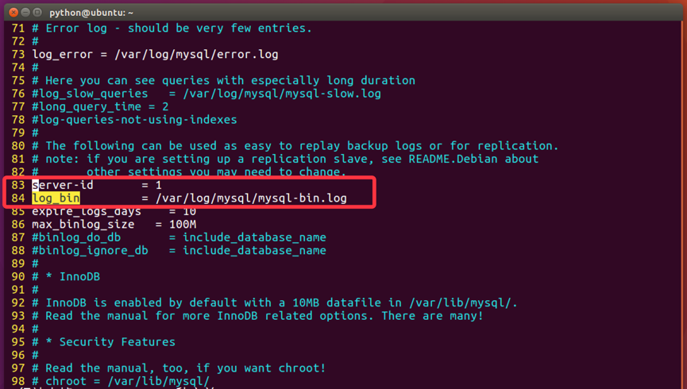

typora-copy-images-to: image

## 一、Mysql概念及使用

### 1. MySQL介绍

MySQL是一个关系型数据库管理系统，由瑞典MySQL AB公司开发，后来被Sun公司收购，Sun公司后来又被Oracle公司收购，目前属于Oracle旗下产品。

#### 1.1 Mysql特点

1. 使用C和C++编写，并使用了多种编译器进行测试，保证源代码的可移植性
2. 支持多种操作系统，如Linux、Windows、AIX、FreeBSD、HP-UX、MacOS、NovellNetware、OpenBSD、OS/2 Wrap、Solaris等
3. 为多种编程语言提供了API，如C、C++、Python、Java、Perl、PHP、Eiffel、Ruby等
4. 支持多线程，充分利用CPU资源
5. 优化的SQL查询算法，有效地提高查询速度
6. 提供多语言支持，常见的编码如GB2312、BIG5、UTF8
7. 提供TCP/IP、ODBC和JDBC等多种数据库连接途径
8. 提供用于管理、检查、优化数据库操作的管理工具
9. 大型的数据库。可以处理拥有上千万条记录的大型数据库
10. 支持多种存储引擎
11. MySQL 软件采用了双授权政策，它分为社区版和商业版，由于其体积小、速度快、总体拥有成本低，尤其是开放源码这一特点，一般中小型网站的开发都选择MySQL作为网站数据库
12. MySQL使用标准的SQL数据语言形式
13. Mysql是可以定制的，采用了GPL协议，你可以修改源码来开发自己的Mysql系统
14. 在线DDL更改功能
15. 复制全局事务标识
16. 复制无崩溃从机
17. 复制多线程从机

开源 免费 不要钱 使用范围广,跨平台支持性好,提供了多种语言调用的 API，是学习数据库开发的首选

### 2. Mysql安装

#### 2.1 Mysql安装（MAC）

1. 官网下载MYSQL Community Server
2. 双击安装，注意保存好最后弹出框的密码，此密码为mysql root密码，或者手动输入的密码
3. 添加环境变量，在`~/.bash_profile`中添加mysql执行文件（mysql本地文件一般为`/usr/local/mysql/bin`），然后输入`source ~/.bash_profile`
4. 安装完成

##### 2.1.1 系统配置

### 3. Mysql数据完整性

在表中为了更加准确的存储数据，保证数据的正确有效，可以在创建表的时候，为表添加一些强制性的验证，包括数据字段的类型、约束等。

#### 3.1 数据类型

使用数据类型的原则是：够用就行，尽量使用取值范围小的，而不用大的，这样可以更多的节省存储空间。

常用数据类型如下：

- 整数：int，bit
- 小数：decimal
- 字符串：varchar,char
- 日期时间: date, time, datetime
- 枚举类型(enum)

> 1. decimal表示浮点数，如decimal(5,2)表示共存5位数，小数占2位
> 2. char表示固定长度的字符串，如char(3)，如果填充'ab'时会补一个空格为`'ab '`
> 3. varchar表示可变长度的字符串，如varchar(3)，填充'ab'时就会存储'ab'
> 4. 字符串text表示存储大文本，当字符大于4000时推荐使用
> 5. 对于图片、音频、视频等文件，不存储在数据库中，而是上传到某个服务器上，然后在表中存储这个文件的保存路径

##### 3.1.1 数值类型(常用)

| 类型        | 字节大小 | 有符号范围(Signed)                         | 无符号范围(Unsigned)     |
| :---------- | :------- | :----------------------------------------- | :----------------------- |
| TINYINT     | 1        | -128 ~ 127                                 | 0 ~ 255                  |
| SMALLINT    | 2        | -32768 ~ 32767                             | 0 ~ 65535                |
| MEDIUMINT   | 3        | -8388608 ~ 8388607                         | 0 ~ 16777215             |
| INT/INTEGER | 4        | -2147483648 ~2147483647                    | 0 ~ 4294967295           |
| BIGINT      | 8        | -9223372036854775808 ~ 9223372036854775807 | 0 ~ 18446744073709551615 |

##### 3.1.2 字符串

| 类型    | 字节大小 | 示例                                                         |
| :------ | :------- | :----------------------------------------------------------- |
| CHAR    | 0-255    | 类型:char(3) 输入 'ab', 实际存储为'ab ', 输入'abcd' 实际存储为 'abc' |
| VARCHAR | 0-255    | 类型:varchar(3) 输 'ab',实际存储为'ab', 输入'abcd',实际存储为'abc' |
| TEXT    | 0-65535  | 大文本                                                       |

##### 3.1.3 日期时间类型

| 类型      | 字节大小 | 示例                                                  |
| :-------- | :------- | :---------------------------------------------------- |
| DATE      | 4        | '2020-01-01'                                          |
| TIME      | 3        | '12:29:59'                                            |
| DATETIME  | 8        | '2020-01-01 12:29:59'                                 |
| YEAR      | 1        | '2017'                                                |
| TIMESTAMP | 4        | '1970-01-01 00:00:01' UTC ~ '2038-01-01 00:00:01' UTC |

#### 3.2 约束

- 主键primary key：物理上存储的顺序
- 非空not null：此字段不允许填写空值
- 惟一unique：此字段的值不允许重复
- 默认default：当不填写此值时会使用默认值，如果填写时以填写为准
- 外键foreign key：对关系字段进行约束，当为关系字段填写值时，会到关联的表中查询此值是否存在，如果存在则填写成功，如果不存在则填写失败并抛出异常
- 说明：虽然外键约束可以保证数据的有效性，但是在进行数据的crud（增加、修改、删除、查询）时，都会降低数据库的性能，所以不推荐使用，那么数据的有效性怎么保证呢？答：可以在逻辑层进行控制

##### 3.2.1 外键约束

在创建数据表的时候就设置外键约束：

```sql
create table goods(
    id int primary key auto_increment not null,
    name varchar(40) default '',
    price decimal(5,2),
    cate_id int unsigned,
    brand_id int unsigned,
    is_show bit default 1,
    is_saleoff bit default 0,
    foreign key(cate_id) references goods_cates(id),
    foreign key(brand_id) references goods_brands(id)
);
```

取消外键约束

```sql
-- 需要先获取外键约束名称,该名称系统会自动生成,可以通过查看表创建语句来获取名称
show create table goods;
-- 获取名称之后就可以根据名称来删除外键约束
alter table goods drop foreign key 外键名称;
```

**在实际开发中,很少会使用到外键约束,会极大的降低表更新的效率**

### 3. 数据库操作

```shell
mysql -uroot -p  # 通过root连接数据库
select version()  # 查看当前版本
select now()  # 显示当前时间
show databases;  # 查看所有数据库
use 数据库名;  # 使用数据库
select database();  # 查看当前使用的数据库
create database 数据库名 charset=utf8;  # 创建数据库
drop database 数据库名;  # 删除数据库
```

#### 3.1 数据表操作

```shell
show tables;  # 查看当前数据库中所有表
desc 表名;  # 查看表结构
CREATE TABLE table_name(  # 创建表 
    column1 datatype contrai,
    column2 datatype,
    column3 datatype,
    .....
    columnN datatype,
    PRIMARY KEY(one or more columns)
);
# 示例，创建班级表
create table classes(
    id int unsigned auto_increment primary key not null,  # auto_increment表示自动增长 
    name varchar(10)
);
# 示例，创建学生表
create table students(
    id int unsigned primary key auto_increment not null,
    name varchar(20) default '',
    age tinyint unsigned default 0,
    height decimal(5,2),
    gender enum('男','女','人妖','保密'),
    cls_id int unsigned default 0
)

alter table 表名 add 列名 类型;  # 修改表-添加字段
# 示例
alter table students add birthday datetime;
# 修改表-修改字段：重命名版
alter table 表名 change 原名 新名 类型及约束;
# 例：
alter table students change birthday birth datetime not null;
# 修改表-修改字段：不重命名版
alter table 表名 modify 列名 类型及约束;
# 例：
alter table students modify birth date not null;
# 修改表-删除字段
alter table 表名 drop 列名;
# 例：
alter table students drop birthday;
# 删除表
drop table 表名;
# 例：
drop table students;
# 查看表的创建语句
show create table 表名;
# 例：
show create table classes;
```

curd的解释: 代表创建（Create）、更新（Update）、读取（Retrieve）和删除（Delete）

#### 3.2 数据库插入

插入格式：

```sql
INSERT [INTO] tb_name [(col_name,...)] {VALUES | VALUE} ({expr | DEFAULT},...),(...),...
```

主键列是自动增长，但是在全列插入时需要占位，通常使用0或者 default 或者 null 来占位，插入成功后以实际数据为准

##### 3.2.1 全列插入

值的顺序与表中字段的顺序对应

```sql
insert into 表名 values(...)
```

##### 3.2.2 部分列插入

值的顺序与给出的列顺序对应

```sql
insert into 表名(列1,...) values(值1,...)
```

上面的语句一次可以向表中插入一行数据，还可以一次性插入多行数据，这样可以减少与数据库的通信，全列多行插入：值的顺序与给出的列顺序对应

```sql
insert into 表名 values(...),(...)...;
```

##### 3.2.3 查表后插入

```sql
insert into goods_cates (name) select cate_name from goods group by cate_name;
-- 这里不用写value
```

##### 3.2.4 创建表时插入查询结果

```sql
create table goods_brands (
    id int unsigned primary key auto_increment,
    name varchar(40) not null) select brand_name as name from goods group by brand_name;
```

#### 3.3 数据库删除

```sql
DELETE FROM tb_name [where 条件判断]
```

#### 3.4 数据库更新

##### 3.4.1 基本更新

```sql
UPDATE tb_name SET col1={expr1|DEFAULT} [,col2={expr2|default}]...[where 条件判断]
```

##### 3.4.2 关联表更新

```sql
update goods as g inner join goods_cates as c on g.cate_name=c.name set g.cate_name=c.id;
-- 该方法可以更新goods表中符合条件的数据。注意，关联后的表更改原表也更改。
```

#### 3.5 数据库查询 

##### 3.5.1 查询所有字段

```sql
select * from tb_name;
```

##### 3.5.2 查询指定字段

```sql
select col_name1, col_name2, ... from tb_name;
```

##### 2.5.3 使用 as 给字段起别名

```sql
select id as 序号, name as 名字, gender as 性别 from students;
```

##### 3.5.4 可以通过 as 给表起别名

```sql
-- 如果是单表查询 可以省略表名
select id, name, gender from students;

-- 表名.字段名
select students.id,students.name,students.gender from students;

-- 可以通过 as 给表起别名 
select s.id,s.name,s.gender from students as s;
```

##### 3.5.5 消除重复行

在select后面列前使用distinct可以消除重复的行

```sql
select distinct 列1,... from 表名;
```

##### 3.5.6 使用条件语句

使用where子句对表中的数据筛选，结果为true的行会出现在结果集中

```sql
select * from 表名 where 条件;
```

where后面支持多种运算符，进行条件的处理：比较运算符、逻辑运算符、模糊查询、范围查询、空判断。

**比较运算符**包含：等于: =、大于: >、大于等于: >=、小于: <、小于等于: <=、不等于: != 或 <>

例：查询没被删除的学生

```sql
select * from students where is_delete=0;
```

**逻辑运算符**包含：and、or、not

例：查询编号小于4或没被删除的学生

```sql
select * from students where id < 4 or is_delete=0;
```

**模糊查询**包含：like、%表示任意多个任意字符、_表示一个任意字符

例：查询姓黄并且“名”是一个字的学生

```sql
select * from students where name like '黄_';
```

**范围查询**包含：in表示在一个非连续的范围内、between ... and ...表示在一个连续的范围内

例：查询编号是1或3或8的学生

```sql
select * from students where id in(1,3,8);
```

例：查询编号为3至8的学生

```sql
select * from students where id between 3 and 8;
```

**空判断**：null与""是不同的，判空is null

例：查询没有填写身高的学生

```sql
select * from students where height is null;
```

**优先级**

优先级由高到低的顺序为：小括号，not，比较运算符，逻辑运算符。其中，and比or先运算，如果同时出现并希望先算or，需要结合()使用。

##### 3.5.7 排序

为了方便查看数据，可以对数据进行排序

```sql
select * from 表名 order by 列1 asc|desc [,列2 asc|desc,...]
```

- 将行数据按照列1进行排序，如果某些行列1的值相同时，则按照列2排序，以此类推
- 默认按照列值从小到大排列（asc），asc从小到大排列，即升序，desc从大到小排序，即降序

例：查询未删除男生信息，按学号降序

```sql
select * from students where gender=1 and is_delete=0 order by id desc;
```

##### 3.5.8 聚合

为了快速得到统计数据，经常会用到如下5个聚合函数

1. 总数

   count(*)表示计算总行数，括号中写星与列名，结果是相同的

   例：查询学生总数

   ```sql
   select count(*) from students;
   ```

2. 最大值

   max(列)表示求此列的最大值

   例：查询女生的编号最大值

   ```sql
   select max(id) from students where gender=2;
   ```

3. 最小值

   min(列)表示求此列的最小值

   例：查询未删除的学生最小编号

   ```sql
   select min(id) from students where is_delete=0;
   ```

4. 求和

   sum(列)表示求此列的和

   例：查询男生的总年龄

   ```mssql
   select sum(age) from students where gender=1;
   
   -- 平均年龄
   select sum(age)/count(*) from students where gender=1;
   ```

5. 平均值

   avg(列)表示求此列的平均值

   例：查询未删除女生的编号平均值

   ```sql
   select avg(id) from students where is_delete=0 and gender=2;
   ```

##### 3.5.9 分组

`group by`：将查询结果按照1个或多个字段进行分组，字段值相同的为一组

1. 单独使用

   `group by`可用于单个字段分组，也可用于多个字段分组

   ```sql
   select * from students;
   +----+-----------+------+--------+--------+--------+-----------+
   | id | name      | age  | height | gender | cls_id | is_delete |
   +----+-----------+------+--------+--------+--------+-----------+
   |  1 | 小明      |   18 | 180.00 | 女     |      1 |           |
   |  2 | 小月月    |   18 | 180.00 | 女     |      2 |          |
   |  3 | 彭于晏    |   29 | 185.00 | 男     |      1 |           |
   |  4 | 刘德华    |   59 | 175.00 | 男     |      2 |          |
   |  5 | 黄蓉      |   38 | 160.00 | 女     |      1 |           |
   |  6 | 凤姐      |   28 | 150.00 | 保密   |      2 |          |
   |  7 | 王祖贤    |   18 | 172.00 | 女     |      1 |          |
   |  8 | 周杰伦    |   36 |   NULL | 男     |      1 |           |
   |  9 | 程坤      |   27 | 181.00 | 男     |      2 |           |
   | 10 | 刘亦菲    |   25 | 166.00 | 女     |      2 |           |
   | 11 | 金星      |   33 | 162.00 | 中性   |      3 |          |
   | 12 | 静香      |   12 | 180.00 | 女     |      4 |           |
   | 13 | 周杰      |   34 | 176.00 | 女     |      5 |           |
   | 14 | 郭靖      |   12 | 170.00 | 男     |      4 |           |
   +----+-----------+------+--------+--------+--------+-----------+
   
   select gender from students group by gender;
   +--------+
   | gender |
   +--------+
   | 男     |
   | 女     |
   | 中性   |
   | 保密   |
   +--------+
   ```

   根据gender字段来分组，gender字段的全部值有4个'男','女','中性','保密'，所以分为了4组。当group by单独使用时，只显示出每组的第一条记录, 所以group by单独使用时的实际意义不大

2. `group by` + `group_concat()``

   ``group_concat(字段名)`可以作为一个输出字段来使用，表示分组之后，根据分组结果，使用group_concat()来放置每一组的某字段的值的集合

   ```sql
   select gender from students group by gender;
   +--------+
   | gender |
   +--------+
   | 男     |
   | 女     |
   | 中性   |
   | 保密   |
   +--------+
   
   select gender,group_concat(name) from students group by gender;
   +--------+-----------------------------------------------------------+
   | gender | group_concat(name)                                        |
   +--------+-----------------------------------------------------------+
   | 男     | 彭于晏,刘德华,周杰伦,程坤,郭靖                                 |
   | 女     | 小明,小月月,黄蓉,王祖贤,刘亦菲,静香,周杰                        |
   | 中性   | 金星                                                       |
   | 保密   | 凤姐                                                       |
   +--------+-----------------------------------------------------------+
   
   select gender,group_concat(id) from students group by gender;
   +--------+------------------+
   | gender | group_concat(id) |
   +--------+------------------+
   | 男     | 3,4,8,9,14       |
   | 女     | 1,2,5,7,10,12,13 |
   | 中性   | 11               |
   | 保密   | 6                |
   +--------+------------------+
   ```

3. `group by` + 集合函数

   通过group_concat()的启发，我们既然可以统计出每个分组的某字段的值的集合，那么我们也可以通过集合函数来对这个`值的集合`做一些操作

   ```sql
   select gender,group_concat(age) from students group by gender;
   +--------+----------------------+
   | gender | group_concat(age)    |
   +--------+----------------------+
   | 男     | 29,59,36,27,12       |
   | 女     | 18,18,38,18,25,12,34 |
   | 中性   | 33                   |
   | 保密   | 28                   |
   +--------+----------------------+
   
   -- 分别统计性别为男/女的人年龄平均值
   select gender,avg(age) from students group by gender;
   +--------+----------+
   | gender | avg(age) |
   +--------+----------+
   | 男     |  32.6000 |
   | 女     |  23.2857 |
   | 中性   |  33.0000 |
   | 保密   |  28.0000 |
   +--------+----------+
   
   -- 分别统计性别为男/女的人的个数
   select gender,count(*) from students group by gender;
   +--------+----------+
   | gender | count(*) |
   +--------+----------+
   | 男     |        5 |
   | 女     |        7 |
   | 中性   |        1 |
   | 保密   |        1 |
   +--------+----------+
   ```

4. `group by` + `having`

   having 条件表达式：用来分组查询后指定一些条件来输出查询结果，having作用和where一样，但having只能用于group by。

   ```sql
   select gender,count(*) from students group by gender having count(*)>2;
   +--------+----------+
   | gender | count(*) |
   +--------+----------+
   | 男     |        5 |
   | 女     |        7 |
   +--------+----------+
   ```

5. `group by` + `with rollup`

   with rollup的作用是：在最后新增一行，来记录当前列里所有记录的总和

   ```sql
   select gender,count(*) from students group by gender with rollup;
   +--------+----------+
   | gender | count(*) |
   +--------+----------+
   | 男     |        5 |
   | 女     |        7 |
   | 中性   |        1 |
   | 保密   |        1 |
   | NULL   |       14 |
   +--------+----------+
   
   select gender,group_concat(age) from students group by gender with rollup;
   +--------+-------------------------------------------+
   | gender | group_concat(age)                         |
   +--------+-------------------------------------------+
   | 男     | 29,59,36,27,12                            |
   | 女     | 18,18,38,18,25,12,34                      |
   | 中性   | 33                                        |
   | 保密   | 28                                        |
   | NULL   | 29,59,36,27,12,18,18,38,18,25,12,34,33,28 |
   +--------+-------------------------------------------+
   ```

##### 3.5.10 分页

当数据量过大时，在一页中查看数据是一件非常麻烦的事情

```sql
select * from 表名 limit start,count
```

- 从start开始，获取count条数据

例：查询前3行男生信息

```sql
select * from students where gender=1 limit 0,3;
```

##### 3.5.11 连接查询

当查询结果的列来源于多张表时，需要将多张表连接成一个大的数据集，再选择合适的列返回

mysql支持三种类型的连接查询，分别为：

1. 内连接查询：查询的结果为两个表匹配到的数据

   

2. 右连接查询：查询的结果为两个表匹配到的数据，右表特有的数据，对于左表中不存在的数据使用null填充

   

3. 左连接查询：查询的结果为两个表匹配到的数据，左表特有的数据，对于右表中不存在的数据使用null填充

   

```sql
select * from 表1 inner|left|right join 表2 on 表1.列 = 表2.列
```

例：使用内连接查询班级表与学生表

```sql
select * from students inner join classes on students.cls_id = classes.id;
```

例：使用左连接查询班级表与学生表

```sql
select * from students as s left join classes as c on s.cls_id = c.id;
```

例：使用右连接查询班级表与学生表

```sql
select * from students as s right join classes as c on s.cls_id = c.id;
```

例：查询学生姓名及班级名称

```sql
select s.name,c.name from students as s inner join classes as c on s.cls_id = c.id;
```

##### 3.5.12 自关联

思考：

当前有一个省信息的表结构provinces

- id
- ptitle

一个设计市信息的表结构citys，citys表的proid表示城市所属的省，对应着provinces表的id值

- id
- ctitle
- proid

问题：能不能将两个表合成一张表呢？

答案：观察两张表发现，citys表比provinces表多一个列proid，其它列的类型都是一样的存储的都是地区信息，而且每种信息的数据量有限，没必要增加一个新表，或者将来还要存储区、乡镇信息，都增加新表的开销太大。

可以使用自关联来实现，定义定义表areas，结构如下

- id
- atitle
- pid

说明：

1. 因为省没有所属的省份，所以可以填写为null
2. 城市所属的省份pid，填写省所对应的编号id
3. 这就是自关联，表中的某一列，关联了这个表中的另外一列，但是它们的业务逻辑含义是不一样的，城市信息的pid引用的是省信息的id
4. 在这个表中，结构不变，可以添加区县、乡镇街道、村社区等信息

例：查询省的名称为“山西省”的所有城市

```sql
select city.* from areas as city
inner join areas as province on city.pid=province.aid
where province.atitle='山西省';
```

例：查询市的名称为“广州市”的所有区县

```sql
select dis.* from areas as dis
inner join areas as city on city.aid=dis.pid
where city.atitle='广州市';
```

##### 3.5.13 子查询

在一个 select 语句中,嵌入了另外一个 select 语句, 那么被嵌入的 select 语句称之为子查询语句

主查询：主要查询的对象,第一条 select 语句

主查询和子查询的关系

1. 子查询是嵌入到主查询中
2. 子查询是辅助主查询的,要么充当条件,要么充当数据源
3. 子查询是可以独立存在的语句,是一条完整的 select 语句

子查询分类

1. 标量子查询: 子查询返回的结果是一个数据(一行一列)
2. 列子查询: 返回的结果是一列(一列多行)
3. 行子查询: 返回的结果是一行(一行多列)

标量子查询

例：查询班级学生的平均身高

```sql
select * from students where age > (select avg(age) from students);
```

列级子查询

例：查询还有学生在班的所有班级名字

```sql
select name from classes where id in (select cls_id from students);
```

行级子查询

查找班级年龄最大,身高最高的学生

>  行元素: 将多个字段合成一个行元素,在行级子查询中会使用到行元素

```sql
select * from students where (height,age) = (select max(height),max(age) from students);
```

子查询中特定关键字使用：in 范围。格式: 主查询 where 条件 in (列子查询)

##### 3.5.14 总格式

```sql
SELECT select_expr [,select_expr,...] [      
      FROM tb_name
      [WHERE 条件判断]
      [GROUP BY {col_name | postion} [ASC | DESC], ...] 
      [HAVING WHERE 条件判断]
      [ORDER BY {col_name|expr|postion} [ASC | DESC], ...]
      [ LIMIT {[offset,]rowcount | row_count OFFSET offset}]
]
```

完整的select语句

```sql
select distinct *
from 表名
where ....
group by ... having ...
order by ...
limit start,count
```

执行顺序为：

- from 表名
- where ....
- group by ...
- select distinct *
- having ...
- order by ...
- limit start,count

实际使用中，只是语句中某些部分的组合，而不是全部

#### 3.6 数据库备份与恢复

```shell
# 备份，运行mysqldump命令
mysqldump –uroot –p 数据库名 > python.sql;


# 恢复，连接mysql，创建新的数据库。然后退出连接，执行如下命令
mysql -uroot –p 新数据库名 < python.sql
```

## 二、Mysql高级

### 1. 视图

对于复杂的查询，往往是有多个数据表进行关联查询而得到，如果数据库因为需求等原因发生了改变，为了保证查询出来的数据与之前相同，则需要在多个地方进行修改，维护起来非常麻烦。这种情况可以通过视图来解决。

#### 1.1 视图的由来

通俗的讲，视图就是一条SELECT语句执行后返回的结果集。所以我们在创建视图的时候，主要的工作就落在创建这条SQL查询语句上。

视图是对若干张基本表的引用，一张虚表，查询语句执行的结果，不存储具体的数据（基本表数据发生了改变，视图也会跟着改变）；

方便操作，特别是查询操作，减少复杂的SQL语句，增强可读性；

#### 1.2 视图的定义

命名建议以v_开头

```sql
create view 视图名称 as select语句;
```

#### 1.3 查看视图

查看表会将所有的视图也列出来

```sql
show tables;
```

#### 1.4 使用视图

视图的用途就是查询

```sql
select * from v_stu_score;
```

#### 1.5 删除视图

```sql
drop view 视图名称;
例：
drop view v_stu_sco;
```

#### 1.6 视图的好处

1. 提高了重用性，就像一个函数
2. 对数据库重构，却不影响程序的运行
3. 提高了安全性能，可以对不同的用户
4. 让数据更加清晰

### 2. 事务

事务广泛的运用于订单系统、银行系统等多种场景

例如：

A用户和B用户是银行的储户，现在A要给B转账500元，那么需要做以下几件事：

1. 检查A的账户余额>500元；
2. A 账户中扣除500元;
3. B 账户中增加500元;

正常的流程走下来，A账户扣了500，B账户加了500，皆大欢喜。

那如果A账户扣了钱之后，系统出故障了呢？A白白损失了500，而B也没有收到本该属于他的500。

以上的案例中，隐藏着一个前提条件：A扣钱和B加钱，要么同时成功，要么同时失败。事务的需求就在于此。

所谓事务,它是一个操作序列，这些操作要么都执行，要么都不执行，它是一个不可分割的工作单位。

例如，银行转帐工作：从一个帐号扣款并使另一个帐号增款，这两个操作要么都执行，要么都不执行。所以，应该把他们看成一个事务。事务是数据库维护数据一致性的单位，在每个事务结束时，都能保持数据一致性

#### 2.1 事务四大特性(简称ACID)

- 原子性(Atomicity)
- 一致性(Consistency)
- 隔离性(Isolation)
- 持久性(Durability)

以下内容出自《高性能MySQL》第三版，了解事务的ACID及四种隔离级有助于我们更好的理解事务运作。

下面举一个银行应用是解释事务必要性的一个经典例子。假如一个银行的数据库有两张表：支票表（checking）和储蓄表（savings）。现在要从用户Jane的支票账户转移200美元到她的储蓄账户，那么至少需要三个步骤：

1. 检查支票账户的余额高于或者等于200美元。
2. 从支票账户余额中减去200美元。
3. 在储蓄帐户余额中增加200美元。

上述三个步骤的操作必须打包在一个事务中，任何一个步骤失败，则必须回滚所有的步骤。

可以用START TRANSACTION语句开始一个事务，然后要么使用COMMIT提交将修改的数据持久保存，要么使用ROLLBACK撤销所有的修改。事务SQL的样本如下：

1. start transaction;
2. select balance from checking where customer_id = 10233276;
3. update checking set balance = balance - 200.00 where customer_id = 10233276;
4. update savings set balance = balance + 200.00 where customer_id = 10233276;
5. commit;

一个很好的事务处理系统，必须具备这些标准特性：

1. 原子性（atomicity）：一个事务必须被视为一个不可分割的最小工作单元，整个事务中的所有操作要么全部提交成功，要么全部失败回滚，对于一个事务来说，不可能只执行其中的一部分操作，这就是事务的原子性
2. 一致性（consistency）：数据库总是从一个一致性的状态转换到另一个一致性的状态。（在前面的例子中，一致性确保了，即使在执行第三、四条语句之间时系统崩溃，支票账户中也不会损失200美元，因为事务最终没有提交，所以事务中所做的修改也不会保存到数据库中。）
3. 隔离性（isolation）：通常来说，一个事务所做的修改在最终提交以前，对其他事务是不可见的。（在前面的例子中，当执行完第三条语句、第四条语句还未开始时，此时有另外的一个账户汇总程序开始运行，则其看到支票帐户的余额并没有被减去200美元。）
4. 持久性（durability）：一旦事务提交，则其所做的修改会永久保存到数据库。（此时即使系统崩溃，修改的数据也不会丢失。）

#### 2.2 事务命令

表的引擎类型必须是**innodb**类型才可以使用事务，这是mysql表的默认引擎

查看表的创建语句，可以看到engine=innodb

```sql
-- 选择数据库
use jing_dong;
-- 查看goods表
show create table goods;
```

##### 2.2.1 开启事务

开启事务后执行修改命令，变更会维护到本地缓存中，而不维护到物理表中

```sql
begin;
或者
start transaction;
-- 亲测：本地事务开启后，执行插入操作，该客户端可以查询到该数据。其他客户端不可以。
```

##### 2.2.2 提交事务

将缓存中的数据变更维护到物理表中

```sql
commit;
```

##### 2.2.3 回滚事务

放弃缓存中变更的数据

```sql
rollback;
```

#### 2.3 TIPS

1. 修改数据的命令会自动的触发事务，包括insert、update、delete
2. 而在SQL语句中有手动开启事务的原因是：可以进行多次数据的修改，如果成功一起成功，否则一起会滚到之前的数据

### 3. 索引

#### 3.1 索引的由来

一般的应用系统对比数据库的读写比例在10:1左右(即有10次查询操作时有1次写的操作)，而且插入操作和更新操作很少出现性能问题，遇到最多、最容易出问题还是一些复杂的查询操作，所以查询语句的优化显然是重中之重。

当数据库中数据量很大时，查找数据会变得很慢，可以通过索引来解决。

#### 3.2 索引的定义

索引是一种特殊的文件(InnoDB数据表上的索引是表空间的一个组成部分)，它们包含着对数据表里所有记录的引用指针。

更通俗的说，数据库索引好比是一本书前面的目录，能加快数据库的查询速度

#### 3.3 索引的目的

索引的目的在于提高查询效率，可以类比字典，如果要查“mysql”这个单词，我们肯定需要定位到m字母，然后从下往下找到y字母，再找到剩下的sql。如果没有索引，那么你可能需要把所有单词看一遍才能找到你想要的，如果我想找到m开头的单词呢？或者ze开头的单词呢？是不是觉得如果没有索引，这个事情根本无法完成？

#### 3.4 索引的原理

除了词典，生活中随处可见索引的例子，如火车站的车次表、图书的目录等。它们的原理都是一样的，通过不断的缩小想要获得数据的范围来筛选出最终想要的结果，同时把随机的事件变成顺序的事件，也就是我们总是通过同一种查找方式来锁定数据。

数据库也是一样，但显然要复杂许多，因为不仅面临着等值查询，还有范围查询(>、<、between、in)、模糊查询(like)、并集查询(or)等等。数据库应该选择怎么样的方式来应对所有的问题呢？我们回想字典的例子，能不能把数据分成段，然后分段查询呢？最简单的如果1000条数据，1到100分成第一段，101到200分成第二段，201到300分成第三段……这样查第250条数据，只要找第三段就可以了，一下子去除了90%的无效数据。

#### 3.5 索引的使用

##### 3.5.1 查看索引

```sql
show index from 表名;
```

##### 3.5.2 创建索引

如果指定字段是字符串，需要指定长度，建议长度与定义字段时的长度一致，字段类型如果不是字符串，可以不填写长度部分

```sql
create index 索引名称 on 表名(字段名称(长度))
```

##### 3.5.3 删除索引

```sql
drop index 索引名称 on 表名;
```

#### 3.6 测试Demo

##### 3.6.1 创建测试表

```sql
create table test_index(title varchar(10));
```

##### 3.6.2 添加数据

使用python程序（ipython也可以）通过pymsql模块 向表中加入十万条数据

```python
from pymysql import connect

def main():
    # 创建Connection连接
    conn = connect(host='localhost',port=3306,database='jing_dong',user='root',password='mysql',charset='utf8')
    # 获得Cursor对象
    cursor = conn.cursor()
    # 插入10万次数据
    for i in range(100000):
        cursor.execute("insert into test_index values('ha-%d')" % i)
    # 提交数据
    conn.commit()

if __name__ == "__main__":
    main()
```

##### 3.6.3 查询测试

```sql
set profiling=1;  -- 开启运行时间监测：
select * from test_index where title='ha-99999';  -- 查找第1万条数据ha-99999
show profiles;  -- 查看执行的时间
create index title_index on test_index(title(10));  -- 为表title_index的title列创建索引
select * from test_index where title='ha-99999';  -- 执行查询语句
show profiles;  -- 再次查看执行的时间
```

#### 3.7 注意

要注意的是，建立太多的索引将会影响更新和插入的速度，因为它需要同样更新每个索引文件。对于一个经常需要更新和插入的表格，就没有必要为一个很少使用的where字句单独建立索引了，对于比较小的表，排序的开销不会很大，也没有必要建立另外的索引。

建立索引会占用磁盘空间

主键以及外键会自动建立索引。

### 4. 账户管理

**在生产环境下操作数据库时，绝对不可以使用root账户连接，而是创建特定的账户，授予这个账户特定的操作权限，然后连接进行操作，主要的操作就是数据的crud**

MySQL账户体系：根据账户所具有的权限的不同，MySQL的账户可以分为以下几种

- 服务实例级账号：启动了一个mysqld，即为一个数据库实例；如果某用户如root，拥有服务实例级分配的权限，那么该账号就可以删除所有的数据库、连同这些库中的表
- 数据库级别账号：对特定数据库执行增删改查的所有操作
- 数据表级别账号：对特定表执行增删改查等所有操作
- 字段级别的权限：对某些表的特定字段进行操作
- 存储程序级别的账号：对存储程序进行增删改查的操作

账户的操作主要包括创建账户、删除账户、修改密码、授权权限等。进行账户操作时，需要使用root账户登录，这个账户拥有最高的实例级权限。生产中通常都使用数据库级操作权限

#### 4.1 创建用户&授予权限

需要使用实例级账户登录后操作，以root为例。主要操作包括：

1. 查看所有用户
2. 修改密码
3. 删除用户

##### 4.1.1 查看所有用户

所有用户及权限信息存储在mysql数据库的user表中，查看user表的结构

```sql
desc user;
  -- Host表示允许访问的主机
  -- User表示用户名
  -- authentication_string表示密码，为加密后的值
```

查看所有用户

```sql
select host,user,authentication_string from user;
```

##### 4.1.2 创建账户、授权

创建账户&授权

```sql
CREATE USER '用户名'@'访问主机' IDENTIFIED BY 'password';
GRANT 权限列表 ON 数据库 TO '用户名'@'访问主机';
 -- 权限列表主要包括：create、alter、drop、insert、update、delete、select，如果分配所有权限，可以使用all privileges
 -- 可以操作python数据库的所有表，方式为: jing_dong.*
 -- 访问主机通常使用 百分号% 表示此账户可以使用任何ip的主机登录访问此数据库
 -- 访问主机可以设置成 localhost或具体的ip，表示只允许本机或特定主机访问
flush privileges;  -- 刷新权限
```

查看用户有哪些权限

```sql
show grants for laowang@localhost;
grant select on jing_dong.* to jct@'%' identified by '12345678';
```

#### 4.2 账户操作

##### 4.2.1 修改权限

```sql
grant 权限名称 on 数据库 to 账户@主机 with grant option;
```

##### 4.2.1 修改密码

使用root登录，修改mysql数据库的user表，使用password()函数进行密码加密

```sql
update user set authentication_string=password('新密码') where user='用户名';
```

注意修改完成后需要刷新权限

```sql
flush privileges;
```

##### 4.2.3 远程登录（危险慎用）

如果向在一个Ubuntu中使用msyql命令远程连接另外一台mysql服务器的话，通过以下方式即可完成，但是此方法仅仅了解就好了，不要在实际生产环境中使用

修改 /etc/mysql/mysql.conf.d/mysqld.cnf 文件，将 `bind-address = 127.0.0.1`前用#注释。

然后重启`service mysql restart`

##### 4.2.4 删除账户

语法1：使用root登录

```sql
drop user '用户名'@'主机';
例：
drop user 'laowang'@'%';
-- 操作结束之后需要刷新权限
flush privileges
```

语法2：使用root登录，删除mysql数据库的user表中数据

```sql
delete from user where user='用户名';
例：
delete from user where user='laowang';

-- 操作结束之后需要刷新权限
flush privileges
```

推荐使用语法1删除用户, 如果使用语法1删除失败，采用语法2方式

### 5. MySQL主从同步配置

#### 5.1 主从同步的定义

主从同步使得数据可以从一个数据库服务器复制到其他服务器上，在复制数据时，一个服务器充当主服务器（master），其余的服务器充当从服务器（slave）。因为复制是异步进行的，所以从服务器不需要一直连接着主服务器，从服务器甚至可以通过拨号断断续续地连接主服务器。通过配置文件，可以指定复制所有的数据库，某个数据库，甚至是某个数据库上的某个表。

使用主从同步的好处：

1. 通过增加从服务器来提高数据库的性能，在主服务器上执行写入和更新，在从服务器上向外提供读功能，可以动态地调整从服务器的数量，从而调整整个数据库的性能。
2. 提高数据安全，因为数据已复制到从服务器，从服务器可以终止复制进程，所以，可以在从服务器上备份而不破坏主服务器相应数据
3. 在主服务器上生成实时数据，而在从服务器上分析这些数据，从而提高主服务器的性能

#### 5.2 主从同步的机制


Mysql服务器之间的主从同步是基于二进制日志机制，主服务器使用二进制日志来记录数据库的变动情况，从服务器通过读取和执行该日志文件来保持和主服务器的数据一致。

在使用二进制日志时，主服务器的所有操作都会被记录下来，然后从服务器会接收到该日志的一个副本。从服务器可以指定执行该日志中的哪一类事件（譬如只插入数据或者只更新数据），默认会执行日志中的所有语句。

每一个从服务器会记录关于二进制日志的信息：文件名和已经处理过的语句，这样意味着不同的从服务器可以分别执行同一个二进制日志的不同部分，并且从服务器可以随时连接或者中断和服务器的连接。

主服务器和每一个从服务器都必须配置一个唯一的ID号（在my.cnf文件的[mysqld]模块下有一个server-id配置项），另外，每一个从服务器还需要通过CHANGE MASTER TO语句来配置它要连接的主服务器的ip地址，日志文件名称和该日志里面的位置（这些信息存储在主服务器的数据库里）

#### 5.3 配置主从同步的基本步骤

有很多种配置主从同步的方法，可以总结为如下的步骤：

1. 在主服务器上，必须开启二进制日志机制和配置一个独立的ID
2. 在每一个从服务器上，配置一个唯一的ID，创建一个用来专门复制主服务器数据的账号
3. 在开始复制进程前，在主服务器上记录二进制文件的位置信息
4. 如果在开始复制之前，数据库中已经有数据，就必须先创建一个数据快照（可以使用mysqldump导出数据库，或者直接复制数据文件）
5. 配置从服务器要连接的主服务器的IP地址和登陆授权，二进制日志文件名和位置

#### 5.4  配置主从同步示例

主和从的身份可以自己指定，我们将虚拟机Ubuntu中MySQL作为主服务器，将另一台Ubuntu中的MySQL作为从服务器。 在主从设置前，要保证网络连通。

##### 5.4.1 备份主服务器到从服务器

如果在设置主从同步前，主服务器上已有大量数据，可以使用mysqldump进行数据备份并还原到从服务器以实现数据的复制。

在主服务器Ubuntu上进行备份，执行命令：

```shell
mysqldump -uroot -pmysql --all-databases --lock-all-tables > ~/master_db.sql
# -u ：用户名
# -p ：示密码
# --all-databases ：导出所有数据库
# --lock-all-tables ：执行操作时锁住所有表，防止操作时有数据修改
# ~/master_db.sql :导出的备份数据（sql文件）位置，可自己指定
```

##### 5.4.2 在从服务器进行数据还原

```
mysql –uroot –pmysql < master_db.sql
```

##### 5.4.3 配置主服务器master

编辑设置mysqld的配置文件，设置log_bin和server-id

```
sudo vim /etc/mysql/mysql.conf.d/mysqld.cnf
```



重启mysql服务

```
sudo service mysql restart
```

##### 5.4.4 建用同步数据使用的帐号

```sql
mysql –uroot –p
CREATE USER 'slave'@'%' IDENTIFIED BY 'slave';
GRANT REPLICATION SLAVE ON *.* TO 'slave'@'%';
FLUSH PRIVILEGES;
```

##### 5.4.5 获取主服务器的二进制日志信息

```
SHOW MASTER STATUS;
```


File为使用的日志文件名字，Position为使用的文件位置，这两个参数须记下，配置从服务器时会用到

##### 5.4.6 配置从服务器slave

编辑my.cnf文件，将server-id修改为2，并保存退出。如果是新创建文件，需要在首行加入

```
[mysqld]
server-id = 2
```

进入mysql，设置连接到master主服务器

```
change master to master_host='10.211.55.5', master_user='slave', master_password='slave',master_log_file='mysql-bin.000006', master_log_pos=590;
```

- master_host：主服务器Ubuntu的ip地址
- master_log_file: 前面查询到的主服务器日志文件名
- master_log_pos: 前面查询到的主服务器日志文件位置

##### 5.4.7 开启同步，查看同步状态

