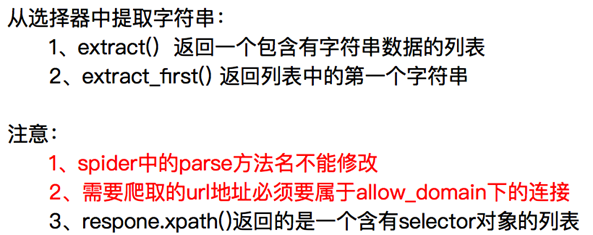

## 一、Scrapy概论

Scrapy是一个为了爬取网络数据，提取结构化数据而编写的应用框架，我们只需要实现少量的代码，就能够快速的抓取。

Scrapy使用了Twisted异步网络框架，可以加快我们的下载速度。

## 二、Scrapy的爬虫流程


## 三、Scrapy使用

### 3.1 Scrapy框架使用流程

```
# 1. 创建一个scrapy项目：
scrapy startproject mySpider
# 2. 生成一个爬虫
scrapy genspider itcast "itcast.cn"
# 3. 提取数据，完善spider，使用xpath等方法
# 4. 保存数据，在pipeline中保存数据
```

### 3.2 创建一个Scrapy项目

- scrapy startproject <project_name>

项目目录：


### 3.3 创建一个爬虫

- scrapy genspider + <spider_name> + <允许爬取的域名>


### 3.4 完善spider




### 3.5 spider的数据传到pipeline


### 3.6 使用pipeline


从pipeline的字典形式可以看出来，pipeline可以有多个。为什么呢？

1. 可能会有多个spider，不同的pipeline处理不同的item的内容
2. 一个spider的内容可能要做不同的操作，比如存入不同的数据库中

**注意：pipeline的权重越小优先级越高；如果数据需要在不同的管道之间传递，管道需要return数据**

### 3.7 Log的设置

我们可以在setting中设置log级别，在setting中添加一行（全部大写）：LOG_LEVEL = "WARNING”，默认终端显示的是debug级别的log信息

```
import logging
def process_item(self, item, spider):
	logging.warning(item)  # 无法显示log位置
	
import logging
logger = logging.getLogger(__name__)
def process_item(self, item, spider):
	logger.warning(item)  # 能够显示log位置
```

### 3.8 实现翻页请求


### 3.9 设置User-Agent

```python
# 在setting中设置User-Agent：
USER_AGENT = 'Mozilla/5.0 (Macintosh; Intel Mac OS X 10_12_5) AppleWebKit/537.36 (KHTML, like Gecko) Chrome/59.0.3071.115 Safari/537.36'
```

### 3.10 定义Item


### 3.11 Debug信息


### 3.12 Scrapy shell使用

Scrapy shell是一个交互终端，我们可以在未启动spider的情况下尝试及调试代码，也可以用来测试XPath表达式。

使用方法：

```
  scrapy shell domain_name
```

response的一些方法：

- response.url：当前响应的url地址
- response.request.url：当前响应对应的请求的url地址
- response.headers：响应头
- response.body：响应体，也就是html代码，默认是byte类型
- response.requests.headers：当前响应的请求头

### 3.13 setting文件


### 3.14 CrawlSpider的使用

生成crawlspider的命令：

```
scrapy genspider –t crawl csdn “csdn.cn”
```


### 3.15 下载中间件

使用方法：
       编写一个Downloader Middlewares和我们编写一个pipeline一样，定义一个类，然后在setting中开启

```python
# Downloader Middlewares默认的方法：
process_request(self, request, spider)：
	当每个request通过下载中间件时，该方法被调用。
process_response(self, request, response, spider)：
	当下载器完成http请求，传递响应给引擎的时候调用
```


### 3.16 模拟登陆之携带cookie


### 3.17 模拟登陆之发送post请求


### 3.18 模拟登陆之自动登录


