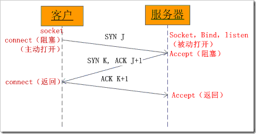

## 一、网络编程

### 1. 相关概念

#### 1.1 网络编程

网络编程就是，让在不同的电脑上的软件能够进行数据传递，即进程之间的通信。

#### 1.2 动态端口

动态端口，是因为它一般不固定分配某种服务，而是动态分配。动态分配是指当一个系统程序或应用程序需要网络通信时，它向主机申请一个端口，主机从可用的端口号中分配一个供它使用。当这个程序关闭时，同时也就释放了所占用的端口号。

如何查看端口号？

可以使用`netstat - an`查看端口状态

#### 1.3 `socket`简介

不同电脑上的进程之间如何通信呢？首先要解决的问题是如何唯一标识一个进程，否则通信无从谈起。在电脑上可以通过进程号（PID）来唯一标识一个进程，但是在网络中这是行不通的。在网络中使用的是IP地址+协议+端口来标识网络的进程。

进程间通信就是指运行的程序之间的数据共享。

socket是进程间通信的一种方式，它与其他进程间通信的一个主要不同是：它能实现不同主机间的进程间通信，我们网络上各种各样的服务大多是基于socket来完成通信的。

socket是全双工的方式进行的。

### 2. socket

#### 2.1 创建socket

在 Python 中 使用socket 模块的函数 socket 就可以完成：

```python
import socket
s = socket.socket(AddressFamily, Type)
# 函数 socket.socket 创建一个 socket，该函数带有两个参数：
# 1. Address Family：可以选择 AF_INET（用于 Internet 进程间通信） 或者 AF_UNIX（用于同一台机器进程间通信）,实际工作中常用AF_INET
# 2. Type：套接字类型，可以是 SOCK_STREAM（流式套接字，主要用于 TCP 协议）或者 SOCK_DGRAM（数据报套接字，主要用于 UDP 协议）
s.close()  # 套接字使用流程与文件的使用流程很类似，使用完毕后需要关闭套接字
```

#### 2.2 UDP网络

##### 2.2.1 发送数据到服务器

```python
#coding=utf-8

from socket import *

# 1. 创建udp套接字
udp_socket = socket(AF_INET, SOCK_DGRAM)
# 2. 准备接收方的地址
dest_addr = ('192.168.1.103', 8080)  # 注意是元组，ip是字符串，端口是数字
# 3. 从键盘获取数据
send_data = input("请输入要发送的数据:")
# 4. 发送数据到指定的电脑上的指定程序中
udp_socket.sendto(send_data.encode('utf-8'), dest_addr)
# 5. 关闭套接字
udp_socket.close()
```

##### 2.2.2 接受数据

```python
#coding=utf-8

from socket import *

# 1. 创建udp套接字
udp_socket = socket(AF_INET, SOCK_DGRAM)
# 2. 准备接收方的地址
dest_addr = ('192.168.236.129', 8080)
# 3. 从键盘获取数据
send_data = input("请输入要发送的数据:")
# 4. 发送数据到指定的电脑上
udp_socket.sendto(send_data.encode('utf-8'), dest_addr)
# 5. 等待接收对方发送的数据
recv_data = udp_socket.recvfrom(1024)  # 1024表示本次接收的最大字节数
# 6. 显示对方发送的数据
# 接收到的数据recv_data是一个元组，第1个元素是对方发送的数据，第2个元素是对方的ip和端口
print(recv_data[0].decode('gbk'))
print(recv_data[1])
# 7. 关闭套接字
udp_socket.close()
```

##### 2.2.3 UDP端口绑定

作为服务器，需要由一个固定的端口提供服务，所以网络程序需要绑定一个端口。

```python
#coding=utf-8

from socket import *

# 1. 创建套接字
udp_socket = socket(AF_INET, SOCK_DGRAM)
# 2. 绑定本地的相关信息，如果一个网络程序不绑定，则系统会随机分配
local_addr = ('', 7788) #  ip地址和端口号，ip一般不用写，表示本机的任何一个ip
udp_socket.bind(local_addr)
# 3. 等待接收对方发送的数据
recv_data = udp_socket.recvfrom(1024) #  1024表示本次接收的最大字节数
# 4. 显示接收到的数据
print(recv_data[0].decode('gbk'))
# 5. 关闭套接字
udp_socket.close()
```

#### 2.3 TCP网络

##### 2.3.1 TCP简介

TCP协议，传输控制协议（英语：Transmission Control Protocol，缩写为 TCP）是一种面向连接的、可靠的、基于字节流的传输层通信协议，由IETF的RFC 793定义。

TCP通信需要经过创建连接、数据传送、终止连接三个步骤。

TCP通信模型中，在通信开始之前，一定要先建立相关的链接，才能发送数据。

##### 2.3.2 TCP特点

1. 面向连接

   通信双方必须先建立连接才能进行数据的传输，双方都必须为该连接分配必要的系统内核资源，以管理连接的状态和连接上的传输。

   双方间的数据传输都可以通过这一个连接进行。完成数据交换后，双方必须断开此连接，以释放系统资源。

   这种连接是一对一的，因此TCP不适用于广播的应用程序，基于广播的应用程序请使用UDP协议。

2. 可靠传输

   1. TCP采用发送应答机制

      TCP发送的每个报文段都必须得到接收方的应答才认为这个TCP报文段传输成功

   2. 超时重传

      发送端发出一个报文段之后就启动定时器，如果在定时时间内没有收到应答就重新发送这个报文段。

      TCP为了保证不发生丢包，就给每个包一个序号，同时序号也保证了传送到接收端实体的包的按序接收。然后接收端实体对已成功收到的包发回一个相应的确认（ACK）；如果发送端实体在合理的往返时延（RTT）内未收到确认，那么对应的数据包就被假设为已丢失将会被进行重传。

   3. 错误校验

      TCP用一个校验和函数来检验数据是否有错误；在发送和接收时都要计算校验和。

   4. 流量控制和阻塞管理

      流量控制用来避免主机发送得过快而使接收方来不及完全收下。

##### 2.3.3 发送数据到服务器


```python
from socket import *

# 创建socket
tcp_client_socket = socket(AF_INET, SOCK_STREAM)
# 目的信息
server_ip = input("请输入服务器ip:")
server_port = int(input("请输入服务器port:"))
# 链接服务器
tcp_client_socket.connect((server_ip, server_port))
# 提示用户输入数据
send_data = input("请输入要发送的数据：")
tcp_client_socket.send(send_data.encode("gbk"))
# 接收对方发送过来的数据，最大接收1024个字节
recvData = tcp_client_socket.recv(1024)
print('接收到的数据为:', recvData.decode('gbk'))
# 关闭套接字
tcp_client_socket.close()
```

##### 2.3.4 从客户端接收数据

在程序中，如果想要完成一个tcp服务器的功能，需要的流程如下：

1. socket创建一个套接字
2. bind绑定ip和port
3. listen使套接字变为可以被动链接
4. accept等待客户端的链接
5. recv/send接收发送数据

```python
from socket import *

# 创建socket
tcp_server_socket = socket(AF_INET, SOCK_STREAM)
# 本地信息
address = ('', 7788)
# 绑定
tcp_server_socket.bind(address)
# 使用socket创建的套接字默认的属性是主动的，使用listen将其变为被动的，这样就可以接收别人的链接了
tcp_server_socket.listen(128)
# 如果有新的客户端来链接服务器，那么就产生一个新的套接字专门为这个客户端服务
# client_socket用来为这个客户端服务
# tcp_server_socket就可以省下来专门等待其他新客户端的链接
client_socket, clientAddr = tcp_server_socket.accept()
# 接收对方发送过来的数据
recv_data = client_socket.recv(1024)  # 接收1024个字节
print('接收到的数据为:', recv_data.decode('gbk'))
# 发送一些数据到客户端
client_socket.send("thank you !".encode('gbk'))
# 关闭为这个客户端服务的套接字，只要关闭了，就意味着为不能再为这个客户端服务了，如果还需要服务，只能再次重新连接
client_socket.close()
```

**TIPS**

1. TCP服务器一般情况下都需要绑定，否则客户端找不到这个服务器
2. TCP客户端一般不绑定，因为是主动链接服务器，所以只要确定好服务器的ip、port等信息就好，本地客户端可以随机
3. TCP服务器中通过listen可以将socket创建出来的主动套接字变为被动的，这是做tcp服务器时必须要做的
4. 当客户端需要链接服务器时，就需要使用connect进行链接，udp是不需要链接的而是直接发送，但是tcp必须先链接，只有链接成功才能通信
5. 当一个tcp客户端连接服务器时，服务器端会有1个新的套接字，这个套接字用来标记这个客户端，单独为这个客户端服务
6. listen后的套接字是被动套接字，用来接收新的客户端的链接请求的，而accept返回的新套接字是标记这个新客户端的
7. 关闭listen后的套接字意味着被动套接字关闭了，会导致新的客户端不能够链接服务器，但是之前已经链接成功的客户端正常通信。
8. 关闭accept返回的套接字意味着这个客户端已经服务完毕
9. 当客户端的套接字调用close后，服务器端会recv解堵塞，并且返回的长度为0，因此服务器可以通过返回数据的长度来区别客户端是否已经下线

#### 2.4 TCP三次握手



#### 2.8 TCP四次挥手


连接的建立通过三次握手，释放则需要四次挥手。

#### 2.9 TCP短连接和长连接

##### 2.9.1 TCP短连接

模拟一种TCP短连接的情况:

1. client 向 server 发起连接请求
2. server 接到请求，双方建立连接
3. client 向 server 发送消息
4. server 回应 client
5. 一次读写完成，此时双方任何一个都可以发起 close 操作

在步骤5中，一般都是 client 先发起 close 操作。当然也不排除有特殊的情况。

从上面的描述看，短连接一般只会在 client/server 间传递一次读写操作！

##### 2.9.2 TCP长连接

再模拟一种长连接的情况:

1. client 向 server 发起连接
2. server 接到请求，双方建立连接
3. client 向 server 发送消息
4. server 回应 client
5. 一次读写完成，连接不关闭
6. 后续读写操作...
7. 长时间操作之后client发起关闭请求

##### 2.9.3 短连接的操作步骤

建立连接——数据传输——关闭连接...建立连接——数据传输——关闭连接

##### 2.9.4 长连接的操作步骤

建立连接——数据传输...（保持连接）...数据传输——关闭连接

##### 2.9.5 短连接与长连接优缺点

1. 长连接可以省去较多的TCP建立和关闭的操作，减少浪费，节约时间。对于频繁请求资源的客户来说，较适用长连接。
2. client与server之间的连接如果一直不关闭的话，会存在一个问题，随着客户端连接越来越多，server早晚有扛不住的时候，这时候server端需要采取一些策略。如关闭一些长时间没有读写事件发生的连接，这样可以避免一些恶意连接导致server端服务受损；如果条件再允许就可以以客户端机器为颗粒度，限制每个客户端的最大长连接数，这样可以完全避免某个蛋疼的客户端连累后端服务。
3. 短连接对于服务器来说管理较为简单，存在的连接都是有用的连接，不需要额外的控制手段。但如果客户请求频繁，将在TCP的建立和关闭操作上浪费时间和带宽。

##### 2.9.6 TCP长/短连接的应用场景

1. 长连接多用于操作频繁，点对点的通讯，而且连接数不能太多情况。每个TCP连接都需要三次握手，这需要时间，如果每个操作都是先连接，再操作的话那么处理速度会降低很多，所以每个操作完后都不断开，再次处理时直接发送数据包就OK了，不用建立TCP连接。

   例如：数据库的连接用长连接，如果用短连接频繁的通信会造成socket错误，而且频繁的socket 创建也是对资源的浪费。

2. 而像WEB网站的http服务一般都用短链接，因为长连接对于服务端来说会耗费一定的资源，而像WEB网站这么频繁的成千上万甚至上亿客户端的连接用短连接会更省一些资源，如果用长连接，而且同时有成千上万的用户，如果每个用户都占用一个连接的话，那可想而知吧。所以并发量大，但每个用户无需频繁操作情况下需用短连好。
