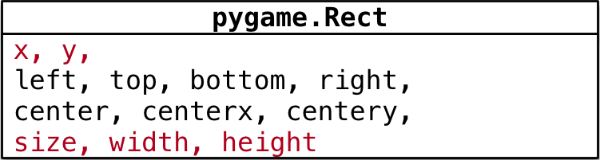

## 一、Pygame的快速入门

### 1. 游戏的初始化和退出

| 方法            | 说明                                                         |
| --------------- | ------------------------------------------------------------ |
| `pygame.init()` | 导入并初始化所有 `pygame` 模块，使用其他模块之前，必须先调用 `init` 方法 |
| `pygame.quit()` | 卸载所有 `pygame` 模块，在游戏结束之前调用！                 |

### 2. 游戏中的元素

在游戏中，所有可见的元素都是以矩形区域来描述位置的，要描述一个矩形区域有四个要素：`(x, y) (width, height)`。

`pygame` 专门提供了一个类 `pygame.Rect` 用于描述 **矩形区域**



> `pygame.Rect` 是一个比较特殊的类，内部只是封装了一些数字计算不执行 `pygame.init() `方法同样能够直接使用

### 3. 创建游戏主窗口

`pygame` 专门提供了一个 **模块** `pygame.display` 用于创建、管理 **游戏窗口**

| 方法                        | 说明                       |
| --------------------------- | -------------------------- |
| `pygame.display.set_mode()` | 初始化游戏显示窗口         |
| `pygame.display.update()`   | 刷新屏幕内容显示，稍后使用 |

#### 3.1 `set_mode` 方法

```python
set_mode(resolution=(0,0), flags=0, depth=0) -> Surface
```

- **作用** —— 创建游戏显示窗口
- **参数**
  - `resolution` 指定屏幕的 `宽` 和 `高`，默认创建的窗口大小和屏幕大小一致
  - `flags` 参数指定屏幕的附加选项，例如是否全屏等等，默认不需要传递
  - `depth` 参数表示颜色的位数，默认自动匹配
- **返回值**
  - **暂时** 可以理解为 **游戏的屏幕**，**游戏的元素** 都需要被绘制到 **游戏的屏幕** 上
- **注意**：必须使用变量记录 `set_mode` 方法的返回结果！因为：后续所有的图像绘制都基于这个返回结果

```python
# 创建游戏主窗口
screen = pygame.display.set_mode((480, 700))
```

### 4. 图像绘制

要在屏幕上看到某一个图像的内容，需要按照三个步骤：

1. 使用 `pygame.image.load()` 加载图像的数据
2. 使用游戏屏幕对象，调用 `blit` 方法 将图像绘制到指定位置
3. 调用 `pygame.display.update()` 方法更新整个屏幕的显示

> 提示：要想在屏幕上看到绘制的结果，就一定要调用 `pygame.display.update()` 方法

#### 4.1 理解 `update()` 方法的作用

可以在 `screen` 对象完成所有`blit` 方法之后，统一调用一次`display.update` 方法，同样可以在屏幕上看到最终的绘制结果。

1. 使用 `display.set_mode()` 创建的 `screen` 对象是一个内存中的屏幕数据对象。
2. 可以理解成是油画的画
3. `screen.blit` 方法可以在画布上绘制很多图像，例如：英雄、敌机、子弹..，这些图像有可能会彼此重叠或者覆盖。`display.update()` 会将画布的最终结果绘制在屏幕上，这样可以提高屏幕绘制效率，增加游戏的流畅度。

### 5. 游戏时钟

`pygame` 专门提供了一个类 `pygame.time.Clock` 可以非常方便的设置屏幕绘制速度 —— 刷新帧率。

要使用时钟对象需要两步：

1. 在游戏初始化创建一个时钟对象
2. 在游戏循环中让时钟对象调用 `tick(帧率)` 方法 
3. `tick` 方法会根据上次被调用的时间，自动设置游戏循环中的延时

### 6. 事件

在游戏循环中，判断用户具体的操作，只有捕获到用户具体的操作，才能有针对性的做出响应。

`pygame` 中通过 `pygame.event.get()` 可以获得用户当前所做动作的事件列表，用户可以同一时间做很多事情

退出游戏代码：

```python
# 游戏循环
while True：
    # 设置屏幕刷新帧率
    clock.tick(60)

    # 事件监听
    for event in pygame.event.get():
        # 判断用户是否点击了关闭按钮
        if event.type == pygame.QUIT:
            print("退出游戏...")
            pygame.quit()
            # 直接退出系统
            exit()
```

###  7. 精灵和精灵组

在刚刚完成的案例中，图像加载、位置变化、绘制图像都需要程序员编写代码分别处理。为了简化开发步骤，`pygame` 提供了两个类：

1. `pygame.sprite.Sprite` —— 存储图像数据 image和位置 rect的对象
2. `pygame.sprite.Group`

/%E6%BA%90%E7%A0%81%E7%AC%94%E8%AE%B0/04python%E6%A0%B8%E5%BF%83%E7%BC%96%E7%A8%8B%E9%98%B6%E6%AE%B5-%E9%A3%9E%E6%9C%BA%E5%A4%A7%E6%88%98/%E8%AF%BE%E4%BB%B6/%E9%A3%9E%E6%9C%BA%E5%A4%A7%E6%88%98_markdown/markdown/media/15025046487919/006_pygame.Sprite.png)

#### 7.1 精灵

在游戏开发中，通常把显示图像的对象叫做精灵 `Sprite`，精灵需要有两个重要的属性：

1. `image` 要显示的图像
2. `rect` 图像要显示在屏幕的位置

默认的 `update()` 方法什么事情也没做，子类可以重写此方法，在每次刷新屏幕时，更新精灵位置。

注意：`pygame.sprite.Sprite` 并没有提供 `image` 和 `rect` 两个属性，需要程序员从 `pygame.sprite.Sprite` 派生子类，并在子类的初始化方法中，设置 `image` 和 `rect` 属性。

#### 7.2 精灵组

一个精灵组可以包含多个精灵对象，调用精灵组对象的 `update()` 方法，可以自动调用组内每一个精灵的 `update()` 方法；调用精灵组对象的 `draw(屏幕对象)` 方法，可以将组内每一个精灵的 `image` 绘制在 `rect` 位置

```python
Group(*sprites) -> Group
```

> 注意：仍然需要调用 `pygame.display.update()` 才能在屏幕看到最终结果    

### 8. 定时器

在 `pygame` 中可以使用 `pygame.time.set_timer()` 来添加定时器，所谓定时器，就是每隔一段时间，去执行一些动作。

```python
set_timer(eventid, milliseconds) -> None
```

- `set_timer` 可以创建一个 **事件**
- 可以在游戏循环的事件监听方法中捕获到该事件
- 第 1 个参数事件代号需要基于常量 `pygame.USEREVENT` 来指定
  - `USEREVENT` 是一个整数，再增加的事件可以使用 `USEREVENT + 1` 指定，依次类推...
- 第 2 个参数是事件触发间隔的毫秒值

#### 8.1 定时器事件的监听

通过 `pygame.event.get()` 可以获取当前时刻所有的事件列表，遍历列表并且判断 `event.type` 是否等于 `eventid`，如果相等，表示定时器事件发生。

### 9. 碰撞检测

`pygame` 提供了两个非常方便的方法可以实现碰撞检测：

#### 9.1 `pygame.sprite.groupcollide()`

两个精灵组中所有的精灵的碰撞检测

```python
groupcollide(group1, group2, dokill1, dokill2, collided = None) -> Sprite_dict
```

- 如果将 `dokill` 设置为 `True`，则发生碰撞的精灵将被自动移除
- `collided` 参数是用于计算碰撞的回调函数，如果没有指定，则每个精灵必须有一个 `rect` 属性

#### 9.2 `pygame.sprite.spritecollide()`

判断某个精灵和指定精灵组中的精灵的碰撞

```python
spritecollide(sprite, group, dokill, collided = None) -> Sprite_list
```

- 如果将 `dokill` 设置为 `True`，则指定精灵组中发生碰撞的精灵将被自动移除
- `collided` 参数是用于计算碰撞的回调函数，如果没有指定，则每个精灵必须有一个 `rect` 属性
- 返回精灵组中跟精灵发生碰撞的精灵列表

### 10. 按键捕捉

在 `pygame` 中针对键盘按键的捕获，有两种方式：

1. 判断 `event.type == pygame.KEYDOWN`
2. 首先使用 `pygame.key.get_pressed()` 返回所有按键元组，通过键盘常量，判断元组中某一个键是否被按下—— 如果被按下，对应数值为 `1`

两种方式区别：

1. 第一种方式 `event.type` 用户必须要抬起按键才算一次按键事件，操作灵活性会大打折扣；
2. 第二种方式用户可以按住方向键不放，就能够实现持续向某一个方向移动了，操作灵活性更好

