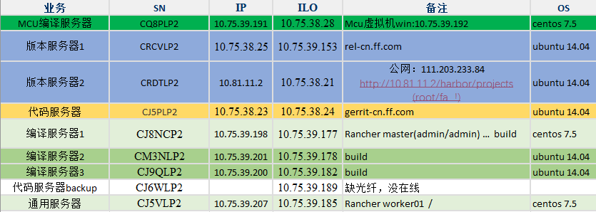
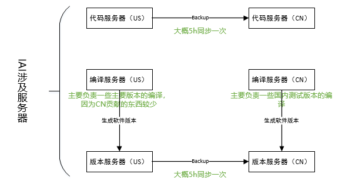

刘文洋 - 早会议题：

需要单独确认每一项内容：

1.  邮件备份 —  北京的邮件数据是单独的，备份策略？晨涛找小锐确认。

已确认，邮件数据没有同步。

2. 产品PLM+IAI。北京IAI handover，机器方面：晨涛，应用是彭淑媛。

机器信息：

机器同步信息：

3. OA系列，丁丁的数据都在云上，用友财务软件。SAP性能问题。

对于钉钉专有云的3种部署方式 。有几个问题等待钉钉安排工作人员回复，3~5工作日。

1. 一体机模式：把专有云钉钉软硬件打包带回家。

   待确认问题：请问是否为购买钉钉硬件服务器，部署到自己的机房？与私有化部署有什么区别？

2. 客户自有硬件模式：将企业已有的硬件资产，直接升级为专有云钉钉，高效利用资源。

   待确认问题：请问是购买钉钉软件就可以吗？

3. 公有云专有机房模式：将硬件全部安全托管在钉钉VIP机房。

   待确认问题：是否为阿里云服务器？与使用其他阿里云有什么区别？

4. 用户系列，online这部分 Zack/Iris。

5. IAI大部分Masterdata都在美国，彭淑媛，Wendy Yan /      Furgeson.