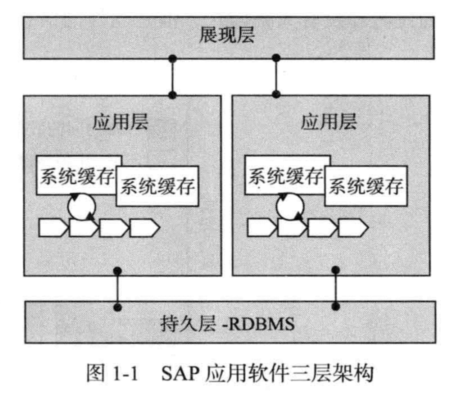

#####HANA

HANA：High Performance ANalytic Applicant，高性能的数据分析设备。

HANA的精髓就是把所有的数据放在内存里——离处理数据最近的地方，也是计算机全身除了CPU速度最快的地方。

传统数据库数据放在硬盘中，使用时需要走复杂的读写操作，然后走系统总线，再到内存进行短暂的处理。回去的时候再沿重复的路回去。

HANA的战略魅力就是企业的管理层/决策层可以随时用最快的最有说服力的处理的最新的数据——包括事务数据以及分析数据，来进行实时决策。

HANA其实就是Appliance，设备，它包含了经过SAP严格认证的硬件和SAP开发的软件（包含了从数据库到管理、开发和建模到提供支持功能的各种工具）。

SAP提供了一整套的服务和工具帮助客户计算他们到底需要什么样的HANA设备。

因为HANA Applicant贵，不是所有的企业都用得起，所有现在有了一些基于云服务的HANA Offering，其中包括SAP自家的HANA Cloud Platform（HCP）。

HANA的优点：

 1.  实行分析数据（小时变成分钟）

	2. 数据大幅度压缩（ERP、SCM、CRM等共用一个数据库）

	3. 数据的实时展示和处理带来的实时的商务行动

	4. 灵活和面向角色的展示层（有机会实现手机、平板实现数据分析并展示）

    	> 使用UI5、Fiori，从HTML5衍伸出来

	5. 跟其他技术趋势的融合好（比如物联网产生的数据）

> 1. OLTP：Online Transaction Processing，简单讲就是基于事务来处理数据。数据量通常不大，但操作相当繁琐，数据大多是“热”数据。
> 2. OLAP：分析已有的不太变化的历史数据（“冷”数据）。数据的访问量不多，但是数据量大得多。

##SAP HANA实战学习笔记

### 第一章 话说内存计算

SAP学习社区：SAP官方中文社区	HANA中国社区

内存计算：In-Memory Computing，使用CPU去计算和管理保存在内存中的数据。内存计算技术最广泛的应用就是在数据库技术方面。

BI：Business Intelligence，商务智能，是一套完整的解决方案。用来将企业中现有的数据进行有效的整合，快速准确地提供报表，并提出决策依据，帮助企业作出明智的业务经营决策。SAP BI等为典型代表。

#### SAP应用的三层架构

</img>

SAP企业管理软件一开始就基于三层架构实现的，可以利用应用层缓存来降低瓶颈，减少对于底层数据库的磁盘读取依赖，提升整个应用系统的性能。

#### OLTP与OLAP类型

OLTP类型的应用主要是保证增、删、改、查等事务运行的完整性和数据更新优先，对于海量数据，查询效率低下。

OLAP类型的应用专门面向分析和查询而创建。

目前，很多OLAP的应用还是建立在OLTP的基础上完成，ETL的时间相当长，无法做到实时分析。

	>ETL：Extract-Transform-Load，数据从OLTP中取出、转换、计算，然后为不同业务需求和聚合规则产生出不同的中间结果和物化层数据，这一过程一般称为ETL。

#### Tips

大量历史数据的存在是影响核心业务系统性能的重要因素之一。

秒级的应用能够大大提升我们对于信息中包含的业务价值的掌控和专注力，而不是让有价值的信息到最后采取行动的时候已经变得毫无意义。

软件架构决定了其上限，比如SAP R/3虽然使用的三层架构，可以横向扩展，但是由于I/O吞吐量的问题，高昂的硬件所换来的性能提升是有限的。

###第二章 实时数据平台

2010年末，SAP推出基于高性能内存计算技术的一体化设备——SAP HANA。

#### 信息系统发展的瓶颈

过去的数据库管理系统的设计中，磁盘的I/O是最主要的瓶颈。

> SSD的读写速度仅比传统磁盘快几倍，性价比不高。但是使用SSD作为闪存缓存，提升持久层的I/O速度，这在一定程度上可以缓解磁盘I/O的瓶颈问题。

从磁盘读取数据到内存，以及CPU的各级缓存之间的速率差，依旧是目前所有应用系统最主要的性能问题。

传统软件架构大多依赖CPU处理速度来提升性能，但是由于CPU主频速度发展变缓且现在大多厂商开始使用多核CPU的架构，传统的OLTP因架构设计问题而无法高效利用当前新硬件架构。

基于内存计算技术架构的软件可以高效解决数据吞吐的平津

#### 内存计算技术解决的问题

基于内存计算技术架构的软件可以高效解决数据吞吐的问题。但是它也出现了瓶颈，就是CPU和内存之间的数据交换。

引入内存技术之后带来的新问题

SAP HANA如何解决这些新问题

SAP HANA产生的技术基础和背景

HANA基本信息和主要软件组件

HANA的一些主要创新技术点，如何利用这些创新技术去解决传统内存计算带来的问题

#### 术语

1. NUMA：Non Uniform Memory Access，非一致性内存访问。一种硬件设计架构，与之相对应的是一致性内存访问（UMA）。
   - 在NUMA架构下，内存访问是CPU内核通过自己集成的内存控制器来访问自己的本地内存，现在正被广泛使用。
   - 在UMA架构下，内存访问则是所有的CPU内核都通过同一个FSB前端总线芯片组来访问内存。由于这个前端总线的带宽有限，在多核多CPU的架构下会出现数据链路阻塞，而且会出现CPU内核间的资源争用情况。现渐渐被厂商抛弃。
2. QPI：Quick Path Interconnect，是基于Intel公司x86芯片的快速通道互连技术，是Intel公司全面抛弃了沿用几十年的FSB架构之后的全新技术，主要用来实现CPU内核和CPU芯片之间的直接互连，极大地增加了带宽，而且不需要统一通过FSB来进行数据通信。
3. IMDB：In-Memory Database，内存数据库，是对应基于磁盘技术的数据库而产生的，利用内存计算技术构建的一种数据库系统。主要的创新是将数据保存在内存中，磁盘仅仅作为持久层来加快数据的读取速度，极大地提升了系统性能。内存数据库抛弃了传统磁盘数据库的设计模式，重新设计整体的架构和优化数据的存储等各个方面。如果不重新开始设计数据库架构，是无法将磁盘架构数据库实现为内存数据库的。
4. 列存储：相对于传统RDBMS的行存储而言，通过将数据以一列一列的方式来存储从而提升数据的读优化、快速查找和聚合速度。采用列存储的数据库一般称为列式数据库。
5. MPP：Massive Parallel Processing，大规模并行处理，是指通过多个计算机硬件系统构建一个集群系统，在用户执行数据处理请求时，可以根据这个任务请求生成很多个子任务，并分发到各个系统上去执行，避免不同服务器的跨系统数据读取，最后做合并运算处理，返回给用户。充分利用多个服务器节点的运算能力，做到真正的并行，而非传统的流水式运算，从而极大地提升计算机的处理能力。
6. 动态聚合：对数据库中的数据做动态聚集（例如求和、平均操作），其中，动态指的是不会在数据库层创建任何临时结果集，查询结束之后聚合出来的结果集会失效过期，内存被自动收回。在传统BI产品中，因为数据库的性能关系，都无法做动态聚合，需要产生临时结果集，写到数据库的数据库表中。
7. 只插入：是SAP HANA对数据的更新方式。传统的数据库更新方式是直接修改原来的值以达到更新数据的目的，而只插入是将更新数据变成插入一条新数据到原来的数据库表中，采用时间戳、数据老化和多版本并发控制方式保证访问数据的ACID原则，旧版本的数据将会在Delta Merge过程中被合并。
8. MVCC：Multi Version Concurrency Control，多版本并发控制。SAP HANA使用MVCC来实现数据的并发访问控制。
9. S锁：共享锁，数据库系统提供的锁定机制。例如，当一个事务执行一条SELECT语句进行数据读取时，系统会为被选择的数据加上S锁，此时其他的事物都可以读取这条被加锁的记录，但是不允许对此数据进行更新，只有在读取执行完毕之后，S锁才会被解除，真正的更新操作才能执行。
10. ACID：传统关系数据库中的ACID理论，即事务原子性（A）、数据一致性（C）、事务隔离性（I）、事务持久性（D）。
11. BASE：海量数据处理下的新型数据库设计原则，即基本可用、软状态、数据一致性。
12. CAP：关于系统架构设计的一致性、可用性、分区容错性的理论。
13. 事务隔离级别：SQL标准定义的数据库隔离级别依次是Read Uncommitted、Read Committed、Repeatable Read、Serializable。级别越高对事务处理的ACID保证就越高，但是也意味着数据库的并发能力越差。

##供应商

1. 华为HANA设备

    - RH2288HV3（2U）
   - 5885H（4U）
   - RH8100（8U）

   > 设备不够用可横向扩展

   供货周期：1个月

   ​

   ​

