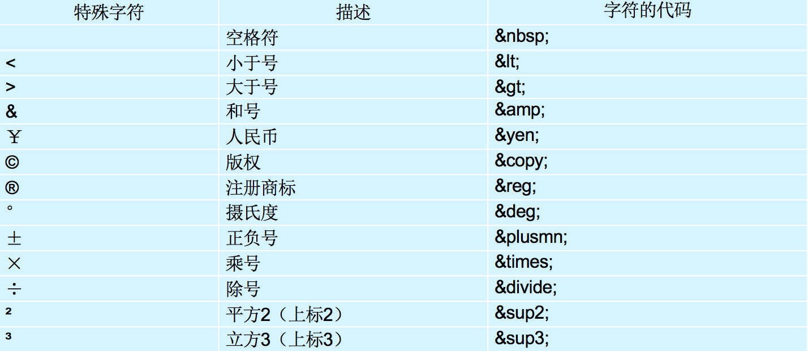
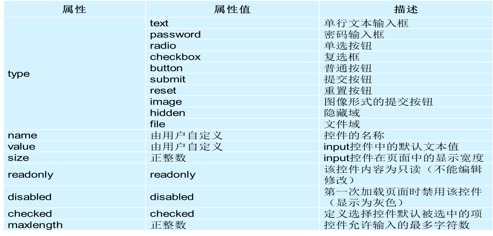
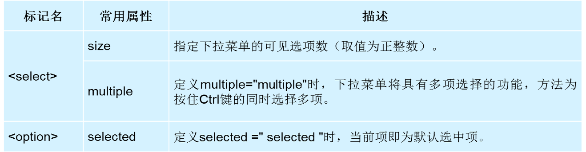
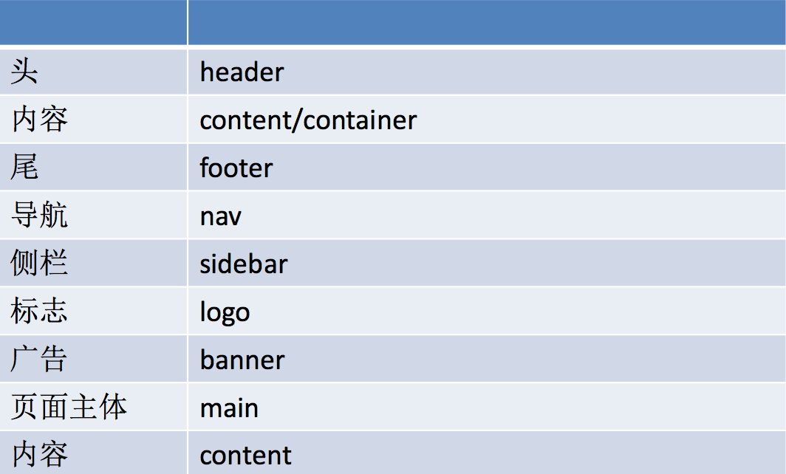
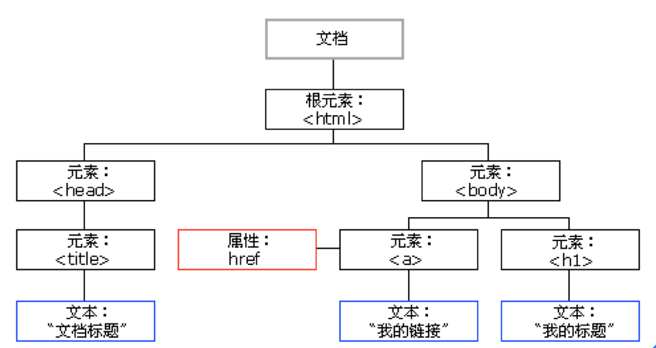

## Html

### Html基础

HTML： Hyper  Text  Markup  Language (超文本标记语言) 

####Html标签介绍

Html中标签的分类：（可嵌套，可并列使用）

- 单标签：标签只有开始没有结束，如：`<link>` ，`<hr>`。
- 双标签：标签有开始有结束，如： `<head></head>` ，`<body></body>` 。

##### 单标签

- 注释标签：`<!-- 注释信息 -->`

- 换行标签：`<br>`

- 横线标签：`<hr>`

- 图片标签：``

  - `src`：设置一个要显示的图片路径
  - `title`：设置鼠标悬停到图片上的文字提示 
  - `alt`：对图片的描述信息，为搜索引擎提供服务
  - `width`：宽度
  - `height`：高度

- Meta标签：`<meta>`

  - `name`：主要用于描述网页，对应于content

    - `<meta name="Generator" content="">`：用以说明生成工具（如Microsoft FrontPage 4.0）等； 
    - `<meta name="KEYWords" content="">`：向搜索引擎说明你的网页的关键词；
    - `<meta name="Description" content="">`：告诉搜索引擎你的站点的主要内容；
    - `<meta name="Author" content="你的姓名">`：告诉搜索引擎你的站点的制作的作者；
    - `<meta name="Robots" contect= "all|none|index|noindex|follow|nofollow">  `：
      - 设定为all：文件将被检索，且页面上的链接可以被查询； 
      - 设定为none：文件将不被检索，且页面上的链接不可以被查询；
      - 设定为index：文件将被检索；
      - 设定为follow：页面上的链接可以被查询；
      - 设定为noindex：文件将不被检索，但页面上的链接可以被查询；
      - 设定为nofollow：文件将不被检索，页面上的链接可以被查询。 

  - `http-equiv`：

    ```html
    <meta http-equiv="Content-Type" contect="text/html" charset=gb_2312"> 
    <meta http-equiv="Refresh" content="5;url=http://www.w3school.com.cn" />
    ```

##### 双标签

- 标题标签：`<h1> </h1>`

- 段落标签：`<p> </p>`

- 强调标签：

  - 文本标签：`<font> </font>`

    ```html
    <font color="pink" size="5">测试</font>
    ```

  - 文本加粗：`<strong> </strong>` 或 `<b> </b>`

  - 文本斜体：`<em> </em>` 或 `<i> </i>`

  - 下划线：`<ins> </ins>` 或 `<u> </u>`

  - 删除线：`<del> </del>` 或 `<s> </s>`

- 超链接标签：`<a href=" "> </a>`：跳转页面

  - `title`：设置鼠标悬停到超链接上的文字提示
  - `target`：
    - `_self`：默认值在当前页面中打开新页面 
    - `_blank`：在新窗口中打开页面 

- 链接状态

  - `<base />`：设置整体链接的打开状态

- 列表：list

  - 无序列表：`<ul> </ul>`
    - 列表项 `<li> </li>`：至少含有一对
    - `type`：`disc`：默认值；`square`：方块；`circle`：空心圆；
  - 有序列表：`<ol> </ol>`
    - 列表项 `<li> </li>`：至少含有一对
    - `type`：用于编号的字母、数字等类型；`type=1/a/A/i/I`：数字/小/大写字母/小/大写罗马数字
    - `start`：编号开始的数值
  - 自定义列表：`<dl> </dl>`
    - `<dt>名词1</dt>`：
    - `<dd>名词1解释1</dd>`
    - `<dd>名词1解释2</dd>`

- 无语义标签：

  - 块标签：`<div> </div>`，可以包含任何标签
  - `<span> </span>`

- 有语义的标签：

  - 导航标签：`<nav> </nav>`
  - 区域：`<section> </section>`
  - 底部：`<footer> </footer>`
  - 侧边栏：`<aside> </aside>`
  - 文章：`<article> </article>`

- Link标签：`<link>`，引用外部css，引用title图片(icon)。`<link rel="icon" href="1.icon">` 

- 表格标签（table）：`<table> </table>`

  - `<tr> </tr>`：表格行；
    - `<td> </td>`：单元格；
    - `<th> </th>`：设置表头，与td用其一。
    - 方式二：将表格划分为头部、主体和页脚，**很少使用**，因为糟糕的浏览器支持
    - `<thread> </thread>`：定义表格的头部，一般包含网页的logo和导航等头部信息。
    - `<tfoot> </tfoot>`：用于定义表格的页脚，一般包含网页底部的企业信息等。 
    - `<tbody> </tbody>`：用于定义表格的主体，一般包含网页中除头部和底部之外的其他内容。 
  - `border`：边框的厚度，默认为0，单位为px
  - `cellpadding`：单元格填充，默认为1px
  - `cellspacing`：单元格间距，默认为2px
  - `width`：设置表格的宽度，单位px
  - `height`：设置表格的高度，单位px
  - `align`：设置表格在网页中的对齐方式，left、right、center
  - `bgcolor`：设置背景颜色
  - `caption`：定义表格标题
  - `cospan`：横向合并
  - `rowspan`：纵向合并

#### 锚链接

锚链接属于超链接的另外一种用法。实现的是本页面内部的跳转。 

```html
<div id="x11">hahahah</div>
<a href="#x11">找笑脸去</a>
```

##### 特殊符号



#### HTML5

过渡版本 Transitional ：可以包含所有的html元素或者属性；

严格版 strict ：可以包含所有的html元素或者属性，但是不包含已经被废弃掉的标签。如： font，b，i 和 属性  align。

#### 表单（form）

```html
<form name="form_name" action="url" method="get|post">...</form>
```

- `name`：定义表单的名称
- `Method`：定义表单结果从浏览器传送到服务器的方式，默认参数为：get ；
- `Action` ：用来指定表单处理程序的位置(服务器端脚本处理程序） 

**表单中可以包含的控件**

1. `<input type="控件类型">`



2. `<textarea> </textarea>`：创建多行文本输入框 

   - `cols`：宽度
   - `rows`：高度

3. `<select> </select>`：下拉菜单

   

4. 组合表单

   - `<fieldset> </fieldset>`：没有必需或唯一的属性
   - `<legend> </legend>`：为 fieldset 元素定义标题

#### 标签语义化

1. 尽可能少的使用无语义的标签div和span；
2. 在语义不明显时，既可以使用div或者p时，尽量用p, 因为p在默认情况下有上下间距，对兼容特殊终端有利；
3. 不要使用纯样式标签，如：b、font、u等，改用css设置；
4. 需要强调的文本，可以包含在strong或者em标签中strong默认样式是加粗（不要用b），em是斜体（不用i）。

###Emmet缩写语法

Emmet 使用类似于 CSS 选择器的语法描述元素在生成的文档树中的位置及其属性。

#### 元素

可以使用元素名（如 div 或者 p）来生成 HTML 标签。Emmet 没有预定义的有效元素名的集合，可以把任何单词当作标签来生成和使用：`div` → `<div></div>`, `foo` → `<foo></foo>` 等。

#### 嵌套运算符

嵌套运算符用于以缩写的方式安排元素在生成文档树中的位置：将其放在内部或成为相邻的元素。

##### 子: `>`

可以使用 > 运算符指定嵌套元素在另一个元素内部：

```html
div>ul>li
```

生成的结果为：

```html
<div>
    <ul>
        <li></li>
    </ul>
</div>
```

##### 兄弟: `+`

使用 `+` 运算符将相邻的其它元素处理为同级：

```
div+p+bq
```

生成的结果为：

```html
<div></div>
<p></p>
<blockquote></blockquote>
```

##### 上升: `^`

使用 `>` 运算符将会降低所有后续所有元素在生成树中的级别，每一级的兄弟元素也被解析成相同深度的元素：

```
div+div>p>span+em
```

将生成：

```html
<div></div>
<div>
    <p><span></span><em></em></p>
</div>
```

使用 `^` 运算符，能够提升元素在生成树中的一个级别，并同时影响其后的元素：

```
div+div>p>span+em^bq
```

将生成：

```html
<div></div>
<div>
    <p><span></span><em></em></p>
    <blockquote></blockquote>
</div>
```

可以连续使用多个 `^` 运算符，每次提高一个级别：

```
div+div>p>span+em^^^bq
```

将生成：

```html
<div></div>
<div>
    <p><span></span><em></em></p>
</div>
<blockquote></blockquote>
```

##### 重复: `*`

使用 `*` 运算符可以定义一组元素：

```
ul>li*5
```

将生成：

```html 
<ul>
    <li></li>
    <li></li>
    <li></li>
    <li></li>
    <li></li>
</ul>
```

##### 分组: `()`

括号用于在复杂的 Emmet 缩写中处理一组子树：

```
div>(header>ul>li*2>a)+footer>p
```

将生成：

```html 
<div>
    <header>
        <ul>
            <li><a href=""></a></li>
            <li><a href=""></a></li>
        </ul>
    </header>
    <footer>
        <p></p>
    </footer>
</div>
```

如果想与浏览器 DOM 协同工作，可能想要对文档片段分组：每个组包含一个子树，所有的后续元素都插入到与组中第一个元素相同的级别中。

能够在组中嵌套组并且使用 `*` 运算符绑定它们：

```
(div>dl>(dt+dd)*3)+footer>p
```

将生成：

```html 
<div>
    <dl>
        <dt></dt>
        <dd></dd>
        <dt></dt>
        <dd></dd>
        <dt></dt>
        <dd></dd>
    </dl>
</div>
<footer>
    <p></p>
</footer>
```

使用分组，可以使用单个缩写逐个写出整页的标签，不过尽量不要这么做。

#### 属性运算符

属性运算符用于编辑所生成的元素的属性，在 HTML 和 XML 中可以快速地为生成元素添加 `class` 属性。

##### ID 和 CLASS

在 CSS 中，可以使用 `elem#id` 和 `elem.class` 注解来达到为元素指定 `id` 或 `class` 属性的目的。在 Emmet 中，可以使用几乎相同的语法来为指定的元素添加这些属性：element:

```
div#header+div.page+div#footer.class1.class2.class3
```

生成：

```html 
<div id="header"></div>
<div class="page"></div>
<div id="footer" class="class1 class2 class3"></div>
```

##### 自定义属性

可以使用 `[attr]` 注解（就像在 CSS 中一样）来为元素添加自定义属性：

```
td[title="Hello world!" colspan=3]
```

将生成：

```html
<td title="Hello world!" colspan="3"></td>
```

- 能够在方括号中放置许多属性，
- 可以不为属性指定值： `td[colspan title]` 将生成 `<td colspan="" title="">` ，如果你的编辑器支持，可以使用 tab 来跳到每个空属性中填写。
- 属性可以用单引号或双引号作为定界符。
- 如果属性不包含空格，不需要用定界符括住它：`td[title=hello colspan=3]` 是正确的。

##### 编号: `##### 

使用 `*` 运算符可以重复生成元素，如果带 `$` 就可以为它们编号。把 `$` 放在元素名、属性名或者属性值中，将为每个元素生成正确的编号：

```
ul>li.item$*5
```

将生成：

```html
<ul>
    <li class="item1"></li>
    <li class="item2"></li>
    <li class="item3"></li>
    <li class="item4"></li>
    <li class="item5"></li>
</ul>
```

使用多 `$` 可以填充前导的零：

```
ul>li.item$$$*5
```

将生成：

```html
<ul>
    <li class="item001"></li>
    <li class="item002"></li>
    <li class="item003"></li>
    <li class="item004"></li>
    <li class="item005"></li>
</ul>
```

##### 改变编号的基数和方向

使用 `@` ，可以改变数字的走向（升序或降序）和基数（例如起始值）。

在 `$` 后添加 `@-` 来改变数字走向：

```
ul>li.item$@-*5
```

将生成：

```html
<ul>
    <li class="item5"></li>
    <li class="item4"></li>
    <li class="item3"></li>
    <li class="item2"></li>
    <li class="item1"></li>
</ul>
```

在 `$` 后面添加 `@N` 改变编号的基数：

```
ul>li.item$@3*5
```

将生成：

```html
<ul>
    <li class="item3"></li>
    <li class="item4"></li>
    <li class="item5"></li>
    <li class="item6"></li>
    <li class="item7"></li>
</ul>
```

这些附加的运算符可以同时使用：

```
ul>li.item$@-3*5
```

将生成：

```html
<ul>
    <li class="item7"></li>
    <li class="item6"></li>
    <li class="item5"></li>
    <li class="item4"></li>
    <li class="item3"></li>
</ul>
```

#### 文本: `{}`

可以用花括号向元素中添加文本：

```
a{Click me}
```

将生成：

```html
<a href="">Click me</a>
```

注意，这个 `{text}` 是被当成独立元素解析的（类似于 `div`, `p` ），但当其跟在其它元素后面时则有所不同。例如， `a{click}` 和 `a>{click}` 产生相同的输出，但是 `a{click}+b{here}` 和 `a>{click}+b{here}` 的输出就不同了：

```html
<!-- a{click}+b{here} -->
<a href="">click</a><b>here</b>

<!-- a>{click}+b{here} -->
<a href="">click<b>here</b></a>
```

在第二示例中， `<b>` 元素放在了 `<a>` 元素的里面。差别如下：当 `{text}` 写在元素的后面，它不影响父元素的上下文。下面是展示这种差别的重要性的较复杂的例子：

```
p>{Click }+a{here}+{ to continue}
```

生成：

```html
<p>Click <a href="">here</a> to continue</p>
```

在这个例子里， 我们用 `>` 运算符明确的将 `Click here to continue` 下移一级，放在 `<p>` 元素内，但对于 `a` 元素的内容就不需要了，因为 `<a>` 仅有 `here` 这一部分内容，它不改变父元素的上下文。

作为比较，下面是不带有 > 运算符的相同缩写：

```
p{Click }+a{here}+{ to continue}
```

生成：

```html
<p>Click </p>
<a href="">here</a> to continue
```

#### 缩写格式的注意事项

当熟悉了 Emmet 的缩写语法后，可能会想要使用一些格式来生成更可读的缩写。例如，在元素和运算符之间使用空格间隔：

```
(header > ul.nav > li*5) + footer
```

但是这种写法是错误的，因为空格是 Emmet 停止缩写解析的标识符。

请多用户误以为每个缩写都应写在新行上，但是他们错了：可以在文本的任意位置键入和扩展缩写。

### CSS基础

HTML主要用来搭建页面结构，CSS用来定义样式，JS负责从交互的角度提升用户体验。

#### CSS属性

- `width`：设置宽度，单位px；
- `height`：设置高度；
- `color`：设置前景色，也就是文字的颜色；
- `background-color`：设置背景色；
- `text-align`：文字居中格式；
- `text-indent`：设置首行缩进， em代表一个文字大小；
- `font-size`：设置文字大小；
- `font-family`：设置字体；
- `font-weight`：设置文字加粗，Normal默认，bold粗体；
- `font-style`：设置字体风格，Normal默认，italic斜体；
- `opacity`：实现半透明；
- `line-height`：行高；
- `background-color`：设置背景颜色；
- `background-image`：设置背景图片；
- `background-repeat`:  设置背景平铺 repeat  on-repeat   repeat-x   repeat-y；
- `background-postion`:  设置背景位置 left,right,center,top,bottom，如果设置一个，另外一个默认center。
- `background-attachment`:   设置背景是否固定；

#### CSS选择器

HTML页面中的元素就是通过CSS选择器进行控制的。

1. 基础选择器

   1. 标签选择器：`<style type="text/css"> p { background-color: red; }</style>`
   2. 类选择器：`<style type="text/css"> .one { background-color: red; }</style>`
   3. ID选择器：`<style type="text/css"> #hh { background-color: red; }</style>`
   4. 通配符选择器：``<style type="text/css"> * { background-color: red; }</style>``

   写样式的时候，不提倡用ID选择器，因为它的权重太高。ID是为了JS准备的。通配符选择器一般不用。

   页面中标签的ID值必须唯一，一个标签只能调用一个ID样式。

2. 复合选择器

   复合选择器是由两个或多个基础选择器，通过不同的方式组合而成的。

   1. 标签指定式选择器（即…又...），交集选择器；`p.one {}`，只有p标签下使用one类才有效；
   2. 后代选择器，`选择器 选择器 {}`，只能选中后代元素。
   3. 子代选择器，`选择器>选择器 {}`，只有直接子代起作用。
   4. 并集选择器，`.one,h3 {}`，并集。

3. 补充选择器

   1. 伪类选择器
      - 结构伪类
        语法：
        - 选择器:first-child {属性: 值;}，选择器中的第一个子元素；
        - 选择器:last-child {属性: 值;}
        - 选择器:nth-child(n) {属性: 值;}
        - 选择器:nth-last-child(n) {属性: 值;}
        - 选择器:nth-child(odd) {属性: 值;} 奇数
        - 选择器:nth-child(even) {属性: 值;} 偶数
      - 目标伪类
      - 空伪类 
      - 排除伪类
   2. 属性选择器，[属性名[="值"]] {属性:值}
      - [属性^=字母] { }  选中以字母开始的标签
      - [属性$=字母] { }  选中以字母结尾的标签
      - [属性*=字母] { }  选中包含字母的标签
   3. 伪元素选择器

#### 类选择器命名规范



#### 字体合写语法

```html 
<style type="text/css"> 
    test { font: font-style font-weight font-size/line-height font-family }
</style>
```

必须有字体大小（font-size）和字体（font-family），必须严格按照顺序写。`escape()`可输出字体的编码值。

#### CSS样式类型

- 内联式（行内式）  `<p style="color:red"></p>  ` 

- 内嵌式：在本页面内

- 外联式：链接外部文件    `<link rel="stylesheet" type="text/css" href="wailian.css">`

#### HTML标签元素分类

- 块级标签：`<div> <p> <h1> <form> <ul> <li>`等；
  - 一个块级元素独占一行
  - 元素的高度、宽度、行高以及顶和底边距都可设置
  - 元素宽度在不设置的情况下，使它本身父容器的100%，除非设定一个宽度。
- 行内标签：`<a>、<span>、<br>、<i>、<em>、<strong>、<label> `等；
  - 和其他元素都在一行上
  - 元素的高度、宽度、行高及顶部和底部边距不可设置
  - 元素的宽度就是它包含的文字或图片的宽度，不可改变（废话）
- 行内块标签：`、<input>`等；
  - 一个块级元素独占一行
  - 元素的高度、宽度、行高及顶部和底部边距都可设置；

转换为块级元素：`display:block;`

转换为行内块元素：`display:inline-block;`

转换为行内元素：`display:inline;`

> 可以把行内元素、块级元素转化为任何一种元素，行内块元素转化行内元素没有效果。

#### CSS三大特性

- 层叠性
- 继承性
  - 对于字体、文本属性等网页中通用的样式可以使用继承；如果大量使用继承会得不偿失；
  - 所有字相关的都可以继承，比如：color、text-系列、font-系列、line-系列、cursor；
  - 并不是所有的CSS属性都可以继承，例如，下面的属性就不具有继承性：边框、外边距、内边距、背景、定位、元素宽高属性；
  - 所有盒子相关的属性都不能继承。 `a`标签 ` h1` 标签不会实现继承；
  - 宽度和高度不能被继承；

#### CSS优先级

!important > 行内样式 > ID选择器 > 类选择器 > 标签选择器

​    10000+   >   10000   >     1000    >      100     >        10  

经常出现两个或更多规则应用在同一元素上，这时就会出现优先级的问题。 

- 继承样式的权重为0。即在嵌套结构中，不管父元素样式的权重多大，被子元素继承时，他的权重都为0，也就是说子元素定义的样式会覆盖继承来的样式。
- 行内样式优先。应用style属性的元素，其行内样式的权重非常高，可以理解为远大于100。总之，他拥有比上面提高的选择器都大的优先级。
- 权重相同时，CSS遵循就近原则。也就是说靠近元素的样式具有最大的优先级，或者说排在最后的样式优先级最大。 
- 所有都相同时，声明靠后的优先级大。 
- CSS定义了一个!important命令，该命令被赋予最大的优先级。也就是说不管权重如何以及样式位置的远近，!important都具有最大优先级。 

!important > 内联 > ID > 伪类|类 | 属性选择  > 标签  > 伪对象 >  通配符 > 继承 

总结：

1. 如果通过选择器指向的是同一个标签，如果权重不一样，那么只要考虑优先级。                   
2. 如果指向是同一标签并且权重一样，直接考虑层叠性。 

#### CSS伪类

- `:link`：伪类将应用于未被访问过的链接。IE6不兼容，解决此问题，直接使用a标签。
- `:hover`：伪类将应用于有鼠标指针悬停于其上的元素。在IE6只能应用于a连接，IE7+所有元素都兼容。
- `:active`：伪类将应用于被激活的元素，如被点击的链接、被按下的按钮等。
- `:visited`：伪类将应用于已经被访问过的链接。只能设置与颜色相关的属性，该伪类具有缓存特性。
- `:focus`：伪类将应用于拥有键盘输入焦点的元素。

如果以上伪类都要设置，需要按照顺序设置，L V H A。

#### 行高

行高 = 上间距 + 文字大小 + 下间距

单位问题：

| 单独给一个标签设置行高 |         结果         | 给父元素设置行高 |    子元素行高结果     |
| :--------------------: | :------------------: | :--------------: | :-------------------: |
|      行高单位是px      |  行高与文字大小无关  |   行高单位是px   |      父元素行高       |
|      行高单位是em      | 行高=文字大小*行高值 |   行高单位是em   | 父元素文字大小*行高值 |
|      行高单位是 %      | 行高=文字大小*行高值 |   行高单位是%    | 父元素文字大小*行高值 |
|      行高没有单位      | 行高=文字大小*行高值 |    行高单位无    | 子元素文字大小*行高值 |

#### 盒模型

盒子模型就是把HTML页面中的元素看作是一个矩形的盒子，也就是一个盛装内容的容器。每个矩形都由元素的内容、内边距（padding）、边框（border）和外边距（margin）组成 

border属性设置：

- `border-width`：设置边框宽度，以px为主；
- `border-style`：设置边框样式，none：无边框，solid：实线，dotted：点线，dashed：虚线。
- `border-color`：设置边框颜色；
- `border-top/bottom/left/right`：设置上/下/左/右边框样式；
- `border-collapse:collapse`：设置表格边框合并；

##### 改变盒子计算方式

默认盒子的计算方式是：`box-sizing:content-box;`与边框算加法；

使用`box-sizing:border-box;`，与边框算减法。

##### 外边距合并

外边距合并指的是，当两个垂直外边距相遇时，它们将形成一个外边距。合并后的外边距的高度等于两个发生合并的外边距的高度中的较大者。边距合并问题只发生在块级元素之间。

解决方法：1. 给父元素设置边框；2. 给父元素设置overflow:hidden（触发元素的bfc）

https://www.zhangxinxu.com/wordpress/2015/02/css-deep-understand-flow-bfc-column-two-auto-layout/

> 行内元素不要给上下的margin和padding；上下的会被忽略，左右会起作用。

#### 浮动

在页面中标签（元素）默认的显示方式就是标准流的显示方式。 标签设置了浮动效果后，会脱离标准流（脱标）。

浮动的特点：

1. 浮动的元素不占位置（脱标）

1. 浮动找浮动，不浮动找不浮动
2. 浮动只影响后面的元素
3. 浮动以元素顶部为基准对齐
4. 浮动可是实现模式转换（span 设置浮动可以设置宽高）
5. 让块级元素在一行显示

当父容器没有设置高度，里面的盒子没有设置浮动的情况下会将父容器的高度撑开。一旦父容器中的盒子设置浮动，脱离标准文档流，父容器立马没有高度，下面的盒子会跑到浮动的盒子下面。出现这种情况，我们需要清除浮动，清除浮动有以下一些方式：

1. 给父容器设置高度

2. 通过设置`clear:left | right  | both `

3. 给父容器设置` overflow:hidden` ，将超出父元素的部分隐藏

4. 通过伪元素  

5. ```html
   .clearfix:after {
   	content:"";
       height:0; 
   	line-height:0;
       visibily:hidden;
   	clear:both;
   	display:block;
   }
   .clearfix {
   	zoom:1    　　　为了兼容IE浏览器
   }
   ```

#### Css初始化

为了考虑到浏览器的兼容问题，其实不同浏览器对有些标签的默认值是不同的，如果没对CSS初始化往往会出现浏览器之间的页面差异。

#### overflow介绍

overflow 属性规定当内容溢出元素框时发生的事情。 

| overflow:visible | 默认值。内容不会被修剪，会呈现在元素框之外。             |
| :--------------- | :------------------------------------------------------- |
| overflow:hidden  | 内容会被修剪，并且其余内容是不可见的。                   |
| overflow:scroll  | 内容会被修剪，但是浏览器会显示滚动条以便查看其余的内容。 |
| overflow:auto    | 如果内容被修剪，则浏览器会显示滚动条以便查看其余的内容。 |

 #### 伪元素

伪元素就是模拟了页面内的一个元素。

```html
div::after {		<!-- div的最后面，浏览器支持不好，一般使用一个: -->	
    content: “这是一个span”;
}

div::before {		<!-- div的最前面 -->	
    content: “这是一个span”;
}

div:selection {		<!-- 选择区域，鼠标放上去，这里就需要两个:: -->
	
}
```

#### 定位(position)

1. 静态定位`positon:static`：按照标准流的方式显示；
2. 绝对定位`position:absolute`：以浏览器左上角为基准设置位置；
   - 当一个盒子包含在另一个盒子中，父盒子未设置定位，子盒子以浏览器左上角为基准设置位置；当父盒子设置除静态定位以外的其他定位，子盒子以父盒子左上角为基准设置位置；
   - 绝对定位不占空间位置（与浮动一样）；
   - 绝对定位可是实现模式转换；
3. 相对定位`position:relative`：以元素原来的位置为基准设置位置 ；
   - 相对定位占位置 ；
   - 一般子元素设置绝对定位，父元素设置相对定位（子绝父相）；
   - 不能实现模式转换；
4. 固定定位`position:fixed`：固定定位不占位置；
   - 固定定位的元素可以实现模式转换；
   - 固定定位的元素始终是以body(浏览器)可视区域为参照设置定位。 

##### 在以后的网页布局中优先考虑：标准流，浮动，定位。

#### z-index

定位元素的特点：                   

- 只有（除静态定位）定位的元素有层级关系
- 通过z-index属性改变层级关系

层级关系特点：                       

-  当给一个元素设置了定位，那么该元素默认的层级z-index值是auto(0) 
- 当z-index值相同的情况下，那么最后的定位元素层级要高于前面的定位元素【后来居上原则】                      
- 当z-index值不同的情况下，那么z-index值越大该元素的层级越高
- 如果元素的父元设置了z-index值,那么父元素的z-index值越大，那么该元素的层级越高 

#### `vertical-align`属性

行内块默认有`vertical-align`属性。设置行内块元素垂直距离。

图片有时底部会有空白，设置`vertical-align`属性即可消除。

#### CSS可见性

- `display:none;`：元素隐藏不占位置
- `overflow:hidden;` ：将超出部分的元素隐藏
- `visibility:hidden;`：元素隐藏占位置

#### CSS内容移除（网页优化）

常用于logo优化：

1. 利用`text-index:-2000em`；
2. 利用padding挤开盒子，并且overflow切割。

#### CSS精灵图

CSS精灵是一种处理网页背景图像的方式。它将一个页面涉及到的所有零星背景图像都集中到一张大图中去，然后将大图应用于网页，这样，当用户访问该页面时，只需向服务发送一次请求，网页中的背景图像即可全部展示出来。 

各个网页元素通常只需要精灵图中不同位置的某个小图，要想精确定位到精灵图中的某个小图，就需要使用CSS的`background-image`、`background-repeat`和`background-position`属性进行背景定位，其中最关键的是使用`background-position`属性精确地定位。 

#### BFC

BFC(Block formatting context)直译为”块级格式化上下文”。它是一个独立的渲染区域，只有Block-level box参与， 它规定了内部的Block-level Box如何布局，并且与这个区域外部毫不相干。 

##### 如何生成BFC

1. 根元素  html
2. float属性不为none 浮动框
3. position为absolute或fixed
4. display为inline-block, table-cell, table-caption, flex, inline-flex 非块框的块容器
5. overflow不为visible的块框。这就是为什么我们经常用overflow:hidden去清除内部浮动的原因
6. 触发IE的hasLayout特性

#### CSS规范

1. CSS文件使用无BOM的UTF-8编码；
2. 使用4个空格作为一个缩紧层级，不允许使用2个空格或者tab字符；
3. 选择器与{之间必须包含空格；属性名与之后的 : 之间不允许包含空格，: 与属性值之间必须包含空格；列表型属性值书写在单行时，, 后必须跟一个空格；
4. 当集体声明多个 selector 时，每个选择器声明必须独占一行；>、+、~ 选择器的两边各保留一个空格；
5. 属性定义必须另起一行；属性定义后必须以分号结尾；
6. 对已经触发 BFC 的元素不需要再进行 clearfix；
7. 选择器的嵌套层级应不大于 3 级，位置靠后的限定条件应尽可能精确；
8. 在可以使用缩写的情况下，尽量使用属性缩写；
9. 使用 border / margin / padding 等缩写时，应注意隐含值对实际数值的影响，确实需要设置多个方向的值时才使用缩写；
10. 文本内容必须用双引号包围；
11. 当数值为 0 - 1 之间的小数时，省略整数部分的 0；
12. 长度为 0 时须省略单位。 (也只有长度单位可省)；
13. url() 函数中的路径不加引号；
14. RGB颜色值必须使用十六进制记号形式 #rrggbb。不允许使用 rgb()；
15. 颜色值可以缩写时，必须使用缩写形式；
16. 颜色值不允许使用命名色值；
17. 颜色值中的英文字符采用小写。如不用小写也需要保证同一项目内保持大小写一致；
18. font-weight 属性必须使用数值方式描述；
19. 层级(z-index)必须清晰明确，页面弹窗、气泡为最高级（最高级为999），不同弹窗气泡之间可在三位数之间调整；

CSS检测地址：http://jigsaw.w3.org/css-validator/ 

### Javascript

JavaScript就是一种基于对象和事件驱动，并具有安全性能的脚本语言。JavaScript可以被嵌入到HTML文件中，不需要经过Web服务器就可以对用户操作作出响应，使网页更好地与用户交互。

#### 组成

- ECMAScript：JavaScript的语法标准；
- DOM：JavaScript操作网页上的元素的API；
- BOM：JavaScript操作浏览器的部分功能的API。

#### 特点

1. 解释执行（解释语言），无需进行严格的变量声明。
2. 基于对象，内置大量现成对象，编写少量程序可以完成目标。

#### 使用

```html
<script> </script>
<script src="1.js"> </script>
```

#### 小原理

1. html页面中出现`<script>`标签后，就会让页面暂停等待脚本的解析和执行。无论当前脚本是内嵌式还是外链式，页面的下载和渲染都必须停下来等待脚本的执行完成才能继续，这在页面的生命周期中是必须的。
   1. 由于页面加载脚本会阻塞其他资源的下载，因此推荐将所有的script标签放在body标签的底部，减少对整个页面下载的影响。
   2. 将能合并的js文件进行合并处理 。

#### 基础

| 网页输出消息    | 网页效果                                                     |
| --------------- | :----------------------------------------------------------- |
| alert("")       | 在网页中弹出提示框，显示信息                                 |
| confirm("")     | 在网页中弹出提示框，显示信息，该方法一般与if判断语句结合使用 |
| prompt(" ")     | 在网页中弹出输入框，一般用来接收用户输入信息                 |
| console.log("") | 在控制台输出消息，一般用来调试程序                           |
| document.write  | 直接在页面中输出信息                                         |

##### 数据类型

- 简单数据类型
  - `Number`：数字类型，最基本的数据类型，不区分整型数值和浮点型数值；
  - `String`：字符串类型，字符串由单引号或双引号括起；
  - `Boolean`：布尔类型；
  - `undefined`：变量未初始化，表示值得空缺。它是变量的一种取值，表示变量未进行初始化（变量没有赋值）。
  - `null`：空类型；
- 复杂数据类型
  - Object：对象（引用）；
  - Array：数组。

NaN：Not a Number，表示不是一个数字。

Infinity：无穷大。

数据类型判断可使用：`typeof()`

#### 数字类型转换

1. 将数字类型转换为字符串类型，`String()/变量.toString()`；
2. 将字符串转换为数字类型，`Number()/parseInt()/parseFloat()`
3. 将其他数据类型转换为布尔类型`Boolean()`

#### 数组

```javascript
var arr = new Array(1,2,2,2);	//数组定义
var arr = [1,2,2,2];
arr.index = 1	//可以自定义属性
```

##### 添加数组

```javascript
push() //向数组的末尾添加一个或多个元素，并返回新的长度。
unshift() //向数组的开头添加一个或多个元素，并返回新的长度。
pop() //删除最后一个元素，返回最后一个值。
shift()	//删除第一个元素，并返回第一个元素的值。
concat() //用于连接两个或多个数组。它不会改变现有的数组，仅仅会返回被连接数组的一个副本。
join(separator) //将数组各个元素通过指定的分隔符进行连接成为一个字符串。若省略separator，则使用'，'。
split(separator,howmany) //把一个字符串分割成字符串数组。separator同上，howmany指定返回的数据的最大长度。
```

##### DOM

js组成主要有三部分：ECMAscript、DOM、BOM。

文档对象模型（DOM）：处理网页内容的方法和接口。

浏览器对象模型（BOM）：与浏览器交互的方法和接口。window.alert() 会有很大的兼容问题。

DOM树：



每个标签都是一个元素节点，标签中的文字是文字节点，标签中的属性是属性节点。

- 父节点：parentNode；
- 兄弟节点：nextSibling、nextElementSibling、previousSibling、previousElementSibling
- 子节点：firstNode、firstElementChild、lastChild、lastElementChild
- 所有节点：childNodes、children

```javascript
var div = document.createElement("li")
appendChild()	// 添加孩子
insertBefore(插入节点, 参照节点)  //在子节点添加孩子
removeChild()	// 移除节点
cloneNode([true|false])	// 克隆节点，深层复制或者浅层复制
node.getAttribute(属性)  // 获取节点的属性
node.setAttribute("class","demo")	//设置节点属性
node.removeAttribute("属性");
```

#####开发

1. 设置网页小图标 

```html
<link rel="shortcut icon" href="images/favicon.ico">
```

##### Alert() 弹出警示框

`window.alert("123")`

##### Console 控制台输出

```javascript
Console.log()	//控制台输出  普通输出语句
Console.warn()	//控制台警示
Console.error()	//错误提示
```

##### document.write() 文档打印输出

document：文档对象，不可以省略；

#### 变量

 `var 变量名`，严格区分大小写。

根据变量的作用范围，可以分为「全局变量」和「局部变量」。

- 全局变量
  1. 在最外层声明的变量
  2. 在**函数体内部**，没有声明 var 的变量也是全局变量
- 局部变量
  1. 在函数体内部的声明的变量

#### 事件驱动

事件源 -> 事件{单机，双击} -> 处理动作

```
事件源.事件 = function(){}
```

#### 隐藏样式

```javascript
diaplay:none		//隐藏不占位置
visibility:hidden	//隐藏占有位置
overflow:hidden		//隐藏超出的部分
```

#### 函数

```javascript
//声明参数
var fun1 = function() {
    alert("直接生命");
}
function fn1(a,b) {}
//入口函数
window.onload=function(){}	//当页面加载完毕后，采取执行函数里面的js部分。
```

##### 函数中变量声明提升

```javascript
function fun(){
	console.log(num);
	var num = 20;
}
//相等于
function fun(){
	var num;		//在函数体内部，声明变量，会把该声明提升到函数体的最顶端。只提升变量声明，不赋值。
	console.log(num);
	Num = 20;
}
//eg:
var a = 18;
f1();
function f1(){
    var b=9;
    console.log(a);		//undefined 
    console.log(b);		//9
    var a = '123';
}
```

```javascript
function fn(a,b) {
	console.log(fn.length); //得到是 函数的形参的个数
	console.log(arguments);	//arguments存储了函数传送过来的实参
	console.log(arguments.length); // 得到的是实参的个数
	if(fn.length == arguments.length) {
		console.log(a+b);
	} else {
        console.error("对不起，您的参数不匹配，正确的参数个数为:" + fn.length);
    }
}
```

#### 内置函数

##### 日期函数 Date()

```javascript
var date = new Date()	// 创造声明一个新的日期函数
getDate()               // 获取日 1-31
getDay ()               // 获取星期 0-6      
getMonth ()             // 获取月  0-11
getFullYear ()	        // 获取完整年份（浏览器都支持）
getHours ()	            // 获取小时 0-23
getMinutes ()	        // 获取分钟 0-59
getSeconds ()	        // 获取秒  0-59
getMilliseconds ()      // 获取当前的毫秒 
getTime ()	       		// 返回累计毫秒数(从1970/1/1午夜)
```

##### 定时器

```javascript
window.setInterval(func, 间隔时间)		// 设置间隔器执行的函数及间隔时间。
clearInterval(定时器名称)			   //  清除定时器
setTimeout(func, 时间)			     //  多长时间后去执行，只执行一次		
```

#### 网址编码

我们知道一个网址自己的网址，不同页面也有自己id网址，我们经常会做一些，把网址送入到后台。但是后台再处理的不认识比如换行啊等特殊符号的。  

```javascript
var url = “http://www.test.cn?name=cz”  
//所以我们要实现编码，然后再传到后台。
encodeURIComponent() 	//函数可把字符串作为 URI 组件进行编码
decodeURIComponent() 	//函数可把字符串作为 URI 组件进行解码
```

##### offset家族

 js中有一套方便的获取元素尺寸的办法就是offset家族。

```javascript
offsetWidth = width + border + padding	// 得到对象的宽度
offsetHeight = height + border + padding // 得到对象的高度
offsetLeft     // 返回距离上级盒子（最近的带有定位）左边的位置，如果父级都没有定位则以body为准。从父级的padding开始算，父级的border不算。
offsetParent   // 返回该对象的父级（带有定位）不一定是亲的爸爸，直到body。	
offsetTop      // 
```

##### HTML基本结构访问

```javascript
document.head 	// 获得头标签
document.body	// 获得body标签
document.title  // 获得标题
document.documentElement	//获得HTML标签
```

##### scroll家族

Offset主要是关于自己的偏移，scroll侧重于滚动

```javascript
//scrollTop	被卷去的头部，当滑动滚轮移动时，网页隐藏在上方的距离。
function scroll() {
	if (window.pageYOffset != null) {   // ie9 + 其他浏览器
		return {
			left: window.pageXOffset,
			top: window.pageYOffset
		}
	} else if (document.compatMode == "CSS1Compat") { // 检测是不是声明<!DOCTYPE html>
		return {
			left: document.documentElement.scrollLeft,
            top: document.documentElement.scrollTop
        }
    }
    return {    // 其他
            left: document.body.scrollLeft,
            top: document.body.scrollTop
    }
}		
// 一般都有自己的封装
scrollTo(s, y)
scrollHeight = 内容大小
```

一般都有自己的封装。

##### client家族

client：可视区域；

```javascript
clientWidth = width + padding	// 返回可视区域的大小，浏览器内部的大小，不包含边框；对比window.screen.width返回的是我们电脑的分辨率，跟浏览器无关。
window.onresize = function() {}	// 改变窗口大小事件
// 设置根据可是区域的不同设置不同的页面。适配手机？
var styleCss = document.getElementById("styleCss");
window.onresize = reSize;
function reSize() {
    var clientWidth = client().width;
    if(clientWidth > 980) {
        styleCss.href = "";
    } else if(clientWidth > 640) {
        styleCss.href = "css/pad.css";
    } else {
        styleCss.href = "css/mobile.css";
    }
}
```

#### 事件冒泡

当一个元素上的事件被触发的时候，比如说鼠标点击了一个按钮，同样的事件将会在那个元素的所有祖先元素中被触发。这一过程被称为事件冒泡，这个事件从原始元素开始一直冒泡到DOM树的最上层。

不是所有事件都冒泡。以下事件不冒泡：blur、focus、load、unload。

##### 阻止冒泡

冒泡顺序：

IE 6.0：div -> body -> html -> document

其他浏览器：div -> body -> html -> document -> window

```javascript
event.stopPropagation()		// 标准浏览器
event.cancelBubble = true	// IE浏览器（6.7.8）

if (event && event.stopPropagation) {	// 兼容性写法
	event.stopPropagation();
} else {
    event.cancelBubble = true;
}
```

##### 判断当前对象

```javascript
event.target.id	      // 火狐、谷歌等
event.srcElement.id   // IE678

var targetId = event.target ? event.target.id : event.srcElement.id; // 兼容性写法 
```

##### 获取用户的选择内容

```javascript
window.getSelection()	// 标准浏览器
document.selection.createRange().text	// IE 

var text = window.getSelection ? window.getSelection().toString() : document.selection.createRange().text;	//兼容性写法
```


#### 实战


