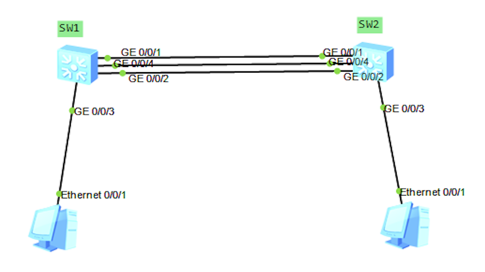
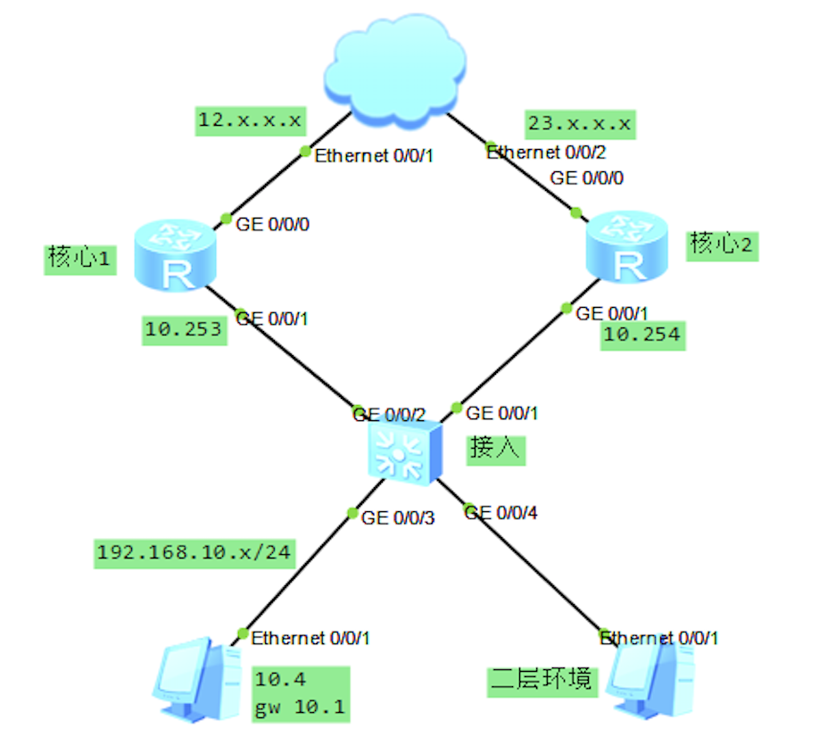
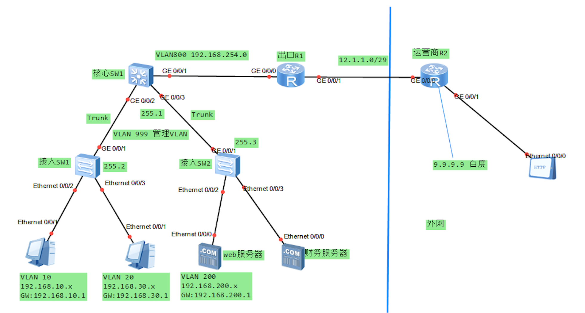

## 计算机网络

### OSI参考模型
OSI（open system interconnect）开放式系统互联，规定了数据传输的标准，以及数据包封装所参考的协议。旨在让不同的设备不同的用户可以互联互通。

- 物理层：规定了物理介质、网线、光纤、电压电流等标准（比特流传输）；
- 数据链路层：MAC地址，交换机。控制物理层与网络层的通信；
- 网络层：IP寻址和路由选择；
- 传输层：建立、维护、管理端到端连接；
- 会话层：建立、维护、管理会话连接；
- 表示层：数据格式化、加密、解密；
- 应用层：为应用程序提供网络服务。

### TCP\IP模型
TCP\IP模型是很多网络协议的集合，其中以tcp协议和ip协议为主，这些协议的集合称为TCP\IP协议族。该模型是目前数据包封装主要参考的模型。

- 物理层
- 数据链路层
- 网络层
- 传输层
- 应用层

###MAC地址
MAC地址就是网卡物理地址，16进制，出厂时烧录在芯片里面的一串全球唯一的地址（默认情况下不能更改）。
#### 特殊二层MAC地址
- 全F：ff-ff-ff-ff-ff-ff，广播MAC地址
- 01-00-5e-xx-xx-xx：组播MAC地址
### IP地址
IP：internet protocol，标识一台网络设备唯一的ID，全球唯一。

#### IP子网划分

IP地址类型 | 第一字节十进制范围 | 二进制固定最高位 | 二进制网络位 | 二进制主机位 |
|:-:|:-:|:-:|:-:|:-:|
| A类 | 1~126 | 0 | 8位 | 24位 | 
| B类 | 128~191 | 10 | 16位 | 16位 | 
| C类 | 192~223 | 110 | 24位 | 8位 | 
| D类 | 224～239 | 1110 | 组播地址 | 组播地址 |
| E类 | 240~254 | 1111 | 保留试验使用 | 保留试验使用 | 

IP网络中主机数的计算方法：num = 2^n - 2

> 其中，主机位全“0”代表网络编号；主机位全“1”表示该网络中的广播地址。

#### 私有地址的范围
- A类：10.0.0.0/8 <br>
    10.0.0.0 ~ 10.255.255.255
- B类：172.16.0.0/12 <br>
    172.16.0.0 ~ 172.31.255.255
- C类：192.168.0.0/16 <br>
    192.168.0.0 ~ 192.168.255.255

>私有地址不能在公网上被传输，如果运营商发现收到的报文三层含有私有地址，则会将报文直接丢弃。

#### 特殊地址
- 127.0.0.1：本地环回测试地址
- 0.0.0.0：代表所有
- 255.255.255.255：广播
- 169.254.x.x：Windows系统给的地址（计算机没有通过DHCP获取到的地址）

### 广播域
广播包可以发送的区域范围称为广播域。路由器隔离广播域（广播包无法穿域路由器，路由器的每个接口都是一个独立的广播域）。交换机不隔离广播域。

###端口

1-1024端口为熟知端口（固定，已经分配），1024以后的端口称为随机端口。

#### 常见协议的端口号

|  协议协议  | 传输类型 |  端口号  |  应用  |
| :----: | :--: | :---: | :--: |
|  HTTP  | TCP  |  80   | 网页浏览 |
| telnet | TCP  |  23   | 远程控制 |
|  FTP   | TCP  | 20/21 | 文件传输 |
|  RDP   | TCP  | 3389  | 远程桌面 |
|  VNC   | TCP  | 5900  |      |

测试某端口是否打开的方法：

```
telnet x.x.x.x port		
```

### 华为相关命令

```javascript
<> //用户视图模式，权限稍低
[] //系统视图模式，权限高
<> system-view //切换到系统视图
[] sysname R1  //更改名字
[] quit  //退出当前模式
<> language-mode Chinese  //提示语言改为中文
[] dis current-configuration  //显示当前所有配置，回车翻一行，空格翻一页，其他任意键退出
[] int e/0/0/0  //进入接口e/0/0/0
    ip address 192.168.1.1 24  //给接口配置ip地址和子网掩码
    shutdown  //关闭该接口
[] dis this  //显示当前配置
[] dis ip int brief  //查看接口的摘要信息
[] dis ip routing-table   //显示路由表
<> save   //保存配置。
[] undo info-center enable   //关闭信息中心，防止弹出日志
undo xxx  //撤销某条指令
description xxxx   //端口描述
dis version	 //查看设备操作系统
<> reset saved-configuration	//擦除华为配置
```

> 其中，global：代表全局公网地址；local：代表内网私有地址；inside：内网

###路由Route

路由表是转发数据包的唯一依据。

#### 路由器的基本组成

内存 + cpu + flash(类似硬盘) + 风扇 + I/O接口  + 主板

####直连路由

直连路由(direct route)：直接相连的路由，当路由器的接口配置好IP地址并up之后，会自动创建该路由。

配置命令：

~~~
[] ip route-static x.x.x.x（目标网段） 24（掩码）  x.x.x.x（下一跳地址） [preference xx(优先级)]
~~~

> 如果出接口故障，那么与该接口相关的直连路由全部消失；如果某路由的下一跳不可达则该路由也会消失。

####路由优先级

路由优先级（preference）用来衡量路由的优先程度，到达同一目标有两种路由协议，此时优选路由优先级较小的路由协议。

路由优先级范围：0-255

常见路由协议默认的优先级（数字越小越优先）：

- 直连路由：0
- 静态路由：60
- Rip：100
- OSPF：10 

>到达某相同目标网段路由表中始终放置最优路由。

####路由度量
路由度量（cost，路由开销）是指到达某目标所花费的开销的总和，用来衡量路径的优劣。

####缺省路由

缺省路由（默认路由）：default route，它属于特殊的静态路由。

    ip route-static 0.0.0.0 0 12.1.1.2 //访问任何网段都将数据包交给12.1.1.2

注：

1. 缺省路由属于替补路由，只有当其他路由不可达时，才会使用其他路由。
2. PC网关其实就是一种缺省路由。
3. 缺省路由适用于边缘节点，以及企业出口。

####路由协议
路由协议为静态路由协议以及动态路由协议。
#####RIP
RIP（Routing Information Protocol）路由信息协议：它是一种基于距离矢量（Distance-Vector）算法的协议，使用跳数作为度量来衡量到达目的网络的距离。16跳不可达。
>RIP主要应用于规模较小的网络中。缺点：古老，收敛速度很慢。

抑制接口：RIP的报文发送将不再发往该接口。

```javascript
silent-interface e0/0/0		//抑制接口
```

RIP协议规定30s发一次路由报文，240s不发送就认为挂了。


#####OSPF
OSPF（Open Shortest Path First）开放式最短路径优先协议是IETF定义的一种基于链路状态的内部网关路由协议。

- area 0：骨干区域/核心区域，其他区域都必须与此区域相连。
- area1、2：常规区域。

**配置命令：**

~~~javascript
R1:
ospf 1
	area 0
		network x.x.x.x 反掩码		//宣告网络
		network x.x.x.x 反掩码
//其他路由器参照R1
<> rest ospf process	//重置OSPF进程，重新建立OSPF邻居关系。 
ospf 1
	silent-interface e0/0/0	//抑制接口：报文发送将不再发往该接口。
dis ospf peer brief		//显示OSPF邻居表
~~~

**OSPF常见的报文有5种**：

- hello：用来建立与维持邻居关系（5s）
- DBD、LSR、LSU、LSack：都是刚开始建立连接才会有。

###动态主机配置协议（DHCP）
DHCP（Dynamic Host Configuration Protocol）用来分配IP地址等网络参数，可以减少管理员的工作量，避免用户手工配置网络参数时造成的地址冲突。

>网络参数包括：IP地址、子网掩码、网关地址、DNS等。

####DHCP配置命令

```javascript
dhcp enable    //开启DHCP功能。
ip pool xxx   //创建地址池
network x.x.x.x mask 24  //分配的IP地址 
gateway-list 192.168.1.1    //分配网关地址
dns-list 192.168.1.1 [8.8.8.8]  //分配DNS地址

int e0/0/0（和用户相连的接口） //
    dhcp select global  //使用本地全局配置的地址池分配IP地址邮箱。  
    
dis ip pool name xxx used   //显示DHCP的使用记录。
```

####IP地址分配流程

1. PC发送DHCP Discover报文。
2. DHCP路由器分配IP地址，发送HDCP offer报文。
3. PC发送DHCP Request报文。（可能有多个DHCP服务器提供多个IP，PC使用其中一个）
4. 服务器发送DHCP ACK报文。

>DHCP使用不同的MAC地址来区分不同的PC。
>用户发送的第一个dhcp请求包为源是0.0.0.0，目标是255.255.255.255的广播报文，该报文称为dhcp discover报文。

####在PC上手动DHCP的方法

```javascript
ipconfig /all		//查看
ipconfig /release   //释放网卡
ipconfig /renew     //重新获取IP地址
```

###文件传输协议（FTP）
FTP（file translate protocol）：FTP是用来传送文件的协议。

使用FTP实现远程文件传输的同时，还可以保证数据传输的可靠性和高效性。目前多数用其来传输安装操作系统。

#### FLASH操作

~~~javascript
dir		//查看flash
pwd     //显示光标所在的位置
cd ..   //返回上一级目录
move aa.zip abc  //剪切
unzip xxx.zip    //解压缩
more xx.txt      //查看文件内容
dir /all         //显示所有文件，[]代表位于回收站里面的文件
undelete    //还原回收站里面的文件
reset recycle-bin   //清空回收站
~~~

思科设备操作系统：ios .bin结尾
华为设备操作系统：vrp .cc结尾

#### FTP配置

```javascript
ftp server enable   //开启FTP服务
aaa 
    local-user aa password cipher aa123 privilege level 3 ftp-directory flash //创建一个账号
    local-user aa service-type ftp
```

登上FTP后下载文件用get，上传文件用put
###远程登录（Telnet）
Telnet可以通过终端对本地和远程的网络设备进行集中管理。

#### Telnet配置

#####Telnet服务器

    telnet server enable    //开启Telnet服务
    aaa
        local-user jct password cipher jct123 privilege level 3   //配置用户名和密码，权限级别3级
        local-user jct server-type telnet  //指定账号的服务类型是telnet
    user-interface vty 0 4  //（同时允许5个人远程）
        authentication-mode aaa   //认证的模式采用aaa认证

##### Telnet客户端

    <> telnet x.x.x.x

###虚拟局域网（VLAN）
VLAN（Virtual Local Area Network）：虚拟局域网。主要在大型的企业内网中的交换机上部署，可以隔离广播域，缩小广播发送的范围，将安全威胁隔离到最小。

####VLAN配置
```javascript
vlan 10  //创建vlan 10
vlan batch 50 60 70     //创建3个Vlan
vlan batch 50 to 100    //同时创建50-100

int gi0/0/1
    port link-type access   //将接口的类型配置为access
    port default vlan 10    //将接口划分到vlan 10里面

dis vlan		//显示VLAN信息
```

>vlan 1属于默认vlan，默认情况下所有交换机的接口属于此vlan。
>vlan隔离广播的同时，也会隔离arp，从而导致单播也不可达。如何想让不同的vlan单播可以通信，还需要三层设备（路由器、三层交换机）做路由。
>默认情况下，交换机的一个接口只能从属于一个vlan，只允许该vlan的数据通过。

####主干链路（Truck）
Truck主要用于交换机和交换机之间，通过一个接口传输多个vlan的数据包。

#####Trunk配置

```javascript
int gi0/0/0
    port link-type trunk
    port trunk allow-pass vlan all
    
dis port vlan	//查看端口链路类型
```

> PC不认识Vlan标记，也不认识tag值，只有通过交换机的trunk接口发出的报文才具备vlan的标记（802.1q tag）

####本征vlan（PVID）

本征vlan的报文经过Trunk口时不打标记（tag）。默认情况下PVID是vlan 1。

#####PVID配置
```javascript
int gi0/0/1
    port trunk pvid vlan 20     //设置PVID为20
```

>将交换机的接口属性更改时：例如由access-->trunk或者由trunk->access 时必须重置接口的默认配置。

```javascript
[]clear configuration int gi 0/0/2	//清除某个接口的配置
```
#### vlan间路由

不同的vlan之间互相通信必须要有三层设备（路由器、多层交换机）做中转。

配置Vlan间路由有两种方法：

##### SVI（常用）

svi：switch virtual interface（交换机）

```javascript
 vlan batch 10 20
 int vlan 10
     ip address 192.168.10.1 24  //给vlan10分配IP地址10.1作为vlan 10用户的网关
```
##### 单臂路由（一根线实现）

主要实现：
1. 交换机上联配置trunk

2. 配置路由器实体接口的子接口

   ```javascript
    interface Ethernet0/0/0.10  //设置vlan 10的虚拟接口
        dot1q termination vid 10
        ip address 192.168.10.1 255.255.255.0
        arp broadcast enable
    interface Ethernet0/0/0.20  //设置vlan 20的虚拟接口
        dot1q termination vid 20
        ip address 192.168.20.1 255.255.255.0
        arp broadcast enable
   ```

###访问控制列表（ACL）
ACL（access control list）：访问控制列表。有两种：

##### 基本ACL

基本ACL（2000-2999）：只能匹配源IP地址。

配置代码：
```javascript
acl number 2000
    rule deny/permit source 192.168.10.1 0    // 0代表0.0.0.0，即精确匹配。这里是反掩码，0代表精确匹配，255代表任意。
int gi0/0/0 //进入需要使用ACL的端口
    traffic-filter inbound acl 2000  //inbound代表进入，outbound代表出，2000是序号
```
##### 高级ACL

高级ACL（3000-3999）：可以匹配源IP、目标IP、源端口、目标端口等三层和四层的字段。

配置代码：
```javascript
acl number 3000
    rule deny/permit source 192.168.10.0 0.0.0.255 destination 172.16.10.2 0    // 0代表0.0.0.0，即精确匹配。这里是反掩码，0代表精确匹配，255代表任意。
int gi0/0/0 //进入需要使用ACL的端口
    traffic-filter inbound acl 3000  //inbound代表进入，outbound代表出，2000是序号
```
>一个接口的同一个方向，只能调用一个ACL。
>一个ACL里面可以有多个rule规则，从上往下依次执行。
>数据包一旦被某rule匹配，就不再继续向下匹配。
>默认隐含放过所有（华为的ACL用来拒绝数据包时）。

##### ACL举例

acl 3005

1. 拒绝源地址是1.1.1.0/24，目标地址是2.2.2.2，FTP的报文；
2. 允许源地址是1.1.1.0/24的任何报文；
3. 拒绝源地址是3.3.3.3，目标地址是7.7.7.7的任何ping包；
4. 拒绝任何telnet的报文；
5. 放过剩下的所有报文；

~~~
acl number 3005
	rule deny tcp source 1.1.1.0 0.0.0.255 destination 2.2.2.2 0 destination-port eq ftp-data
	rule deny tcp source 1.1.1.0 0.0.0.255 destination 2.2.2.2 0 destination-port eq ftp
	rule permit ip source 1.1.1.0 0.0.0.255 
	rule deny icmp source 3.3.3.3 0 destination 7.7.7.7 0
	rule deny tcp destination-port eq telnet
	rule permit ip
~~~

###网络地址转换技术（NAT）
NAT（Network Address Translation）技术可以将私有地址转换为公网地址，并且多个私网用户可以共用一个公网地址，这样既可以保证网络互通，又节省了公网地址。

####静态NAT
静态NAT：static NAT，一对一，一个私网地址对应一个公网地址，**外网的用户可以访问内网的主机**。

```javascript
int gi0/0/0     // 外网口
    nat static global 12.1.1.2 inside 192.168.31.2 //将私网地址31.2和公网地址1.2做一对一的映射。 
```

查看实时NAT转换信息（ping）

    dis nat session protocol icmp

缺点：有多少个私有地址就得有多少个公网地址。

####Easy IP
优点：允许多个私网地址转换成一个公网IP，**很常用**。

```javascript
acl number 2000     //先写acl匹配内网私网地址段
    rule permit source 192.168.0.0 0.0.255.255 //acl用来做匹配范围时，没有默认隐含允许所有的规则。
int gi0/0/0  //出口
    net outbound 2000   （2000是acl的表号）
```

原理：内网私网地址出包时转换成公网接口gi0/0/0当前的IP地址。 

####server NAT
server NAT：可以将某服务器的某端口映射出去（非常安全）

```javascript
int gi0/0/0
    nat server protocol tcp global 12.1.1.4 www inside 192.168.31.254 www   //仅仅将服务器的80端口映射出去
```

该方案每个IP地址的每个端口都可以映射一个内网地址。
###广域网链路

在广域网链路二层可以封装：PPP、HDLC、FR。

广域网中经常会使用串行链路来提供远距离的数据传输，高级数据链路控制HDLC（High-Level Data Link Control）和点对点协议PPP（Point to Point Protocol）是两种典型的**串口**封装协议。

####PPP协议 
PPP协议可以对链路做认证。

#####PAP认证

明文传输，两次握手

**服务器端：**
```javascript
aaa // 3A
    local-user xxx password cipher xx
    local-user xxx service-type ppp
int s4/0/0
    ppp authentication-mode pap     
```

**客户端：**
    int s4/0/0
        ppp pap local-user xxx password simple xx

>检测是否成功 需要shutdown端口然后undo shutdown。

#####CHAP认证 

密文传输，三次握手

**服务器：**
```javascript
aaa // 3A
    local-user xxx password cipher xx
    local-user xxx service-type ppp
int s4/0/0
    ppp authentication-mode chap      
```

**客户端：**

    int s4/0/0
        ppp chap user xxx 
        ppp chap password simple xx

PPPOE（PPP Over Ethernet）：PPP其实是串口线（非网口线，抓包后发现二层封装为PPP）。PPPOE实际上是在以太网的基础上使用PPP认证（二层还是以太网）。
####HDLC
此时二层的封装方式是Cisco HDLC。

    int s4/0/0
        link-protocol hdlc
#### 帧中继（FR）

FR：frame-relay ，此时二层的封装方式是FR。

    int s4/0/0
        link-protocol fr
>华为串行接口默认的封装方式是PPP，Cisco串口默认的封装方式是HDLC。

###链路聚合

链路聚合又称为链路捆绑，端口聚合，eth-channel。

随着网络规模不断扩大，用户对骨干链路的带宽和可靠性提出了越来越高的要求。在传统技术中，常用更换高速率的接口板或更换支持高速率接口板的设备的方式来增加带宽，但这种方案需要付出高额的费用，而且不够灵活。

采用链路聚合技术可以在不进行硬件升级的条件下，通过将多个物理接口捆绑为一个逻辑接口，来达到增加链路带宽的目的。在实现增大带宽目的同时，链路聚合采用备份链路的机制，可以有效的提高设备之间链路的可靠性。

实验拓扑：




配置代码：
```javascript
在SW1及SW2上配置：
int eth-trunk 1  //创建逻辑的捆绑接口组1
int gi0/0/1      //进入1口
    eth-trunk 1	 //将接口加入接口组1
int gi0/0/2
    eth-trunk 1
int gi0/0/4
    eth-trunk 1
```
```javascript
dis stp brief    //查看STP端口信息
dis eth-trink    //查看链路聚合信息
```

###虚拟网关冗余协议（VRRP）
VRRP（Virtual Router Redundancy Protocol）：虚拟网关冗余协议，三层网关冗余技术。可以对用户的网关做冗余。

其实就是两台交换机共享一个网关IP地址。

实验拓扑：


VRRP配置：

核心1：

~~~javascript
int gi0/0/1 //两个核心交换机的下联接口，主要是配置虚拟网关地址10.1
	ip address 192.168.10.253 24	//配置IP地址，待测试正确性
    vrrp vrid 1 virtual-ip 192.168.10.1 //创建虚拟组1，并配置一个虚拟网关IP
~~~

核心2:

```javascript
int gi0/0/1 //两个核心交换机的下联接口，主要是配置虚拟网关地址10.1
	ip address 192.168.10.253 24	//配置IP地址，待测试正确性
    vrrp vrid 1 virtual-ip 192.168.10.1 //创建虚拟组1，并配置一个虚拟网关IP
    vrrp vrid 1 priority 105  //配置虚拟网关优先级（默认100，数字越大越优先）
```

查看vrrp状态​
    dis vrrp brief

工作原理：核心路由器会每隔一段时间（约2s）发送一个特定的vrrp报文，如果一段时间内没有收到对方发来的VRRP报文，就认为对方master设备出现故障。此时backup路由器自动切换为master。

上面的配置当下联及路由器错误时，会自动切换。但如果上联线路出现故障，则仍无法通信。需要继续配置：

```javascript
vrrp vrid 1 track interface GigabitEthernet 0/0/0 //跟踪接口0/0/0，如果出现故障，自动降低自身的优先级 （-10），以让出master位置。
```

>优先级配置成105很灵性。

为了防止用户私自配置路由器造成网络故障，可配置VRRP密码：

```javascript
int gi0/0/1
    vrrp vrid 1 anthentication-mode simple plain 123 //配置简单明文密码，所有的冗余路由器都得配置
```

###生成树协议（STP）

STP（spanning tree protocol）可以**防止环路**

> 为了提高网络可靠性，交换网络中通常会使用冗余链路。然而，冗余链路会给交换网络带来环路风险，并导致广播风暴以及MAC地址表抖动等问题，进而影响到用户的通信质量。生成树协议STP（Spanning Tree Protocol）可以在提高可靠性的同时又能避免环路带来的各种问题。 

TTL值过三层设备才-1，二层交换机无法通过TTL防止环路。

STP协议交换机开机后自动运行，无需配置。

原理：通过运行STP算法，阻塞特定的接口来消除环路，并能实现链路备份的目的。

**STP算法：**
大原则：先选出不被阻塞的接口，剩下的接口都会被阻塞。

1. 整个网络（整个广播域）先选出根桥。先比较优先级，再比较Mac地址，越小越优先。根桥上面的端口都是指定端口。
2. 非根桥上面选举根端口（根端口有且仅有一个）到达根桥最近的端口当选为根端口。 
3. 每段链路选举一个指定端口（必须得选，且只有一个）。桥ID（优先级+mac）较小的交换机上面的端口当选为指定端口。
4. 剩下的端口全部被阻塞。

设置STP优先级：
​    
```javascript
stp priority <0-61440>  // 优先级必须是4096的倍数
stp root primary // 自动降低优先级，成为根桥
```

边缘端口：建议将接PC的接口配置为边缘端口（减少接口的收敛时间）

    int gi0/0/3
        stp edged-port enable

####STP根保护：建议到根桥的接口配置

    int gi0/0/2
        stp root-protection

一旦使能根保护功能的指定端口收到优先级更低的BPDU时，端口状态将进入Discarding状态，不再转发报文。在经过一段时间（通常为两倍的Forward Delay），如果端口一直没有再收到优先级较高的（数值低）BPDU，端口会自动恢复到正常的Forwarding状态。

>该指令只能在指定端口配置才会生效。

####STP bpdu防护：保护根桥

```javascript
stp bpdu-protection //全局
```

作用：开启BPDU保护后，如果从边缘端口收到STP报文，交换机会自动将该接口shutdown。从而确保根桥不被抢占，从而确保不会出现环路。

```javascript
error-down auto-recovery cause bpdu-protection interval 30    // 30s后自动up 自动恢复机制。
```

####RSTP：rapaid stp快速的生成树协议，STP的升级版。

```javascript
stp mode rstp   // 将STP模式切换为RSTP 
```
###IPV6

IPV6由8个字段组成，每个字段占16个bit

特殊IPv6地址：

- ::1 ：本地环回地址 类似IPv4   127.x.x.x
- ::：相当于IPv4  0.0.0.0
- FF开头 组播V6地址  例如：FF::5类似224.0.0.5

ipv6地址分类：
- 单播
- 组播（取消了广播）
- 任意播

IPv6 无状态自动配置：PC会通过发送特定类型的icmp报文请求路由接口的前缀，结合自己的Mac地址自动生成全球独一无二的IPv6地址。

IPv6中以FE80::开头的地址都属于本地链路地址，只在本地链路有效。启动了IPv6功能的接口都会自动生成相应的本地链路地址（Link-local地址）。

###Tips
1. 路由器隔离广播域，交换机不隔离广播域（路由器的每个接口都是一个广播域   ）。

2. 当PC访问外网时，此时二层会封装网关的MAC地址。

3. 数据链路层帧封装的时候需要对方的MAC地址。

4. 三次握手：面向连接的高层协议在正式传输数据之前需要先建立连接，建立连接的过程需要来回交互三个报文，我们将建立连接的过程称为三次握手。（SYN -> SYN+ACK -> ACK）

   可靠传输：客户端收到报文后，需要发送TCP的ACK确认包，并告诉服务端接下来要收的报文的序号。同时该过程确定了两者传输的“Windows窗口”大小。

5. telnet -port可以用来测试某个端口是否被打开。

6. ping需要双方**互通**，其参考的协议标准是ICMP。

7. 如果出接口故障，那么与该接口相关的直连路由全部消失。如果某路由的下一跳不可达则该路由也会消失。  

8. RIP路由只看距离远近，距离是以跳数（经过路由器的个数）来衡量。

9. RIP路由16跳不可达，30s发送一次rip报文

10. 二层或三层交换机指数据链路层或者网络层交换机。

11. TTL（Time to live）：生存周期，可以用来防止环路，起始值经过路由器时递减。

12. tracert x.x.x.x：测试本地到达目标所经过的三层设备。

13. ARP(address Resolution Protocol)：通过目的IP地址，请求对方MAC地址的过程。

14. 数据链路层封装的时候需要对方的MAC地址。

15. 环回接口（lookback）：环回接口是逻辑接口，可以模拟网段、PC、服务器，后期用于动态路由选举Router-ID。

16. 华为操作系统VRP（Versatile Routing Platform ve 5.x）在路由器中保存的配置文件放在vrpcfg.zip中

17. 交换机接口由down到转发状态大概经过30s。
    down--->listener--->learning--->forwarding.

18. 具有相同网络位的IP和掩码的组合称为同一个网段（局域网、子网）。

19. 相同网段的PC通信不需要网关，不同网段的PC互相通信需要网关（三层设备）做中转。


###思科/锐捷命令行简介
```javascript
>   // 用户模式
#   // 特权模式
(config)#   // 全局模式

enable  // 由>进入#模式 
configure terminal  //由#进入(config)#
exit    // 退出当前模式
(config)# hostname    //为设备命名

vlan 10 //创建一个Vlan 10
int vlan 10   //进入Vlan 10
    ip add 192.168.1.1 255.255.255.0   //配置IP地址 
interface FastEthernet 0/1  // 进入0/1口
    switchport access vlan 10   // 将接口划入Vlan 10
    switchport mode access  // 模式改为access
    
    // 思科3层设备设置trunk时需要首先配置封装模式dot1q
    switchport trunk encapsulation dot1q    // 配置封装模式为dot1q
    switch mode trunk   //模式改为trunk
    
end // 从当前模式跳到#模式
# show ip int brief // 查看接口信息
# show ip route   // 展示路由信息
# show run    // 显示当前配置

# write // 保存
no XXXX //相当于华为的undo xx

int range fa0/1-fa0/24  // 同时对多个接口做配置 

# earse startup-config //擦除配置
show version    //查看设备信息

access-lits
ctrl + shift + 6  // 终止当前进程
      
//-----------------------------------配置ACL------------------------------------
access-list 1 deny 192.168.10.2 0.0.0.0     // 配置ACL，默认隐含拒绝所有
access-list 1 permit any
int fa0/0/0
    ip access-group 1 in 

access-list 100 deny icmp 192.168.10.2 0.0.0.0 any  // 配置高级ACL
int fa0/0
    ip access-group 100 in 
      
//-----------------------------------配置NAT------------------------------------
int fa0/0
    ip nat inside   // 指明内网接口
int fa1/0
    ip nat outside  // 指明外网接口
access-list 5 per 192.168.10.0 0.0.0.255  // 用acl匹配内网网段
ip nat inside source list 5 interface fa1/0 overload
      
//-----------------------------------配置Telnet------------------------------------
username aa privilege 15 password aa123     //配置用户密码，权限级别是15（最高）
line vty 0 15   // 同时允许16个人登录
	login local     // 使用本地的用户名和密码对登录的用户做认证
      
//-----------------------------------配置DHCP------------------------------------
service dhcp  enable
ip dhcp pool aa //建立地址池
    network 192.168.1.0 255.255.255.0   //配置网络
    default-router 192.168.10.1  
    dns-server 8.8.8.8
```


###综合实验
####两层架构的综合实验
园区网两层架构的配置：两层架构包括核心层和接入层。

1. 用户的网关配置在核心交换机
2. 企业内网划分多个Vlan，减少广播域大小，提高网络稳定性。
3. 所有设备，在任何位置都可以telnet远程管理。
4. 出口配置NAT
5. STP运行RSTP模式，确保核心交换机为根桥。并将接入用户的接口配置为边缘端口加快收敛。
6. 配置根桥保护措施，确保根桥不被抢占。
7. 所有用户均为自动获取IP地址。
8. 在企业出口将内网服务器的80端口映射出去，允许外网用户访问。
9. 企业财务服务器，只允许财务部的员工访问。




配置代码：   
sw1：
​    
    //配置VLAN
    vlan batch 10 30
    //配置e0/0/2
    interface e0/0/2
        port link-type access
        port default vlan 10
    //配置e0/0/3
    interface e0/0/3
        port link-type access
        port default vlan 30
    //配置gi0/0/1
    int gi0/0/1
        port link-type trunk
        port trunk allow-pass vlan 10 30 
    
    //配置telnet
    telnet server enable
    aaa
       local-user jct password cipher jct123 privilege level 3
       local-user jct server-type telnet
    user-interface vty 0 4
        authentication-mode aaa
      
    //配置管理VLAN999,管理地址段：192.168.255.x
    vlan 999
    interface vlan 999
        ip address 192.168.255.2 24
    ip route-static 0.0.0.0 0 192.168.255.1 //给管理流量回报的缺省路由  
    interface gi0/0/1
        port trunk allow-pass vlan 999
    
    //配置RSTP
    stp mode rstp
    //配置RSTP
    stp mode rstp
    port-group group-member e0/0/2 to e0/0/3    // 交换机统一配置
        stp edged-port enable   // 配置边缘端口
    //配置根桥保护
    stp bpdu-protection

sw2：

    //配置VLAN
    vlan batch 200
    //配置e0/0/2
    interface e0/0/2
    port link-type access
    port default vlan 200
    //配置e0/0/3
    interface e0/0/3
    port link-type access
    port default vlan 200
    //配置gi0/0/1
    int gi0/0/1
    port link-type trunk
    port trunk allow-pass vlan 200
    
    //配置管理VLAN999,管理地址段：192.168.255.x
    vlan 999
    interface vlanif 999
        ip address 192.168.255.3 24
    ip route-static 0.0.0.0 0 192.168.255.1 //给管理流量回报的缺省路由 
    interface gi0/0/1
        port trunk allow-pass vlan 999   
    
    //配置RSTP
    stp mode rstp
    port-group group-member e0/0/2 to e0/0/3    // 交换机统一配置
        stp edged-port enable   // 配置边缘端口
    //配置根桥保护
    stp bpdu-protection

核心SW：
​    
    //配置VLAN
    vlan batch 200
    //配置e0/0/2
    interface e0/0/2
    port link-type access
    port default vlan 200
    //配置e0/0/3
    interface e0/0/3
    port link-type access
    port default vlan 200
    //配置gi0/0/1
    int gi0/0/1
    port link-type trunk
    port trunk allow-pass vlan 200
    
    //配置SVI
    int vlanif 10
    ip address 192.168.10.1 24
    int vlanif 30
    ip address 192.168.30.1 24
    int vlanif 200
    ip address 192.168.200.1 24 
    
    //配置DHCP
    //配置IP地址池
    ip pool vlan_10
    network 192.168.10.0 mask 255.255.255.0
    gateway-list 192.168.10.1
    dns-list 192.168.10.1
    
    ip pool vlan_30
    network 192.168.30.0 mask 255.255.255.0
    gateway-list 192.168.30.1
    dns-list 192.168.30.1
    
    ip pool vlan_200
    network 192.168.200.0 mask 255.255.255.0
    gateway-list 192.168.200.1
    dns-list 192.168.200.1
    
    int vlanif 10
    dhcp select global
    int vlanif 30
    dhcp select global
    int vlanif 200
    dhcp select global
    
    //配置管理VLAN999,管理地址段：192.168.255.x,为了方便不具备IP地址的接入交换机进行远程管理
    vlan 999
    interface vlanif 999
        ip address 192.168.255.1 24
    interface gi0/0/2
        port trunk allow-pass vlan 999
    interface gi0/0/3
        port trunk allow-pass vlan 999
    
    //配置NAT
    //由于华为交换机接口不能直接配置IP地址，需要配置一个VLAN，然后为VLAN分配IP
    vlan 800
    int gi0/0/1
        port link-type access
        port default vlan 800
    int vlanif 800
        ip address 192.168.254.1 24
    
    //配置RSTP
    stp mode rstp
    stp priority 0  //确保核心交换机为根桥 
    
    //配置ACL
    acl number 3000
        rule permit ip source 192.168.30.0 0.0.0.255 destination 192.168.200.20 0
        rule deny ip destination 192.168.200.20 0
    int gi0/0/3
        traffic-filter outbound acl 3000
出口R1：

    // 配置路由器IP地址
    int gi0/0/0
        ip address 192.168.254.2 24
    int gi0/0.1
        ip address 12.1.1.1 29
    
    // 配置直连路由
    ip route-static 0.0.0.0 0 12.1.1.6
    
     acl number 2000     //先写acl匹配内网私网地址段
        rule permit source 192.168.31.0 0.0.0.255   //acl用来做匹配范围时，没有默认隐含允许所有的规则。
    int gi0/0/0  //出口
        net outbound 2000   （2000是acl的表号）
    
    //映射服务器80端口
    int gi0/0/1    
        nat server protocol tcp global 12.1.1.4 www inside 192.168.200.10 www

​        

运营商R2：
​    
    // 配置路由器IP
    int gi0/0/0
        ip address 12.1.1.6 29
    
    // 模拟外网网站
    int loopback 0
        ip address 9.9.9.9 24
    // 配置直连路由
    ip route-static 0.0.0.0 24 12.1.1.2

####三层架构的综合实验

接入sw1：

    vlan 10
    int e0/0/2
        port link-type access
        port default vlan 10
    int gi0/0/1
        port link-type trunk
        port trunk allow-pass vlan 10 999
    
    //配置管理IP及telnet服务器
    vlan 999
    int vlan 999
        ip address 192.168.255.4 24
    aaa 
        local-user jct password cipher jct123 privilege level 3
        local-user jct service-type telnet
    user-interface vty 0 4 
        authentication-mode aaa
    ip route-s 0.0.0.0 0 192.168.255.1 //回路路由
接入sw2：
​    
    vlan 20
    int e0/0/2
        port link-type access
        port default vlan 20
    int e0/0/1
        port link-type trunk
        port trunk allow-pass vlan 20 999
    
    //配置管理IP及telnet服务器
    vlan 999
    int vlan 999
        ip address 192.168.255.5 24
    aaa 
        local-user jct password cipher jct123 privilege level 3
        local-user jct service-type telnet
    user-interface vty 0 4 
        authentication-mode aaa
    ip route-s 0.0.0.0 0 192.168.255.1 //回路路由
汇聚SW1：
​    
    vlan 10 20
    port-group group-member gi0/0/1 gi0/0/2 e0/0/1
        port link-type trunk
        port trunk allow-pass 10 20 999 
    
    //配置管理IP及telnet服务器
    vlan 999
    int vlan 999
        ip address 192.168.255.2 24
    aaa 
        local-user jct password cipher jct123 privilege level 3
        local-user jct service-type telnet
    user-interface vty 0 4 
        authentication-mode aaa
        
    ip route-s 0.0.0.0 0 192.168.255.1 //回路路由
汇聚sw2：

    vlan 200
    int e0/0/2
        port link-type access
        port default vlan 200
    int gi0/0/1
        port link-type trunk
        port trunk allow-pass vlan 200 999
    
    //配置管理IP及telnet服务器
    vlan 999
    int vlan 999
        ip address 192.168.255.3 24
    aaa 
        local-user jct password cipher jct123 privilege level 3
        local-user jct service-type telnet
    user-interface vty 0 4 
        authentication-mode aaa
    ip route-s 0.0.0.0 0 192.168.255.1 //回路路由
核心SW：
    vlan batch 10 20 200 999
    port-group group-member gi0/0/2 gi0/0/3 
        port link-type trunk
        port trunk allow-pass vlan 999
    int gi0/0/2
        port trunk allow-pass vlan 10 20
    int gi0/0/3 
        port trunk allow-pass vlan 200
        
    //配置Vlan IP地址 
    int vlanif 10
        ip address 192.168.10.1 24
    int vlanif 20
        ip address 192.168.20.1 24
    int vlanif 200
        ip address 192.168.200.1 24
    
    //配置DHCP
    dhcp enable
    ip pool vlan_10
        network 192.168.10.0 mask 24
        gateway-list 192.168.10.1
        dns-list 192.168.10.1
    ip pool vlan_20
        network 192.168.20.0 mask 24
        gateway-list 192.168.20.1
        dns-list 192.168.20.1
    ip pool vlan_200
        network 192.168.200.0 mask 24
        gateway-list 192.168.200.1
        dns-list 192.168.200.1
        
    int vlanif 10
        dhcp select global
    int vlanif 20
        dhcp select global
    int vlanif 200 
        dhcp select global
    
    //配置管理IP及telnet服务器
    vlan 999
    int vlan 999
        ip address 192.168.255.1 24
    aaa 
        local-user jct password cipher jct123 privilege level 3
        local-user jct service-type telnet
    user-interface vty 0 4 
        authentication-mode aaa

R1：

```的
aaa 
    local-user jct password cipher jct123 privilege level 3
    local-user jct service-type telnet
user-interface vty 0 4 
    authentication-mode aaa
```

### Wireshark过滤规则

- ip.addr == x.x.x.x
- ip.src == x.x.x.x
- ip.dst == x.x.x.x
- tcp.port == 80
- tcp.dstport == 80 过滤出目标端口为80的端口
- tcp.srcport == 80
- eth.dst == xx:xx:xx:xx:xx:xx
- eth.src == xx:xx:xx:xx:xx:xx

