# 邮箱归档操作指引

首先，根据您的操作系统进行选择：

1. <a href="#windows">windows</a>
2. <a href="#mac">mac</a>

<a href="#question">常见问题解答</a>

##Windows 邮箱归档

由于Windows版Outlook默认只可归档**一年内**的邮件，若需要归档**12个月之前**的邮件，请点击 <a href="#more than 12">Windows Outlook归档12个月之前邮件</a>。

###Windows Outlook归档邮件

> 注：Windows Outlook默认只能归档12个月之内的邮件。

1. - 如果您是Outlook 2013版本，请在主界面点击【文件】->【信息】-> 【工具】->【清理旧项目】。

    

    - 如果您是Outlook 2016版本，请在主界面点击【文件】->【信息】-> 【清理工具】->【存档】。

    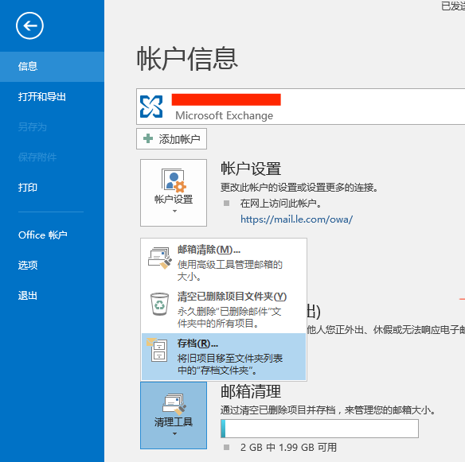

2. 在存档界面**选中邮箱根目录**，选择【将该文件夹及其子文件夹存档】，设置**归档时间点**（将归档早于该时间点的邮件）、**存档文件位置**及**文件名**，点击【确定】。

    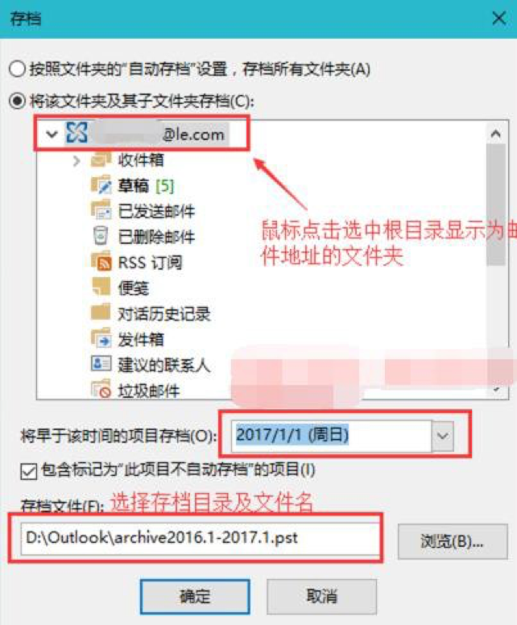

3. 返回Outlook主界面，将在右下方提示“正在归档”，归档期间不影响邮件收发。在归档完成之前请勿关闭Outlook。如图所示：
    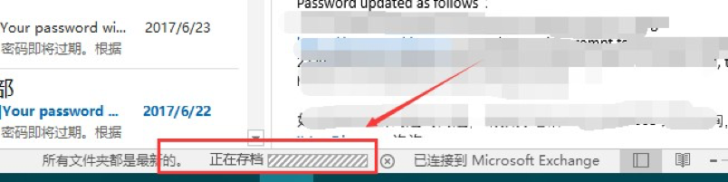

    > 注：**如归档期间不小心关闭Outlook，请重新执行上述步骤完成归档。**

4. 至此，邮箱归档已成功，归档文件已保存至所选存档目录。为了确保邮件已全部归档成功，请检查归档后的邮箱大小。

    右击邮箱账户->【数据文件属性】，在【常规】下点击【文件夹大小】，选择【服务器数据】，检查各个文件夹的大小及文件总大小。如图所示：
    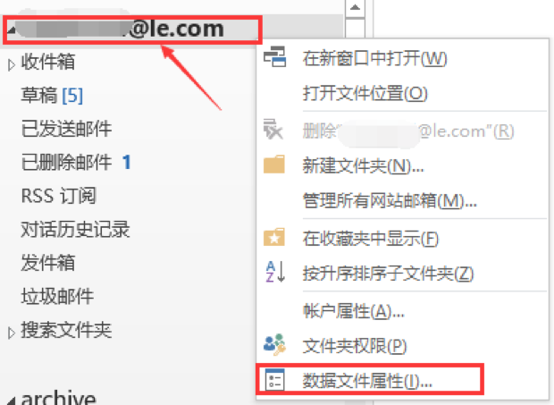

    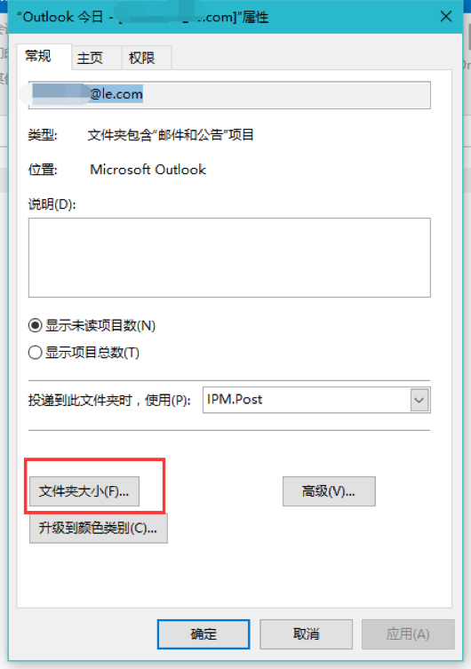

    

 至此，您已将邮件存储至本地。**归档到本地后，请及时备份，以防邮件数据丢失。**

###
Windows Outlook归档12个月之前邮件

如需归档一年内的邮件，请点击<a href="#in 12">Windows Outlook归档一年内邮件</a>。

1. 

配置Outlook存档模式。点击【开始】，打开【控制面板】，选择小图标查看方式，如图：

   

2. 

选择MAil（邮箱），如图：

   

3. 点击【显示配置文件】，**记住自己当前使用的配置文件**，本例中配置文件名为test。如图：

   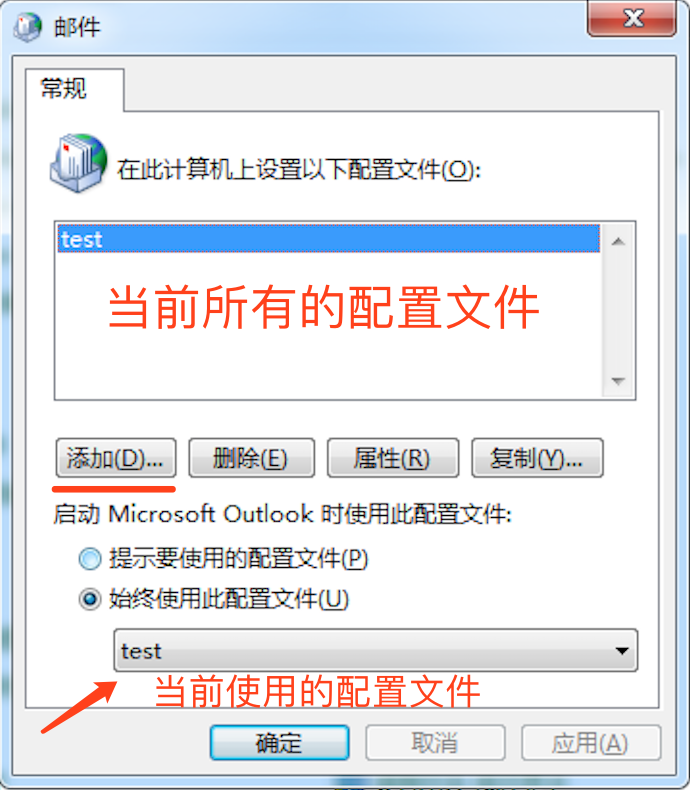

4. 点击【添加】，输入与现有配置文件的名称不同的文件名，这里举例输入online，点击【确定】，如图：

   

5. - 如果您是Outlook2010\2013用户，点击【电子邮件帐户】。如图：

     

   - 如果您是Outlook2016用户，点击【连接到另一个账户】，如图：

     

6. 输入 邮件地址及密码，点击下一步。如图：

   

7. - 若您是Outlook2010\2016版本，选中【手动配置服务器设置】，并点击下一步，如图：

     

   -  若您是Outlook2016版本，选中更改用户设置，并点击下一步。如图：

     

8. 取消勾选【使用缓存Exchange模式】，点击完成。

   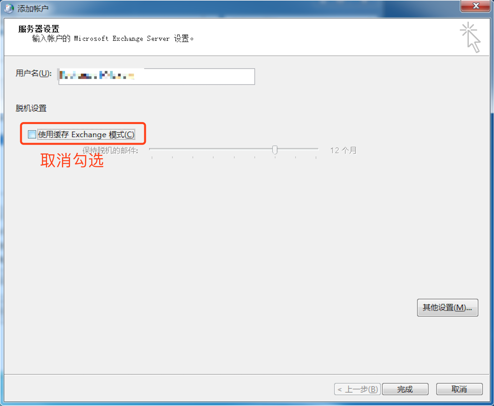

9. 返回邮件窗口，在【始终使用配置文件】下选择刚刚创建的配置文件，点击【确定】。如图：

   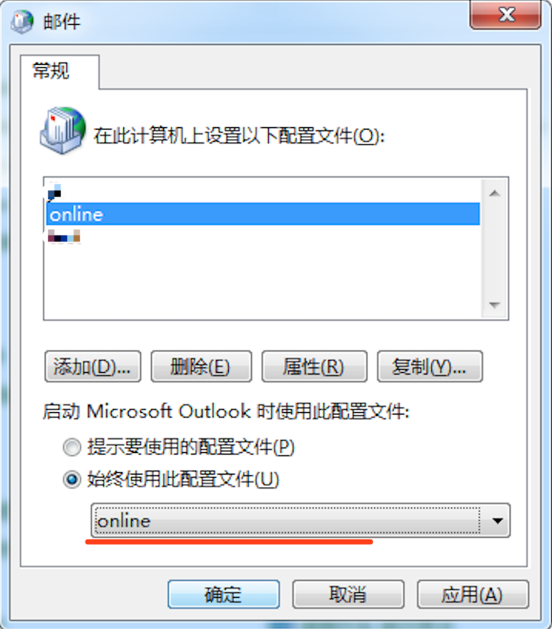

10. - 如果您是Outlook 2013版本，请在主界面点击【文件】->【信息】-> 【工具】->【清理旧项目】。如图：

  

  - 如果您是Outlook 2016版本，请在主界面点击【文件】->【信息】-> 【清理工具】->【存档】。如图：

  

11. 在存档界面**选中邮箱根目录**，且**选择【将该文件夹及其子文件夹存档】**，设置**归档时间点**（将归档早于该时间点的邮件）、**存档文件位置**及**文件名**，点击【确定】。如图所示：

    > ​	选择存档时间间隔时，若您有多年邮件，且邮件超过 50GB，则请分多次来归档。例如，您最早的邮件为2014 年 1 月的邮件，则可以选择时间为 2015 年 1 月 1 日，这样邮件将在这个文件中归档 2014 年 1 月到 2015 年 1 月 1 日的邮件。

    

12. 返回Outlook主界面，将在右下方提示“正在归档”，归档期间不影响邮件收发。在归档完成之前请勿关闭Outlook。如图所示：
    

    **注：如归档期间不小心关闭Outlook，请重新执行上述步骤完成归档。**

13. 至此，邮箱归档已成功，归档文件已保存至所选存档目录。为了确保邮件已全部归档成功，请检查归档后的邮箱大小。

    右击邮箱账户->【数据文件属性】，在【常规】下点击【文件夹大小】，选择【服务器数据】，检查各个文件夹的大小及文件总大小。如图所示：
    

    

    

14. 归档完成后，重复<a href="#bz1">步骤1</a>及<a href="bz2">步骤2</a>，进入邮件界面，在【始终使用此配置文件】下方选择之前的配置文件，点击【确定】。如图：

    > 注意：此处test为举例，之前配置文件不一定是这个名字。

    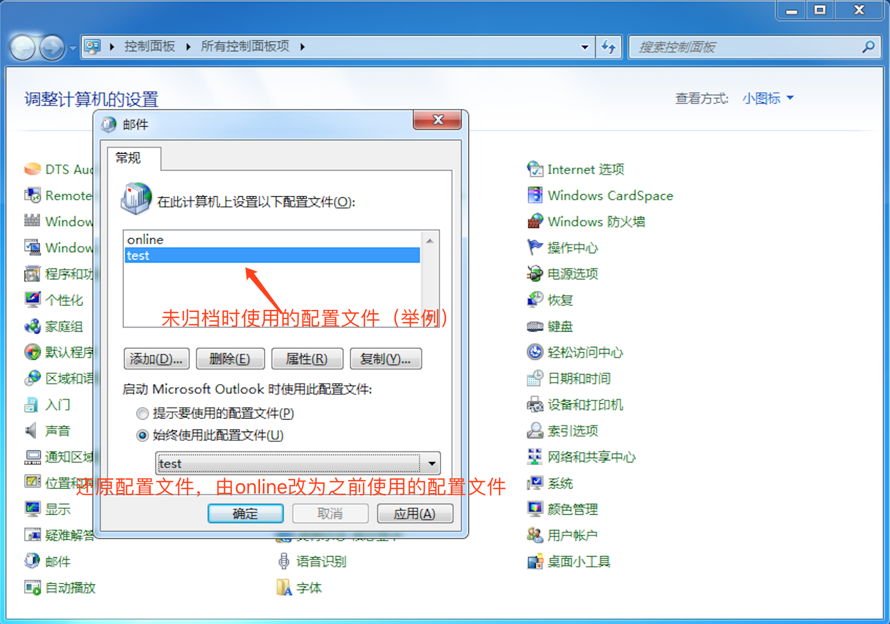

15. 在outlook主界面，点击【文件】->【信息】->【账户设置】。如图：

    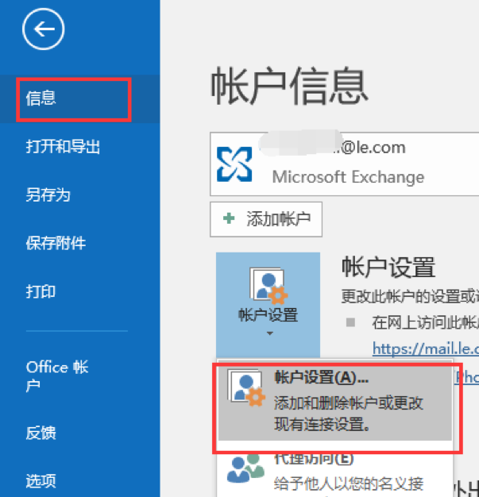

16. 进入账户设置页面后，点击【数据文件】->【添加】，如图：

    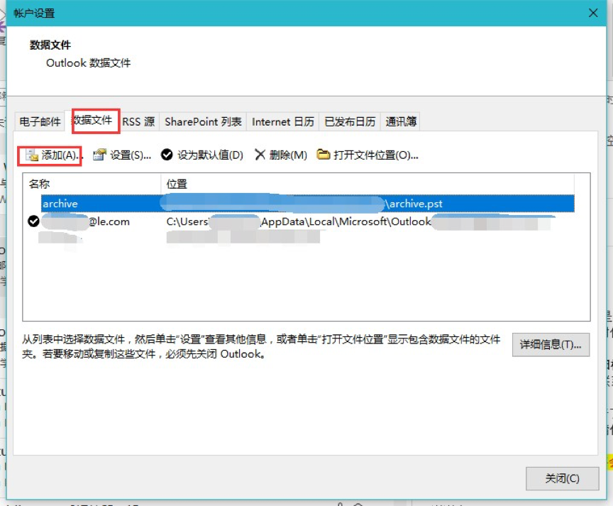

17. 选择之前存储的归档文件，点击【确定】。如图：

    

18. 添加成功后会显示在设置页面中，为方便查看，我们可以修改其显示名称。双击刚刚添加的数据文件，如本例中的test。

    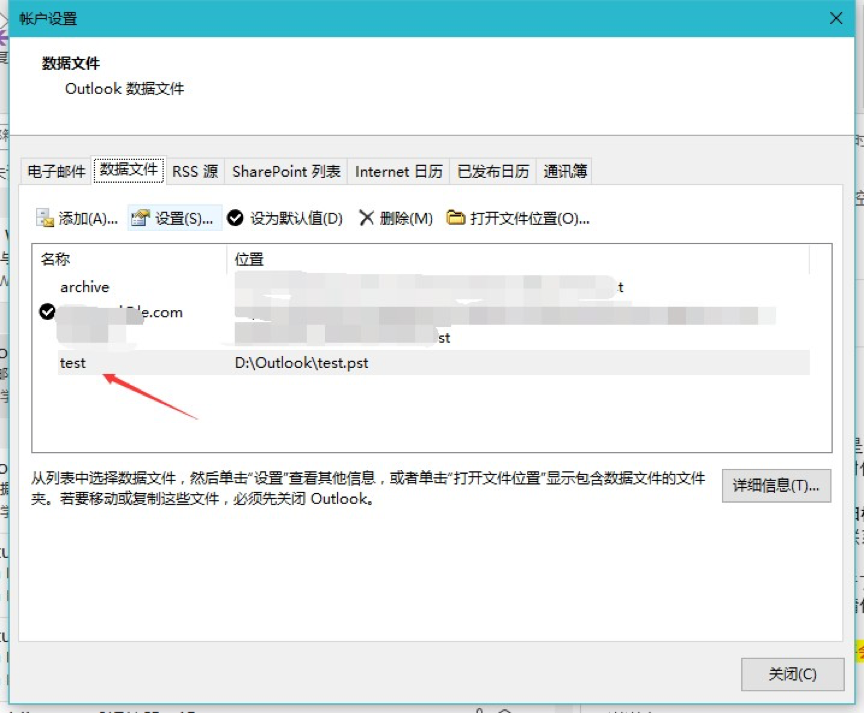

19. 根据存档的邮件时间段或类型输入名称，如存档2016.1-2018 .8，点击【确定】。

    

20. 到此，归档操作全部完成。可在Outlook主界面左侧导航栏查看存档的邮件。 **归档到本地后，请及时备份，以防邮件数据丢失。**

    

##
MAC 邮箱归档

请根据您使用的邮箱软件进行选择：

1. <a href="#mac outlook">MAC版Outlook</a>
2. <a href="#mac mail">MAC自带邮件</a>

###
使用MAC Outlook归档旧邮件到本地

1. ​点击【outlook】 -> 【偏好设置】，打开设置页面。如图：   

    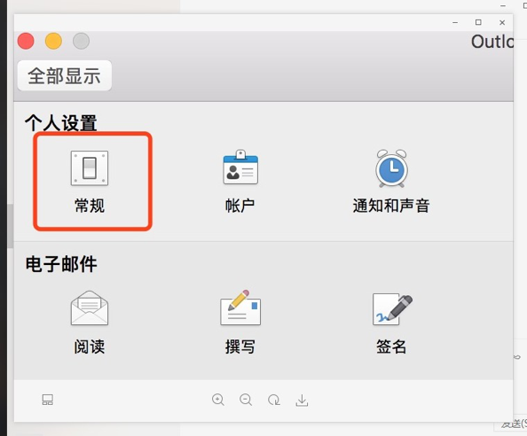

2. 点击常规，取消勾选【隐藏“在我的电脑上”文件夹】（如果未勾选，请忽略）。如图：

    

3. 关掉设置页面，在outlook左侧导航栏中会出现 “在我的电脑上“ 文件夹。

    右击【在我的电脑上】->点击【新建文件夹】，根据需求创建相应的文件夹，这里以“收件箱”、“发件箱”文件夹为例。如图：

    

4. 回到个人邮箱，选择需要归档的邮件，右击->【移动】，移动邮件到刚刚创建的本地文件夹。（command + a 可选择当前文件夹下的所有邮件）如图：

    

5. 为了确保所有邮件已经归档完成，右击邮箱账户->【属性】，打开邮箱账户属性页面，选择【存储】，检查各个文件的大小。

    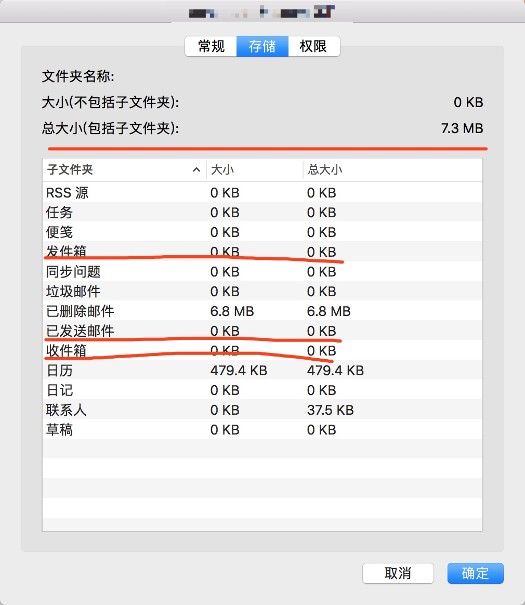

至此，您已将邮件存储至本地。**归档到本地后，请及时备份，以防邮件数据丢失。**

###
使用MAC自带mail归档旧邮件到本地

1. 鼠标放在收件箱上方会显示 **+** 号。如图：

    

2. 点击【+】图标来新建文件夹，在位置后选择【我的MAC上】，输入文件夹的名称，这里以“本地邮件箱”为例。如图：

    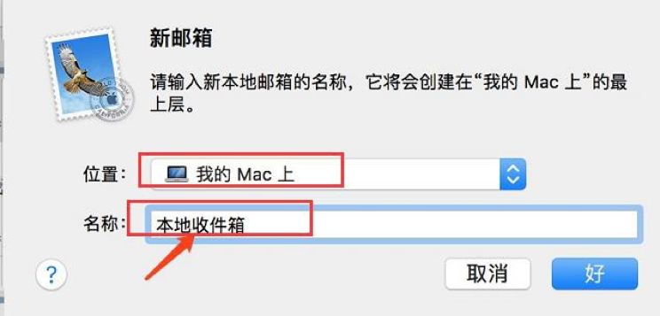

3. 回到个人邮箱，选择需要归档的邮件，右击->【移动】，移动邮件到刚刚创建的本地文件夹。（command + a 可选择当前文件夹下的所有邮件）如图：

    

4. 为了确保所有邮件已经归档完成，右击邮箱账户->【显示账户简介】，打开账户简介页面，选择【服务器上的邮件】，检查各个文件的大小。

    

     至此，您已将邮件存储至本地。**归档到本地后，请及时备份，以防邮件数据丢失。**

##常见归档问题解答

####问题 1：归档到本地的文件需要备份吗？ 

邮件归档到本地后服务器端不再存储，丢失后也无法恢复，请保存好归档到本地 的 PST 文件，谨防邮件丢失。若您更换电脑，请将其拷贝到新电脑并加载即可。

####问题 2：我有好几年的邮件，但为何我 outlook 2013\2016 邮箱中查看已经归档完了，但查看邮箱依旧很大，归档中也没有一年以前的邮件？ 
请完成超大文件归档。<a href="#more than 12">点击跳转</a>

